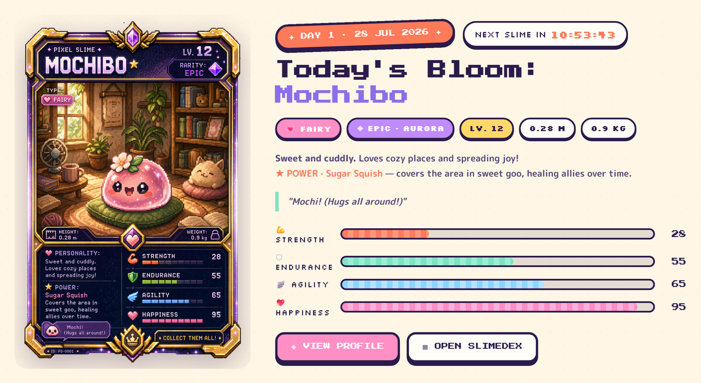
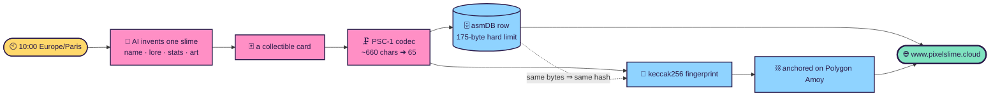
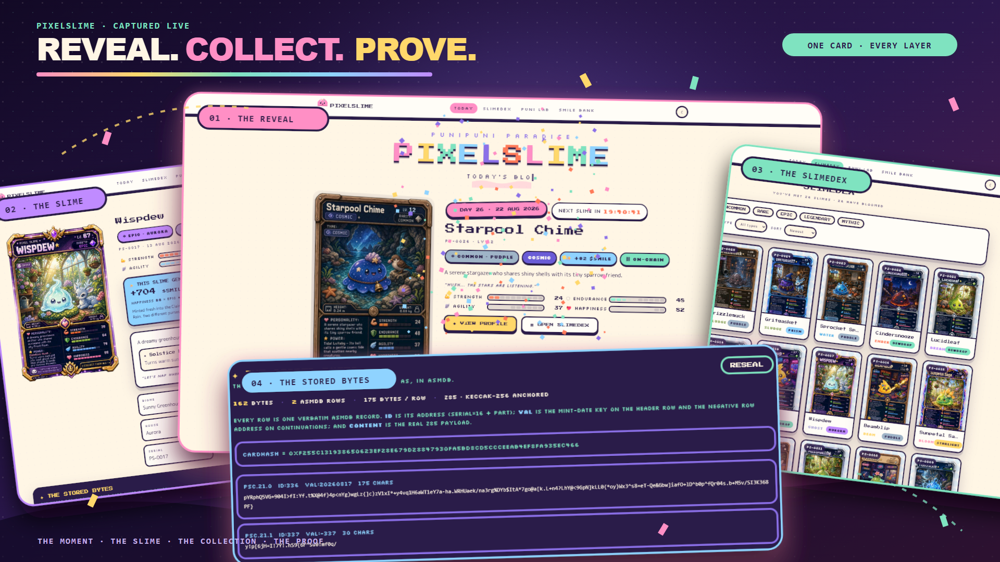
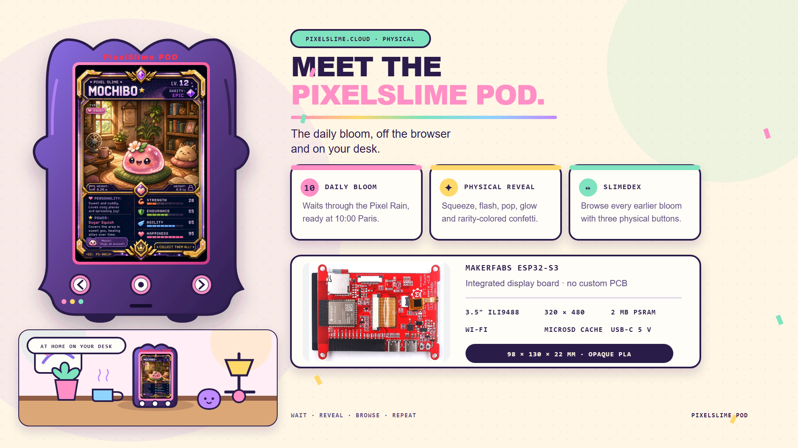
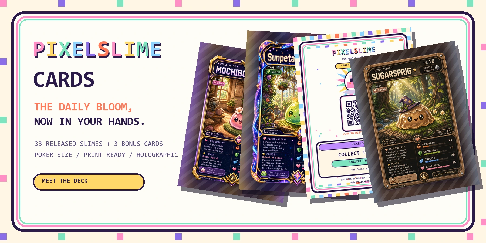
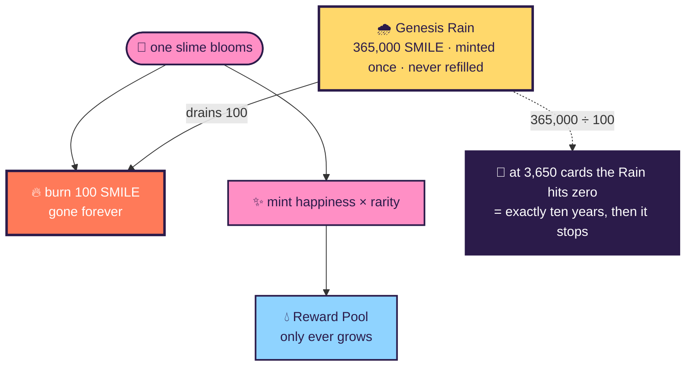
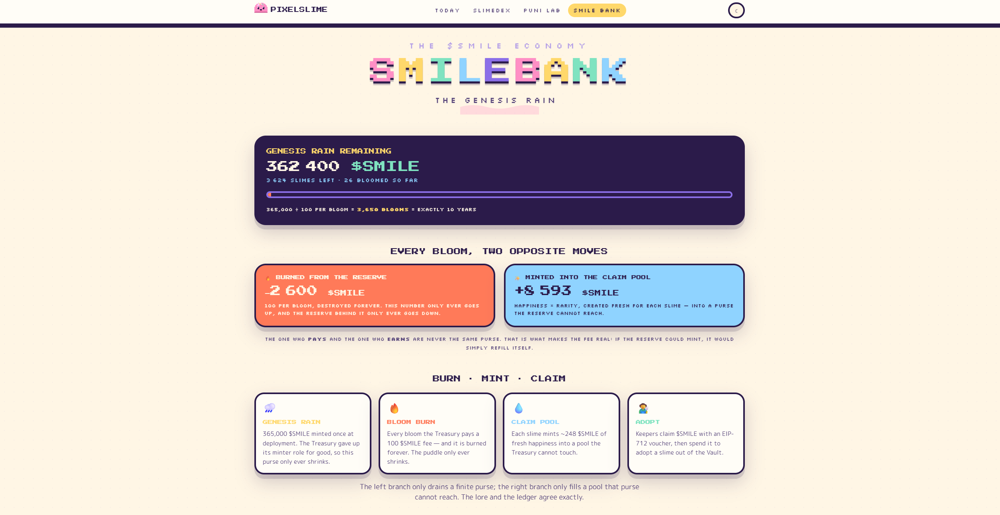

<div align="center">


# ✦ PIXELSLIME ✦

### ぷにぷに &nbsp;·&nbsp; **One AI slime per dawn — a whole trading card in 175 bytes, fingerprinted on-chain.**

*A rainbow crashed above the clouds, and it rained pixels. Wherever a pixel landed on*<br>
*something happy, the thing went soft, wobbled twice, and opened two shiny eyes.*

<br>

[](https://www.pixelslime.cloud)
[](https://github.com/fredgis/pixelslime/actions/workflows/ci.yml)
[](https://amoy.polygonscan.com/)
[](#-verified-not-asserted)

</div>

---

## 🫧 What it is

**PIXELSLIME** invents exactly **one** AI-illustrated collectible creature card every day at **10:00 Europe/Paris**,
stores the *entire* card inside a single **175-byte** row of an external [asmDB Cloud](https://www.asmdb.cloud)
database, and anchors a `keccak256` fingerprint of it on the **Polygon Amoy** blockchain. The site is fully
public — no account, no cookie, no tracking — and it runs itself: a cron job wakes, rolls a rarity, writes the
card, paints it, verifies it, stores it, anchors it, and goes back to sleep. It is live at
**[www.pixelslime.cloud](https://www.pixelslime.cloud)**.

<div align="center">
  
</div>

---

## ✨ Three things that make it interesting

| | |
|---|---|
| 🗜️ **A trading card in 65 characters** | An asmDB row gives you **175 bytes** of UTF-8 — no NUL, no CR, no LF. A normal JSON card is **~660**. The **PSC-1 codec** (a 32-byte packed header + dictionary-DEFLATE text, Z85-encoded) gets the first card, *Mochibo*, down to **65 bytes** — one row, 110 to spare. |
| ⛓️ **Provably the same card, twice** | The exact packed bytes are what gets hashed on-chain. The `cardHash` in the database and the one minted on Polygon Amoy are **byte-for-byte identical** — change one letter of a slime's name and the two would no longer match. |
| 🌧️ **A ten-year clock made of arithmetic** | A finite reserve of **365,000 SMILE** drains by exactly **100 per card**. `365,000 ÷ 100 = 3,650 cards = exactly ten years`, then it stops forever. That deadline is not a policy — it is baked into the contract, and a Foundry test drains it to *exactly zero* at bloom 3,650. |

### The daily bloom, end to end



Every card exposes its own **provenance**: the literal Z85 bytes exactly as they sit in the database.

<div align="center">
  
</div>

---

## Meet PixelSlime POD

<div align="center">
  
</div>

**PixelSlime POD** brings the daily bloom out of the browser and onto a small desk device. It uses a
Makerfabs ESP32-S3 board with a 3.5-inch portrait display, microSD cache, USB-C power and three physical
buttons, all inside an opaque 3D-printed slime shell.

From midnight, the screen waits under a slow Pixel Rain and counts down to 10:00 Europe/Paris. The new
card arrives face down and stays sealed until the center button starts the squeeze, flash, pop and
rarity-colored confetti reveal. Left and right browse earlier blooms; the center button opens card details
and a profile QR code. Cached cards remain available when Wi-Fi drops.

**[Build the PixelSlime POD →](docs/PIXELSLIME-POD.md)**

---

## Meet PixelSlime Cards

<div align="center">
  
</div>

**PixelSlime Cards** turns the daily bloom into a physical poker-size collector deck. The first print
snapshot contains every released slime from **PS-0001 through PS-0033**, plus three original bonus cards
to complete a 36-card deck. Each slime gets a colourful matching back with its serial, rarity and a QR
code leading to the live profile and provenance.

The print pack is prepared at PrinterStudio's official **822 × 1122 px / 300 dpi** poker-card size, with
full bleed, side-by-side previews and an optional common back. It is ready for standard or front-only
holographic production.

**[Meet PixelSlime Cards →](cards/README.md)**

---

## 🪙 SLIME and SMILE are two different tokens

They are one letter apart and it trips everyone up. They are **not** versions of each other — they are
different standards doing different jobs.

| | 🃏 **SLIME** — the card | 🪙 **SMILE** — the money |
|---|---|---|
| Standard | **ERC-721** (non-fungible) | **ERC-20** (fungible) |
| Divisible? | ❌ no — one token per slime | ✅ yes, 18 decimals |
| Supply | grows by 1 per anchored card · **3,650 max** | **365,660** today · each bloom shifts it by `yield − 100` |
| Burned? | never | **100 per bloom**, and minted as yield |
| Read it as | *the card you hold* | *the coin you spend* |

> Every bloom **burns 100 SMILE** from the finite reserve and **mints `happiness × rarity`** into a
> separate reward pool. The purse that pays the fee can never print more of it — verified on the live chain,
> not just asserted in the code.



<div align="center">
  
</div>

---

## 🚀 Quick start — run it locally

No Azure, no asmDB, no wallet. The backend boots against an **in-memory fake** seeded from
`contracts/cards/*.json`, and the frontend ships a **Mock Service Worker** that answers the whole API.

```powershell
# 1 · the API, against in-memory fakes (offline)          → http://127.0.0.1:8000
cd backend
pip install -e ".[dev]"
$env:LOCAL_DEV = "1"
python -m uvicorn app.main:app --reload

# 2 · the SPA, against its built-in mock (no API needed)  → http://127.0.0.1:5173
cd frontend
npm install
npm run dev
```

The health probe should answer immediately:

```console
$ curl http://127.0.0.1:8000/api/health
{"status":"ok","cards":3,"engine":"asmdb-fake/1.0"}
```

<details>
<summary><b>🐳 Or run the real container image</b></summary>

<br>

The Dockerfile is **one image with two entrypoints** — the API and the daily job — so there is a single
origin and therefore no CORS problem with asmDB. CI builds this exact image on every push.

```powershell
docker build -t pixelslime .
docker run --rm -p 8000:8000 -e LOCAL_DEV=1 pixelslime   # → http://127.0.0.1:8000
```

Full deployment (Azure + Key Vault bearer + Bicep) lives in **[`docs/RUNBOOK.md`](docs/RUNBOOK.md)**.

</details>

---

## 🗂 Repository map

| Directory | What lives there |
|---|---|
| **`backend/`** | FastAPI app + tests — `codec` · `asmdb` · `ai` · `api` · `core` · `storage` · `jobs` · `chain` |
| **`frontend/`** | Vite + React 18 + TypeScript SPA — a kawaii design system and the five screens |
| **`chain/`** | Foundry project — the four Solidity contracts, tests, and the Amoy deploy script |
| **`cards/`** | Print-ready physical deck — 33 released slimes, 3 bonus cards, QR backs and previews |
| **`contracts/`** | The binding truth: `card.schema.json`, `openapi.yaml`, design tokens, lookups, card fixtures |
| **`infra/`** | Bicep — identity, Key Vault, Storage, ACR, Container Apps, VNet, RBAC |
| **`assets/`** | The pinned DEFLATE dictionary (`psdict_v1.bin`) and the Mochibo style template |
| **`scripts/`** | Contract validation, row verification, dictionary build, template cleanup |
| **`docs/`** | Architecture, data path, plain-language, codec spec, plan, runbook, security audit, agents + the mockup |
| **`Dockerfile`** | One image, two entrypoints: the API and the daily job |

---

## 📚 Documentation index

| Document | Who it's for |
|---|---|
| **[`docs/PIXELSLIME-POD.md`](docs/PIXELSLIME-POD.md)** | Makers — the complete hardware, enclosure, firmware and API build guide |
| **[`cards/README.md`](cards/README.md)** | Collectors — the physical card deck, print files, previews and ordering guide |
| **[`docs/EASYLEARN.md`](docs/EASYLEARN.md)** | Newcomers — the whole thing in plain language, no jargon |
| **[`docs/ARCHITECTURE.md`](docs/ARCHITECTURE.md)** | Operators & engineers — what is *actually* deployed on Azure and Amoy, with drift called out |
| **[`docs/HOWITWORKS.md`](docs/HOWITWORKS.md)** | Engineers — the byte-for-byte data path through asmDB and the chain |
| **[`docs/CODEC.md`](docs/CODEC.md)** | Codec implementers — the normative PSC-1 specification |
| **[`docs/PLAN.md`](docs/PLAN.md)** | Anyone who wants the full reasoning — product, architecture, economy, the agent split |
| **[`docs/RUNBOOK.md`](docs/RUNBOOK.md)** | Whoever ships it — rollout, backfill, token rotation, troubleshooting |
| **[`docs/SECURITY-AUDIT.md`](docs/SECURITY-AUDIT.md)** | Anyone assessing the risk — OWASP review of the web app, infrastructure and contracts, open findings included |
| **[`docs/AGENTS.md`](docs/AGENTS.md)** | Contributors — how work is split across parallel workstreams |

---

## 🌍 Live deployment

| | |
|---|---|
| **Site** | **[www.pixelslime.cloud](https://www.pixelslime.cloud)** · HTTPS with a managed certificate |
| **Health** | `/api/health` → `{"status":"ok","cards":1,"engine":"1.7.0"}` |
| **Host** | Azure Container Apps · resource group `FGI-ASMDBPIXELSMILES` · `swedencentral` |
| **Database** | asmDB Cloud · `smilesdb` · 175-byte rows, the source of truth |
| **Chain** | Polygon **Amoy** testnet · chain id **80002** · explorer [`amoy.polygonscan.com`](https://amoy.polygonscan.com/) |
| **Apex** | `pixelslime.cloud` (no `www`) is **not yet bound** — only `www.` serves valid HTTPS |

### Contracts on Polygon Amoy

| Contract | Address | Role |
|---|---|---|
| `SmileToken` · ERC-20 **SMILE** | [`0x0BBaC39B…4B39b798`](https://amoy.polygonscan.com/token/0x0BBaC39Bf418ab63BF71802808A4C63D4B39b798) | the currency |
| `PixelSlimeCard` · ERC-721 **SLIME** | [`0xD88928B5…432Baf7f`](https://amoy.polygonscan.com/token/0xD88928B55CefcAe756e55824a48342cA432Baf7f) | the cards |
| `ClaimPool` | [`0xbce1362c…B155160d`](https://amoy.polygonscan.com/address/0xbce1362c1155777df19F9cea6c8ECa68B155160d) | burns the fee, mints the yield |
| `SlimeAdoption` | [`0x20d6A4F3…497473CcA`](https://amoy.polygonscan.com/address/0x20d6A4F365d00b4d27726f13093Dc2C497473CcA) | spend SMILE to adopt |

### PS-0001 · Mochibo, verified end to end

| | |
|---|---|
| Card | **Mochibo** · `PS-0001` · `SLIME #1` · EPIC (Aurora) · happiness 95 |
| Mint tx | [`0x6a1c3c6e…bce6260e`](https://amoy.polygonscan.com/tx/0x6a1c3c6e5879851568bcf934b273aa5979f26de6cd9c248043dae133bce6260e) |
| Bloom tx | [`0xa29bcec7…f6276ac7`](https://amoy.polygonscan.com/tx/0xa29bcec720a3d34c5973c07fb3b186345c4343ca25cbe5ce9e202676f6276ac7) — burned **100 SMILE**, minted **760** (95 × EPIC ×8) |
| `cardHash` | `0xe99e4c83…62e7af0a` — **identical** in asmDB and on-chain |

---

## 🔬 Verified, not asserted

Every number below was produced by running the suite in this repository, not copied from a note.

| Area | Result |
|---|---|
| **Backend** | **726 tests** (725 passing · 1 skipped · 0 failing) · `mypy --strict` clean across **69 modules** |
| **Smart contracts** | `forge test` → **49 passing** across 5 suites; 3,650 blooms drain the Genesis Rain to **exactly zero** |
| **Frontend** | `tsc --noEmit` clean · production build succeeds (fully code-split; React vendor ~51 KB gzip) |
| **Contracts & codec** | `validate_contracts.py`: all valid · `verify_rows.py`: every row legal for asmDB · Mochibo = **65 of 175 bytes** |

```powershell
cd backend  ; pip install -e ".[dev]" ; pytest ; mypy -p app ; ruff check .
cd chain    ; forge test
cd frontend ; npm install ; npm run build
python scripts/validate_contracts.py   # contracts are internally consistent
python scripts/verify_rows.py           # every emitted row is legal for asmDB
```

---

## 🎴 Rarity tiers

| | Tier | House | Odds | Yield ×multiplier | Adopt price |
|---|---|---|---:|---:|---:|
| ⬜ | `COMMON` | **Puddle** | 45 % | ×1 | 200 |
| 🟩 | `UNCOMMON` | **Dewdrop** | 27 % | ×2 | 400 |
| 🟦 | `RARE` | **Prism** | 17 % | ×4 | 900 |
| 🟪 | `EPIC` | **Aurora** | 8 % | ×8 | 2,000 |
| 🟨 | `LEGENDARY` | **Starlight** | 2.5 % | ×20 | 6,000 |
| 🟥 | `MYTHIC` | **Dreamdrop** | 0.5 % | ×100 | 25,000 |

Rarity is rolled in code with a seeded weighted random — never left to the model — with a pity timer that
forces a `RARE` or better if fourteen days pass without one.

---

## 🚧 Honest status

This is a **testnet** build. It works end to end, but it is not finished — here is the unvarnished state.

| | Status |
|---|---|
| 🟢 **Live & automated** | Site is up, card generation is on a cron, blockchain anchoring is automated, the economy fires on each bloom |
| 🟡 **No wallet, no claim yet** | `SMILE` is minted and countable on-chain, but there is **no wallet connection and no claim endpoint** — no human can claim or spend it yet |
| 🟡 **Adoption not armed** | `SlimeAdoption` is deployed and priced, but the Treasury has **not approved it** to move cards out of the Vault |
| 🟡 **Key custody** | The chain signing key lives in a **Container Apps secret, not Key Vault** (a governance policy makes the vault's data plane unreachable). The code **refuses to sign on any non-testnet chain** |
| 🟡 **Apex domain** | `pixelslime.cloud` is not yet bound; only `www.pixelslime.cloud` serves valid HTTPS |
| ⚪ **Testnet only** | Polygon Amoy · **no real value** |

---

<div align="center">

*"A slime is a place, a feeling and a friend, squished together."*<br>
<sub>— SLIMEDEX, volume one</sub>

<br>

**✦ COLLECT THEM ALL ✦**

</div>
