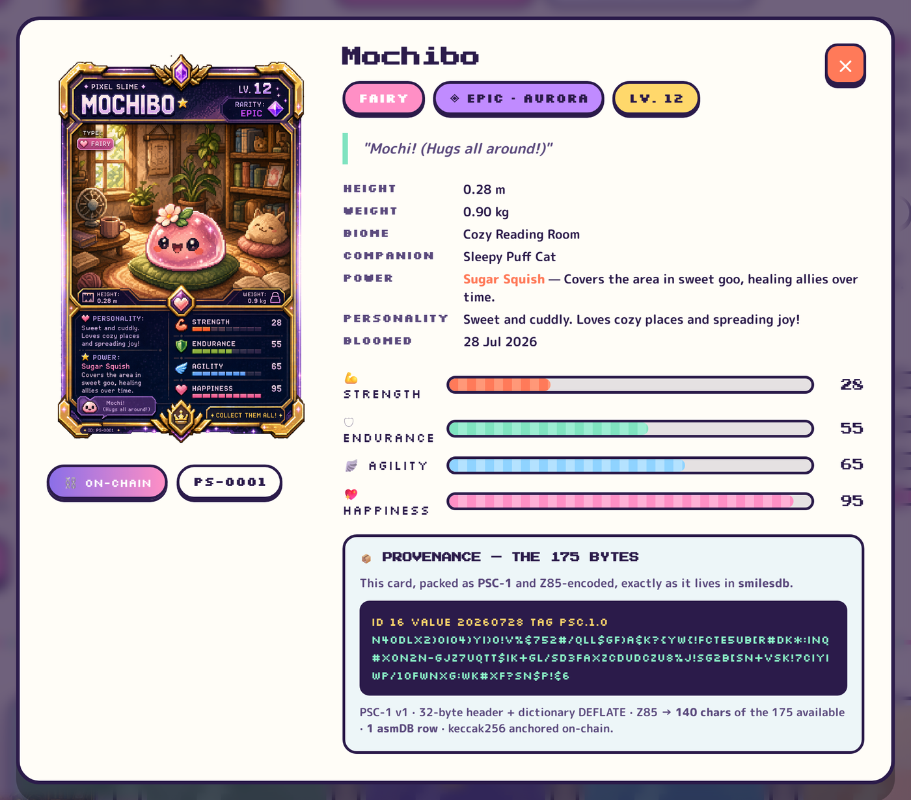

<div align="center">


### ✦ ぷにぷに ✦ &nbsp;**One slime per dawn.**

*A rainbow crashed above the clouds, and it rained pixels.*<br>
*Wherever a pixel landed on something happy, the thing went soft, wobbled twice,*<br>
*and opened two shiny eyes.*

<br>

[](docs/PLAN.md)
[](docs/PLAN.md)
[](docs/mockup/index.html)
[](assets/template/mochibo.png)

</div>

---

**PIXELSLIME** generates **one unique AI collectible card every day at 10:00 Europe/Paris**, catalogues it
in a public gallery, packs it into **175 bytes** inside an [asmDB Cloud](https://www.asmdb.cloud)
database, and — later — anchors it on-chain with the **$SMILE** token.

> [!NOTE]
> **Status: PLANNING.** No application code yet, no Azure resources created yet.
> Everything below is a design that has already been **verified against the live APIs** — read
> **[`docs/PLAN.md`](docs/PLAN.md)** before writing a line of code.

<br>

## 🌸 Today's Bloom

The card of the day arrives face down. Click it, and it flips.

<div align="center">
  
</div>

<br>

## ◈ Slime Profile

Every card exposes its own **provenance**: the exact packed bytes as they live in the database.

<div align="center">
  
</div>

<br>

## 🫧 What makes this interesting

| | |
|---|---|
| **175 bytes** | An asmDB row gives you `175` bytes of UTF-8 for content — no NUL, no CR, no LF. A whole trading card has to fit in that. It becomes the **PSC-1 codec**: a 32-byte header plus dictionary-DEFLATE text, Z85-encoded, chunked across rows. |
| **The constraint is the feature** | Those same packed bytes are what gets hashed with keccak256 on-chain. The chain proves a slime existed exactly like that, on that day — **without duplicating a single byte of it**. |
| **No keys anywhere** | API key auth is disabled on the model endpoint, so the backend authenticates with a **managed identity**. The database bearer lives in Key Vault. Nothing reaches the browser. |
| **No login, no personal data** | The site is fully public. Which slimes you've discovered lives in your own `localStorage` — nothing about a visitor is ever sent to the server. |
| **It runs itself** | A cron job wakes at 10:00 Paris, rolls a rarity, writes the card, paints it, verifies it, stores it, and goes back to sleep. |

<br>

## 📚 Start here

| Document | What it is |
|---|---|
| **[`docs/PLAN.md`](docs/PLAN.md)** | The complete plan — verified API facts, Azure architecture, the 175-byte codec, the AI pipeline, the $SMILE economy, and an 11-workstream split designed for parallel agents |
| **[`docs/mockup/index.html`](docs/mockup/index.html)** | The clickable mockup. Open it in a browser — the card flips, the gallery filters, the economy is laid out |

<br>

## 🗂 What's in the repo right now

```
docs/PLAN.md                          the plan — read this first
docs/mockup/index.html                the clickable mockup
docs/assets/                          the screenshots above
assets/template/mochibo.png           style reference card, RGBA with real alpha
assets/template/mochibo-original.png  the original — RGB, with a checkerboard painted in
scripts/clean_template.py             turns that checkerboard into a real alpha channel
```

<details>
<summary><b>Why the template needed cleaning</b></summary>

<br>

`mochibo-original.png` looks like it has a transparent background. It does not — it is `RGB` with **no
alpha channel at all**, and the "transparency" is an 8-pixel checkerboard painted into the pixels.

Handing that to an image model as a style reference is asking it to **paint a checkerboard**. So the
pattern is flood-filled from the borders and converted into a real alpha channel:

```bash
python scripts/clean_template.py \
  assets/template/mochibo-original.png \
  assets/template/mochibo.png
```

```
transparent : 279,475 / 1,572,864 px  (17.8%)
corner alpha: [0, 0, 0, 0]   centre alpha: 255
```

Requires `pillow`, `numpy` and `scipy`.

</details>

<br>

## 🎴 Rarity tiers

| | Tier | House name | Odds |
|---|---|---|---:|
| ⬜ | `COMMON` | **Puddle** | 45 % |
| 🟩 | `UNCOMMON` | **Dewdrop** | 27 % |
| 🟦 | `RARE` | **Prism** | 17 % |
| 🟪 | `EPIC` | **Aurora** | 8 % |
| 🟨 | `LEGENDARY` | **Starlight** | 2.5 % |
| 🟥 | `MYTHIC` | **Dreamdrop** | 0.5 % |

Rolled in code with a seeded weighted random — never left to the model — with a pity timer that forces
a `RARE` or better if fourteen days pass without one.

<br>

---

<div align="center">

*"A slime is a place, a feeling and a friend, squished together."*<br>
<sub>— SLIMEDEX, volume one</sub>

<br>

**✦ COLLECT THEM ALL ✦**

</div>
