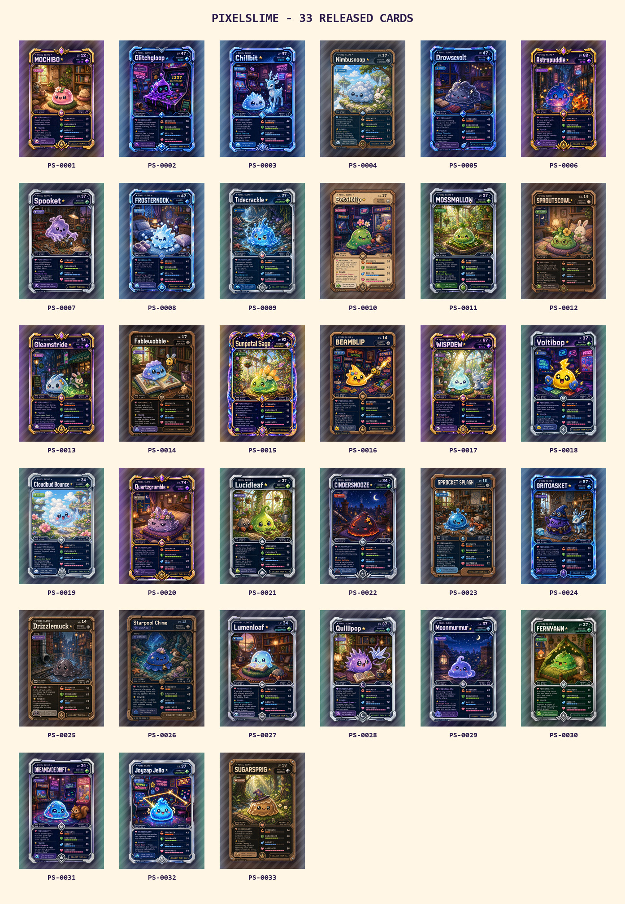

# PixelSlime Cards

  

**PixelSlime Cards** brings the daily bloom into a physical poker-size collector deck. This first print
snapshot captures the **33 slimes released from PS-0001 through PS-0033**, then adds three playful bonus
cards — **The First Splash**, **Rarity Roulette** and **Puni Quest** — to form a complete 36-card deck.

Every released slime has a matching back with its serial, rarity and a QR code leading to the live card
profile and provenance. The public site and canonical NFT artwork remain the source of truth; these files
are print layouts prepared specifically for physical production.

## Print specification

| Property | Value |
|---|---|
| Product | Poker-size custom cards |
| Finished size | 63.5 × 88.9 mm |
| Upload size | **822 × 1122 px** |
| Resolution | 300 dpi |
| Bleed | 36 px on every side |
| Colour / format | RGB PNG |
| Deck | 33 released slimes + 3 bonus cards |

The red dotted line shown by a printer's online preview is the **safe area**, not part of the printed
card. Important text must stay inside it; backgrounds and decorative frames are expected to extend beyond
it and may be trimmed slightly.

## Order a deck

The pack is prepared for
[PrinterStudio France's custom poker cards](https://www.printerstudio.fr/personnalise/cartes-de-jeu-sur-mesure-cartes-blanches.html).

1. Select a **36-card**, 63.5 × 88.9 mm, double-sided deck.
2. Upload the numbered files from [`print/fronts`](print/fronts) in order.
3. Upload the matching numbered files from [`print/backs`](print/backs) in the same order.
4. Use [`000-verso-commun-optionnel.png`](print/backs/000-verso-commun-optionnel.png) only if you want one common back instead of unique QR backs.
5. For a first order, print one prototype deck. **Premium Holographic on the fronts only** keeps the QR backs easier to scan.

The files in [`previews`](previews) place each front and back side by side for inspection. They are not
the files to upload to the printer.

## Pack contents

| Path | Contents |
|---|---|
| [`print/fronts`](print/fronts) | 36 numbered, print-ready fronts |
| [`print/backs`](print/backs) | 36 matching unique backs plus one optional common back |
| [`previews`](previews) | Optimised side-by-side WebP previews |
| [`guide/printerstudio-poker-template.png`](guide/printerstudio-poker-template.png) | Bleed, cut and safe-area guide |
| [`manifest.csv`](manifest.csv) | Slot, serial, rarity, date, profile URL and filenames |
| [`ORDERING.txt`](ORDERING.txt) | Short upload checklist |

## Collection snapshot

  

This snapshot was assembled on **29 August 2026**. Later daily blooms are not silently added to this
pack: a future print edition must declare its own final serial and deck size.
