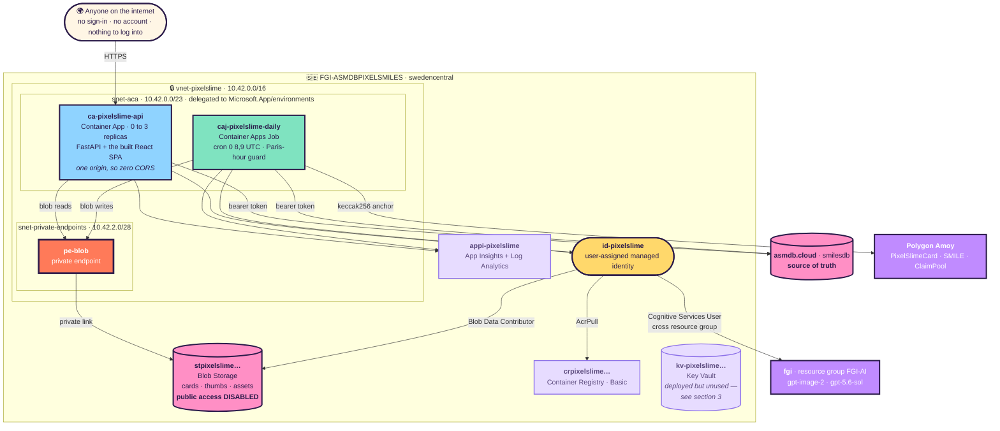
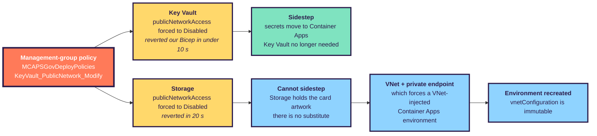
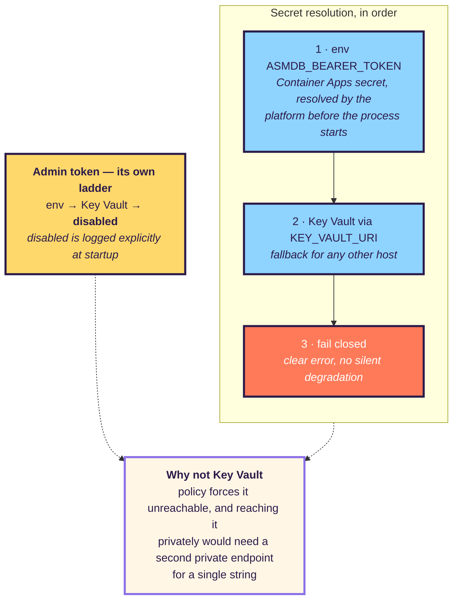
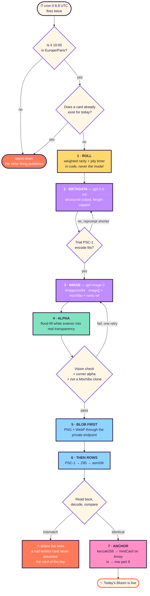
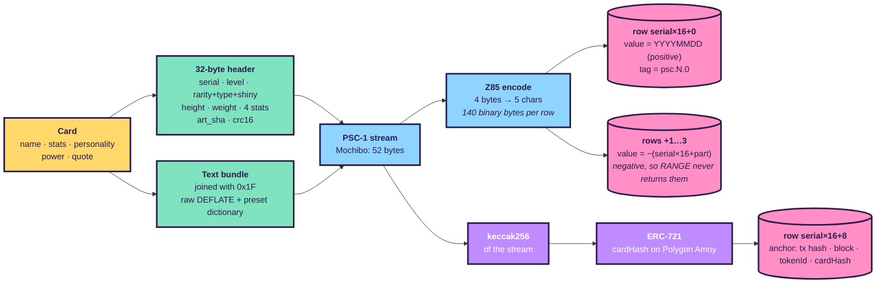
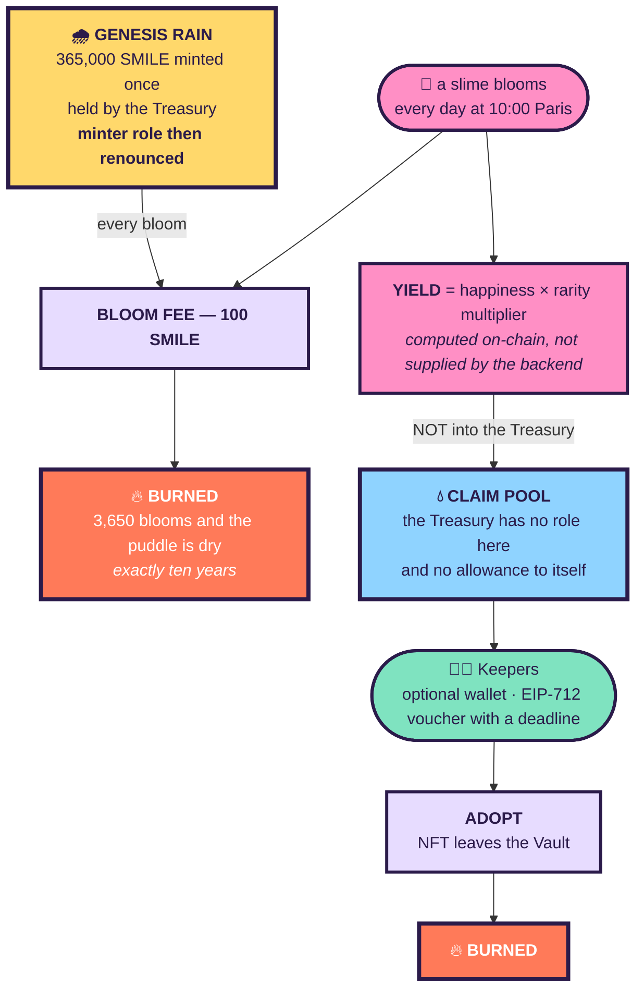
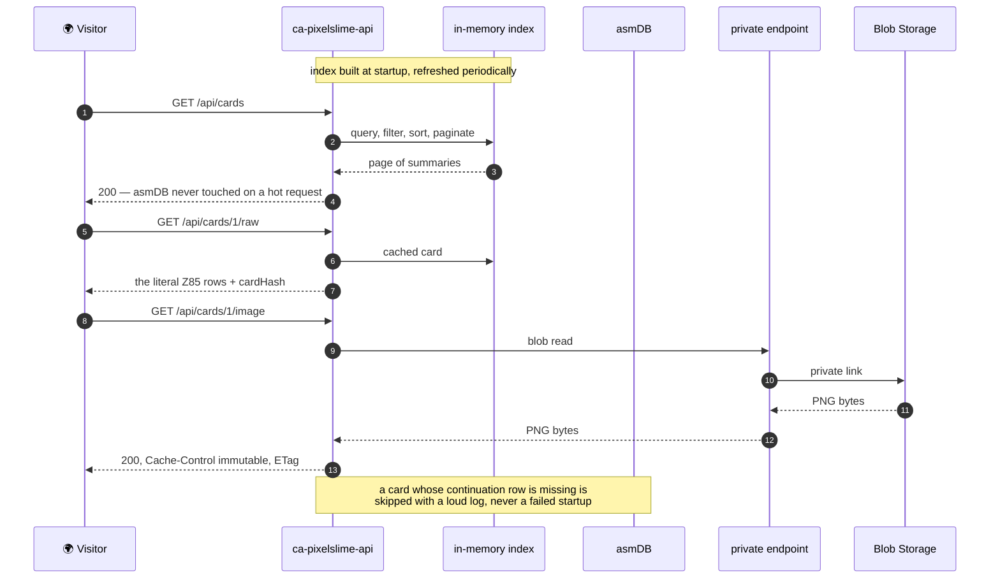

# 🏗️ ARCHITECTURE — PIXELSLIME as actually deployed

> This describes what is **running**, not what was planned. Where the two differ, the difference is
> explained — usually because reality pushed back. [`PLAN.md`](PLAN.md) holds the reasoning;
> [`RUNBOOK.md`](RUNBOOK.md) holds the operations.

| | |
|---|---|
| Subscription | `<SUBSCRIPTION_ID>` |
| Resource group | `FGI-ASMDBPIXELSMILES` · `swedencentral` |
| Public URL | `ca-pixelslime-api.blackbay-470e05c9.swedencentral.azurecontainerapps.io` |
| Database | asmDB Cloud · `smilesdb` · instance `<ASMDB_INSTANCE>` |
| Chain | Polygon **Amoy** testnet |

---

## 1. The whole picture

---

## 2. Why there is a VNet at all

The plan had no network. The site is public by design, Container Apps Consumption was enough, and the
whole thing was meant to cost €15–25/month. Two governance policies changed that during deployment.

**What was checked rather than assumed.** Only Storage and Key Vault are restricted. The container
registry (Basic) and Log Analytics both still accept public traffic, so they need no private
endpoints. Scoping the network to a **single** private endpoint instead of four kept the footprint and
the cost down.

**What was deliberately *not* built.** An API Management gateway was considered and rejected: it fronts
HTTP APIs and does not proxy the Key Vault or Storage data planes, so it would not have unblocked
anything. The Developer SKU also carries no SLA, which would have made a daily-publishing site *less*
reliable, for about €45/month.

---

## 3. Where the secrets live

The bearer **fails closed** — without it the app refuses to start, because an API silently serving an
empty gallery is worse than one that will not boot. The admin token **fails safe** — absent means the
endpoint is disabled, and that state is announced in one explicit log line, because a security control
that turns itself off quietly is worse than one that was never there.

> ⚠️ **Bicep is declarative: a redeploy that omits a secret deletes it.** `deploy.ps1` reads the current
> values back and passes them through, otherwise a routine image bump would unauthenticate the app
> against asmDB and the gallery would quietly go empty.

---

## 4. What happens every day at 10:00 Paris

**Blobs are written before rows, deliberately.** If the upload fails, nothing has reached the database.
An orphan blob is harmless and gets overwritten; an orphan **row** would surface as a broken card.

---

## 5. How a card is stored in 175 bytes

An asmDB row gives **175 bytes of UTF-8 with no NUL, CR or LF** — it is text, not a binary field, which
is why raw bytes cannot simply be written. Z85 was chosen over base64 for density (140 usable bytes
versus 131) and because its alphabet contains no backslash, space or quote, so it cannot collide with
the engine's internal TSV escaping.

| Fixture | Stream | Rows | Widest row |
|---|---:|---:|---:|
| `mochibo` | 52 B | **1** | 65 of 175 |
| a realistic unseen card | 183 B | 2 | 175 |
| every field at its limit, incompressible | 205 B | 2 | 175 |

The largest schema-valid card provably deflates to a 557-byte stream against a 560-byte ceiling, so
**no valid card can overflow**. Chunking is the guarantee; the dictionary is upside.

---

## 6. The chain, and why the fee is real

**The left branch only ever drains a finite purse; the right branch only ever fills a pool that purse
cannot reach.** That separation is what makes the fee real rather than the Treasury paying itself.

Three ways this could have been faked, all closed in code and tested:

| Hole | Why it mattered | Fix |
|---|---|---|
| `admin == treasury` | An admin can `grantRole(MINTER_ROLE, self)` and refill the Rain — the burn becomes theatre | Keys must be distinct; enforced in the constructor **and** re-checked at deploy |
| Voucher had no expiry | A leaked voucher was claimable forever with no way to rotate it out | `deadline` added to the signed tuple |
| Backend supplied the yield amount | A compromised backend key mints unlimited supply | Formula moved on-chain; the job supplies inputs, never payouts |

Simulating all 3,650 blooms in Foundry ends with the Genesis Rain at **exactly zero** and **904,050
SMILE** in existence — all of it earned, none of it decreed. It is a knife-edge: bloom 3,651 reverts,
and a day skipped and never backfilled leaves dust forever. That makes the backfill job structural.

Transactions are signed by an **Azure Key Vault secp256k1 key** — the private key never leaves the HSM,
and `v` recovery plus low-`s` normalisation are done client-side because Key Vault returns only `(r,s)`.

---

## 7. Reading a card, end to end

The gallery is served entirely from an in-memory index mirrored to an `index.json` blob. asmDB remains
the **source of truth**; the index is a rebuildable projection. `FIND` and `RANGE` are full scans in the
engine, so keeping them off the hot path is not an optimisation, it is a requirement.

---

## 8. What it costs

| Item | Monthly |
|---|---|
| Container Apps (scale-to-zero) | ~€5–12 |
| Container Apps Job (30 runs) | < €1 |
| **Private endpoint + private DNS zone** | **~€8** |
| Storage (365 PNG/year) | ~€1 |
| ACR Basic | ~€4 |
| Log Analytics + App Insights | ~€3–6 |
| Key Vault (deployed, unused) | < €1 |
| asmDB · Amoy gas | €0 |
| **Total excluding image generation** | **≈ €22–33** |

The VNet itself is free; only the private endpoint carries a charge. Refusing APIM saved roughly
€45/month and avoided putting an SLA-less component in front of a site meant to publish daily.

---

## 9. Deviations from the plan, and why

| Planned | Built | Why |
|---|---|---|
| Key Vault holds the bearer | Container Apps secret | Policy forces the vault unreachable; a private endpoint for one string was not worth it |
| No VNet | VNet + one private endpoint | Storage is also policy-locked, and the card artwork has no substitute |
| `background=transparent` on the model | White exterior + Pillow flood-fill | The parameter is rejected on `/images/edits`, the only endpoint that accepts a reference image |
| Anchor row stores 8-byte hash prefixes | Full 32-byte hashes, version `0x02` | A prefix cannot address a block explorer, which was the row's entire purpose |
| Single-row card | 1–4 chunked rows | The original design needed 143 bytes for 140 bytes of space |
| Companion stored as text | 6-bit `companion_id` in reserved flag bits | The name was unrecoverable from the stream |

---

*"A slime is a place, a feeling and a friend, squished together."*

