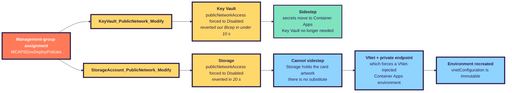
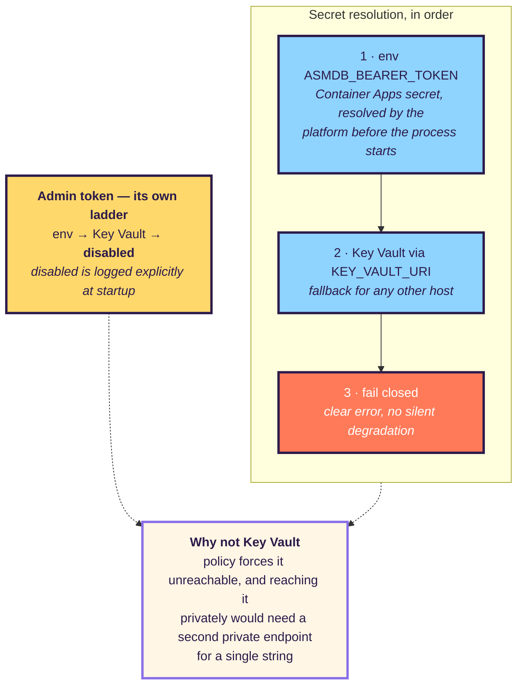
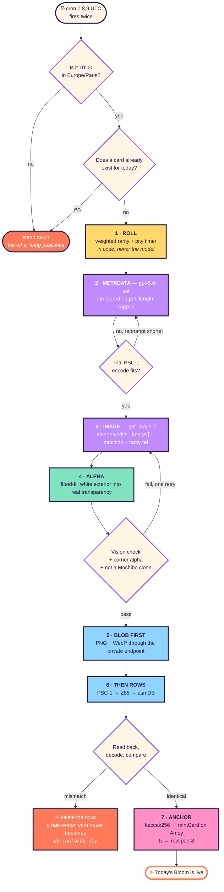
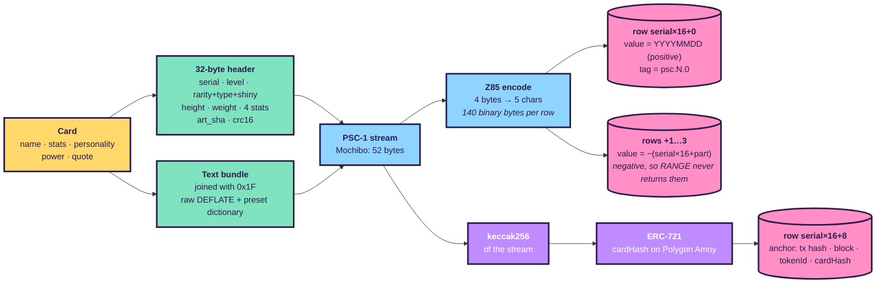
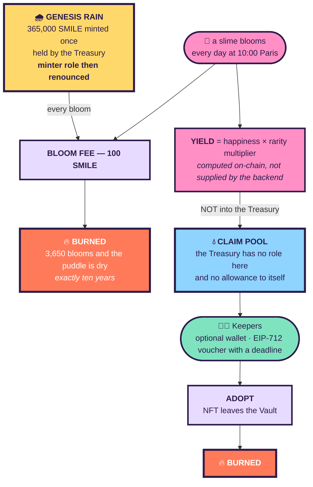
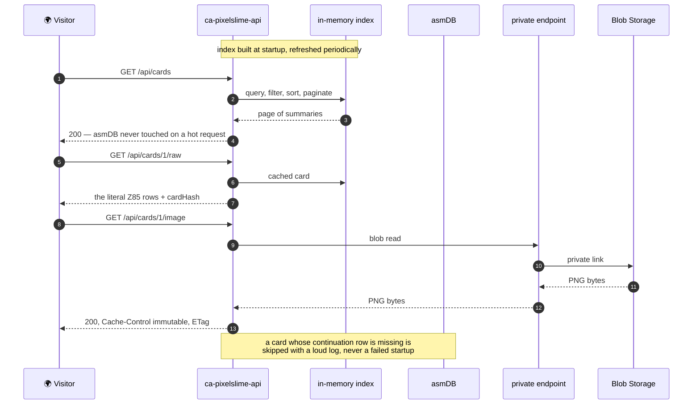

# 🏗️ ARCHITECTURE — PIXELSLIME as actually deployed

> This describes what is **running**, not what was planned. Where the two differ, the difference is
> explained — usually because reality pushed back. [`PLAN.md`](PLAN.md) holds the reasoning;
> [`RUNBOOK.md`](RUNBOOK.md) holds the operations; [`HOWITWORKS.md`](HOWITWORKS.md) follows the
> byte-for-byte data path.
>
> **Live-state checkpoint:** Azure, the public API and Polygon Amoy were queried on **2026-07-29**.
> Where the checked-in source is newer than the active container image, that deployment drift is
> called out explicitly rather than blurred into the architecture.

| | |
|---|---|
| Subscription | `<SUBSCRIPTION_ID>` |
| Resource group | `FGI-ASMDBPIXELSMILES` · `swedencentral` |
| Public site | [`https://www.pixelslime.cloud`](https://www.pixelslime.cloud) · managed certificate · `SniEnabled` |
| Platform FQDN | `ca-pixelslime-api.blackbay-470e05c9.swedencentral.azurecontainerapps.io` |
| Apex domain | `pixelslime.cloud` is present with a disabled binding; its managed certificate is failed |
| Live health | `{"status":"ok","cards":1,"engine":"1.7.0"}` |
| Active image | `crpixelslimededh2k35j5.azurecr.io/pixelslime:v8` |
| Database | asmDB Cloud · `smilesdb` · instance `<ASMDB_INSTANCE>` |
| Chain | Polygon **Amoy** testnet · chain id `80002` |

## Contents

- [1. The whole picture](#1-the-whole-picture)
- [2. Why there is a VNet at all](#2-why-there-is-a-vnet-at-all)
- [3. Where the secrets live](#3-where-the-secrets-live)
- [4. The jobs architecture](#4-the-jobs-architecture)
- [5. How a card is stored in 175 bytes](#5-how-a-card-is-stored-in-175-bytes)
- [6. The chain, and why the fee is real](#6-the-chain-and-why-the-fee-is-real)
- [7. Reading a card, end to end](#7-reading-a-card-end-to-end)
- [8. Azure resource inventory](#8-azure-resource-inventory)
- [9. How to navigate the codebase](#9-how-to-navigate-the-codebase)
- [10. What it costs](#10-what-it-costs)
- [11. Drift, limitations, and deviations](#11-drift-limitations-and-deviations)

---

## 1. The whole picture


The API and both jobs run the **same immutable image** with different entrypoints. The API owns the
public read path; generation owns AI, blob and card-row writes; anchoring owns chain writes. Keeping
anchoring separate means an RPC outage can never roll back or suppress a valid card already stored in
asmDB.

---

## 2. Why there is a VNet at all

The plan had no network. The site is public by design, Container Apps Consumption was enough, and the
whole thing was meant to cost €15–25/month. Two governance policies changed that during deployment.



The two resources are modified by **separate policy definitions under the same assignment**. Azure
Policy reported both resources compliant with the `modify` action, and the live control plane showed
`publicNetworkAccess: Disabled` on each. Only Storage and Key Vault are restricted: ACR Basic,
Application Insights and Log Analytics still accept public traffic, so they need no private
endpoints. Scoping the network to a **single** private endpoint instead of four kept the footprint and
the cost down.

**What was deliberately *not* built.** An API Management gateway was considered and rejected: it fronts
HTTP APIs and does not proxy the Key Vault or Storage data planes, so it would not have unblocked
anything. The Developer SKU also carries no SLA, which would have made a daily-publishing site *less*
reliable, for about €45/month.

---

## 3. Where the secrets live



The bearer **fails closed** — without it the app refuses to start, because an API silently serving an
empty gallery is worse than one that will not boot. The admin token **fails safe** — absent means the
endpoint is disabled, and that state is announced in one explicit log line, because a security control
that turns itself off quietly is worse than one that was never there.

> ⚠️ **Bicep is declarative: a redeploy that omits a secret deletes it.** `deploy.ps1` reads the current
> values back and passes them through, otherwise a routine image bump would unauthenticate the app
> against asmDB and the gallery would quietly go empty.

---

## 4. What happens every day at 10:00 Paris



**Blobs are written before rows, deliberately.** If the upload fails, nothing has reached the database.
An orphan blob is harmless and gets overwritten; an orphan **row** would surface as a broken card.

---

## 5. How a card is stored in 175 bytes



An asmDB row gives **175 bytes of UTF-8 with no NUL, CR or LF** — it is text, not a binary field, which
is why raw bytes cannot simply be written. Z85 was chosen over base64 for density (140 usable bytes
versus 131) and because its alphabet contains no backslash, space or quote, so it cannot collide with
the engine's internal TSV escaping.

| Fixture | Stream | Rows | Widest row |
|---|---:|---:|---:|
| `mochibo` | 52 B | **1** | 65 of 175 |
| a realistic unseen card | 183 B | 2 | 175 |
| every field at its limit, incompressible | 205 B | 2 | 175 |

The largest schema-valid card provably deflates to a 557-byte stream against a 560-byte ceiling, so
**no valid card can overflow**. Chunking is the guarantee; the dictionary is upside.

---

## 6. The chain, and why the fee is real



**The left branch only ever drains a finite purse; the right branch only ever fills a pool that purse
cannot reach.** That separation is what makes the fee real rather than the Treasury paying itself.

Three ways this could have been faked, all closed in code and tested:

| Hole | Why it mattered | Fix |
|---|---|---|
| `admin == treasury` | An admin can `grantRole(MINTER_ROLE, self)` and refill the Rain — the burn becomes theatre | Keys must be distinct; enforced in the constructor **and** re-checked at deploy |
| Voucher had no expiry | A leaked voucher was claimable forever with no way to rotate it out | `deadline` added to the signed tuple |
| Backend supplied the yield amount | A compromised backend key mints unlimited supply | Formula moved on-chain; the job supplies inputs, never payouts |

Simulating all 3,650 blooms in Foundry ends with the Genesis Rain at **exactly zero** and **904,050
SMILE** in existence — all of it earned, none of it decreed. It is a knife-edge: bloom 3,651 reverts,
and a day skipped and never backfilled leaves dust forever. That makes the backfill job structural.

### 6.1 Two tokens, one letter apart

The system deploys **two different tokens**, and confusing them is the easiest mistake to make when
reading a block explorer. They are not variants of each other — they are different standards doing
different jobs.

| | `0xD88928B5…432Baf7f` | `0x0BBaC39B…4B39b798` |
|---|---|---|
| Name | PixelSlime **Card** | PixelSlime **Smile** |
| Symbol | **SLIME** | **SMILE** |
| Standard | **ERC-721** (non-fungible) | **ERC-20** (fungible) |
| Decimals | none — indivisible | 18 |
| What it is | **the cards themselves** | **the money** |
| Supply | one token per slime, ever | 365,660 and growing |
| Mochibo | `SLIME #1`, owned by the Vault | — |

Read it as a card game: **SLIME is the card you hold, SMILE is the coin you spend.** You cannot own
half a Mochibo; you can own half a SMILE.

Both branches of §6 move **SMILE**. The **SLIME** token is what the anchor mints and what adoption
eventually transfers out of the Vault.

> ⚠️ **Known footgun.** `SLIME` and `SMILE` are anagram-adjacent and easy to misread in logs and
> explorer tabs. This is tolerable on a testnet; renaming the NFT symbol to something unmistakable
> (e.g. `PSCARD`) is on the list before any value-bearing deployment.

### 6.2 How the transactions are signed — and why not Key Vault

The design called for an **Azure Key Vault secp256k1 key**, so the private key would never leave the
HSM. `KeyVaultSigner` is written, tested, and still the preferred path — but it **cannot be used in
this subscription**. The `KeyVault_PublicNetwork_Modify` policy at management-group scope forces
`publicNetworkAccess: Disabled` and reverts any change within seconds, and no private endpoint for
Key Vault was provisioned, so its data plane is unreachable from the app.

Amoy therefore signs with a raw key held in a **Container Apps secret**. That is a real reduction in
security, not an equivalent alternative: anyone with RBAC on the container app can read it. It is
acceptable only because these tokens carry no value.

Rather than leave that as a warning comment for a future reader to respect, the limit is enforced:

```python
if settings.chain_id not in TESTNET_CHAIN_IDS:
    raise SignerError("refusing the in-process LocalSigner ...")
```

Pointing this configuration at a value-bearing chain **fails closed**. Restoring the Key Vault path
means adding a private endpoint for the vault — the VNet that §2 already builds makes that a small
change.

### 6.3 Deployed on Polygon Amoy — live addresses

| Contract | Address | Role |
|---|---|---|
| `SmileToken` | [`0x0BBaC39Bf418ab63BF71802808A4C63D4B39b798`](https://amoy.polygonscan.com/token/0x0BBaC39Bf418ab63BF71802808A4C63D4B39b798) | the $SMILE currency |
| `PixelSlimeCard` | [`0xD88928B55CefcAe756e55824a48342cA432Baf7f`](https://amoy.polygonscan.com/token/0xD88928B55CefcAe756e55824a48342cA432Baf7f) | the SLIME cards |
| `ClaimPool` | `0x02a6887730894E39B437eB0A4AB457d98167Fc0f` | burns the fee, mints the yield |
| `SlimeAdoption` | `0x20d6A4F365d00b4d27726f13093Dc2C497473CcA` | spend $SMILE to adopt |

**Invariants read back off the live chain, not asserted from the source:**

| Check | Expected | Actual |
|---|---|---|
| Genesis Rain in Treasury | 365,000 | ✅ 365,000 at deploy |
| Bloom fee | 100 | ✅ 100 |
| Admin can mint $SMILE | **false** | ✅ `false` |
| Treasury can mint $SMILE | **false** | ✅ `false` |
| ClaimPool can mint $SMILE | true | ✅ `true` |

The two `false` rows are the whole point: **the purse that pays the fee cannot print more of it.**

**PS-0001 Mochibo, verified end to end:**

| | Value |
|---|---|
| Mint tx | [`0x6a1c3c6e…bce6260e`](https://amoy.polygonscan.com/tx/0x6a1c3c6e5879851568bcf934b273aa5979f26de6cd9c248043dae133bce6260e) |
| Block | 43,516,915 |
| Owner | the Vault (Treasury) |
| `cardHash` on-chain | `0xe99e4c83…62e7af0a` |
| `cardHash` from the API | `0xe99e4c83…62e7af0a` — **identical** |
| Bloom tx | [`0xa29bcec7…f6276ac7`](https://amoy.polygonscan.com/tx/0xa29bcec720a3d34c5973c07fb3b186345c4343ca25cbe5ce9e202676f6276ac7) |
| Burned | 100 $SMILE (Treasury → `0x0`) |
| Minted | 760 $SMILE (`0x0` → ClaimPool) = happiness 95 × EPIC ×8 |

After that single bloom: Genesis Rain **364,900**, Claim Pool **760**, total supply **365,660**.

---

## 7. Reading a card, end to end



The gallery is served entirely from an in-memory index mirrored to an `index.json` blob. asmDB remains
the **source of truth**; the index is a rebuildable projection. `FIND` and `RANGE` are full scans in the
engine, so keeping them off the hot path is not an optimisation, it is a requirement.

---

## 8. What it costs

| Item | Monthly |
|---|---|
| Container Apps (scale-to-zero) | ~€5–12 |
| Container Apps Job (30 runs) | < €1 |
| **Private endpoint + private DNS zone** | **~€8** |
| Storage (365 PNG/year) | ~€1 |
| ACR Basic | ~€4 |
| Log Analytics + App Insights | ~€3–6 |
| Key Vault (deployed, unused) | < €1 |
| asmDB · Amoy gas | €0 |
| **Total excluding image generation** | **≈ €22–33** |

The VNet itself is free; only the private endpoint carries a charge. Refusing APIM saved roughly
€45/month and avoided putting an SLA-less component in front of a site meant to publish daily.

---

## 9. Deviations from the plan, and why

| Planned | Built | Why |
|---|---|---|
| Key Vault holds the bearer | Container Apps secret | Policy forces the vault unreachable; a private endpoint for one string was not worth it |
| No VNet | VNet + one private endpoint | Storage is also policy-locked, and the card artwork has no substitute |
| `background=transparent` on the model | White exterior + Pillow flood-fill | The parameter is rejected on `/images/edits`, the only endpoint that accepts a reference image |
| Anchor row stores 8-byte hash prefixes | Full 32-byte hashes, version `0x02` | A prefix cannot address a block explorer, which was the row's entire purpose |
| Single-row card | 1–4 chunked rows | The original design needed 143 bytes for 140 bytes of space |
| Companion stored as text | 6-bit `companion_id` in reserved flag bits | The name was unrecoverable from the stream |

---

<div align="center">

*"A slime is a place, a feeling and a friend, squished together."*

</div>
