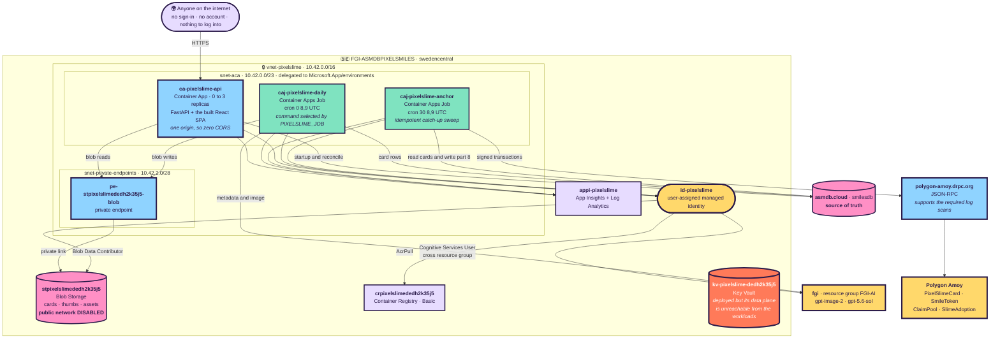
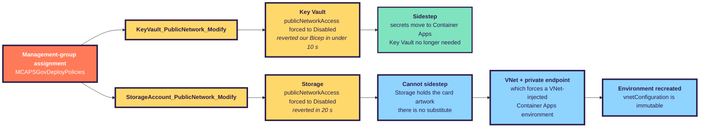
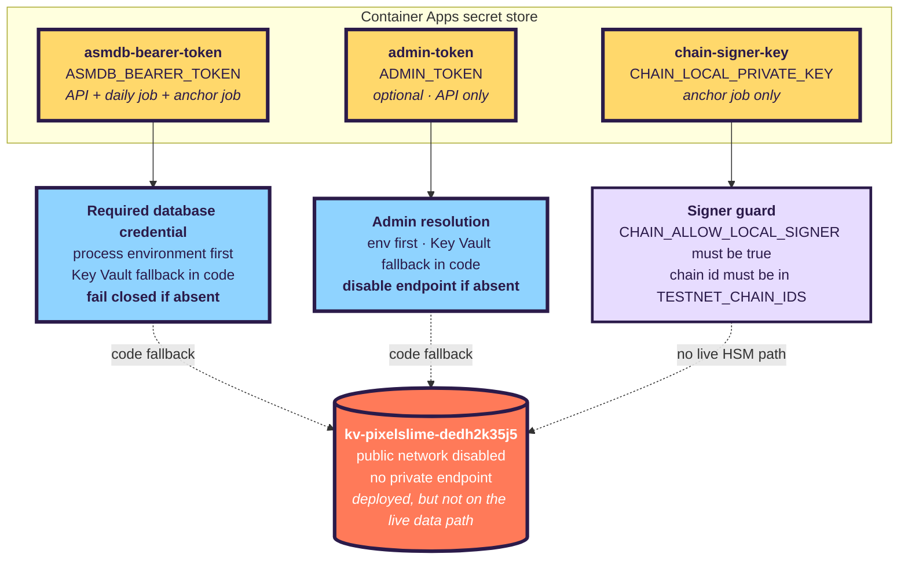
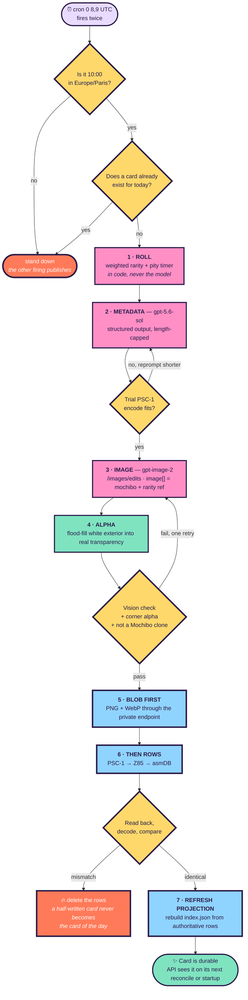
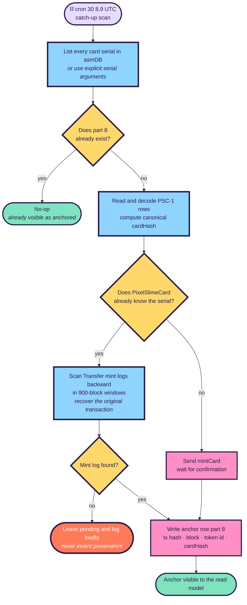
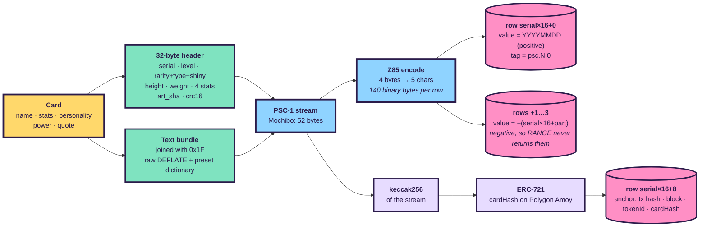
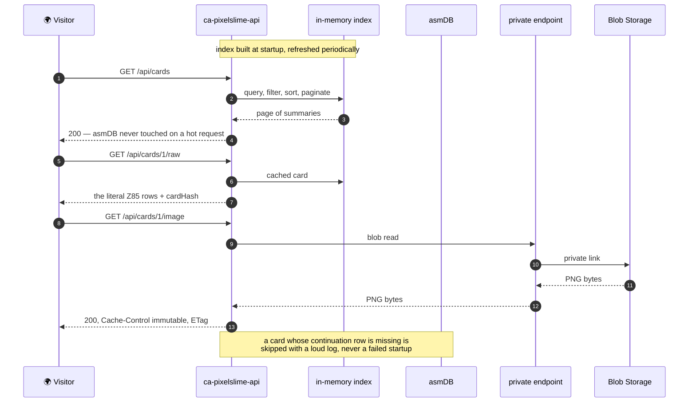

# 🏗️ ARCHITECTURE — PIXELSLIME as actually deployed

> This describes what is **running**, not what was planned. Where the two differ, the difference is
> explained — usually because reality pushed back. [`PLAN.md`](PLAN.md) holds the reasoning;
> [`RUNBOOK.md`](RUNBOOK.md) holds the operations; [`HOWITWORKS.md`](HOWITWORKS.md) follows the
> byte-for-byte data path.
>
> **Live-state checkpoint:** Azure, the public API and Polygon Amoy were queried on **2026-07-29**.
> Where the checked-in source is newer than the active container image, that deployment drift is
> called out explicitly rather than blurred into the architecture.

| | |
|---|---|
| Subscription | `<SUBSCRIPTION_ID>` |
| Resource group | `FGI-ASMDBPIXELSMILES` · `swedencentral` |
| Public site | [`https://www.pixelslime.cloud`](https://www.pixelslime.cloud) · managed certificate · `SniEnabled` |
| Platform FQDN | `ca-pixelslime-api.blackbay-470e05c9.swedencentral.azurecontainerapps.io` |
| Apex domain | `pixelslime.cloud` is present with a disabled binding; its managed certificate is failed |
| Live health | `{"status":"ok","cards":1,"engine":"1.7.0"}` |
| Active image | `crpixelslimededh2k35j5.azurecr.io/pixelslime:v9` |
| Database | asmDB Cloud · `smilesdb` · instance `<ASMDB_INSTANCE>` |
| Chain | Polygon **Amoy** testnet · chain id `80002` |

## Contents

- [1. The whole picture](#1-the-whole-picture)
- [2. Why there is a VNet at all](#2-why-there-is-a-vnet-at-all)
- [3. Where the secrets live](#3-where-the-secrets-live)
- [4. The jobs architecture](#4-the-jobs-architecture)
- [5. How a card is stored in 175 bytes](#5-how-a-card-is-stored-in-175-bytes)
- [6. The chain, and why the fee is real](#6-the-chain-and-why-the-fee-is-real)
- [7. Reading a card, end to end](#7-reading-a-card-end-to-end)
- [8. Azure resource inventory](#8-azure-resource-inventory)
- [9. How to navigate the codebase](#9-how-to-navigate-the-codebase)
- [10. What it costs](#10-what-it-costs)
- [11. Drift, limitations, and deviations](#11-drift-limitations-and-deviations)

---

## 1. The whole picture



The API and both jobs run the **same immutable image** with different entrypoints. The API owns the
public read path; generation owns AI, blob and card-row writes; anchoring owns chain writes. Keeping
anchoring separate means an RPC outage can never roll back or suppress a valid card already stored in
asmDB.

---

## 2. Why there is a VNet at all

The plan had no network. The site is public by design, Container Apps Consumption was enough, and the
whole thing was meant to cost €15–25/month. Two governance policies changed that during deployment.



The two resources are modified by **separate policy definitions under the same assignment**. Azure
Policy reported both resources compliant with the `modify` action, and the live control plane showed
`publicNetworkAccess: Disabled` on each. Only Storage and Key Vault are restricted: ACR Basic,
Application Insights and Log Analytics still accept public traffic, so they need no private
endpoints. Scoping the network to a **single** private endpoint instead of four kept the footprint and
the cost down.

**What was deliberately *not* built.** An API Management gateway was considered and rejected: it fronts
HTTP APIs and does not proxy the Key Vault or Storage data planes, so it would not have unblocked
anything. The Developer SKU also carries no SLA, which would have added a fixed gateway charge while
making a daily-publishing site *less* reliable.

---

## 3. Where the secrets live



The bearer **fails closed** — without it the app refuses to start, because an API silently serving an
empty gallery is worse than one that will not boot. The admin token **fails safe** — absent means the
endpoint is disabled, and that state is announced in one explicit log line, because a security control
that turns itself off quietly is worse than one that was never there.

The chain key is different: it is a raw secp256k1 private key exposed to the anchor process through a
Container Apps secret reference. It is **not an HSM-backed key**. The compensating control is in code:
`build_signer()` permits that path only when it is explicitly enabled and the chain id is one of the
hard-coded testnets.

> ⚠️ **Bicep is declarative: a redeploy that omits a secret deletes it.** For the API and daily-job
> secrets managed by the current template, `deploy.ps1` reads existing values back and passes them
> through. The live anchor job and its signer secret are not represented in that Bicep yet; §8 calls
> out that infrastructure drift.

---

## 4. The jobs architecture

The container image has one multiplexer, `python -m app.jobs`, and **four subcommands**:

| Subcommand | Trigger | Responsibility | Idempotency boundary |
|---|---|---|---|
| `daily` | scheduled steady state | create the card for the current Paris business date | date lookup refuses a second card |
| `backfill START END` | operator | fill an inclusive range of missed dates, rate-limited between image generations | existing dates are skipped |
| `seed` | operator / fresh environment | install the fixed PS-0001 through PS-0004 seed plan | validates and skips matching serials |
| `anchor [SERIAL ...]` | scheduled catch-up or operator | anchor selected serials, or every serial when none are supplied | part-8 row and on-chain `cardHash` probes |

### 4.1 Why `PIXELSLIME_JOB` selects the command

Both Container Apps Jobs keep the template command as `python -m app.jobs`; the subcommand comes from
`PIXELSLIME_JOB`. This is not aesthetic indirection. Starting a Container Apps Job with a command
override replaces the **whole container template** and silently drops its environment variables,
including the asmDB URL and secret references. Selecting through an environment variable preserves
the deployed template and all of its configuration.

### 4.2 Two UTC schedules, one Paris clock

| Live resource | UTC cron | Normal dispatch | Seasonal behaviour |
|---|---|---|---|
| `caj-pixelslime-daily` | `0 8,9 * * *` | intended: `daily` | fires twice; `daily.py` accepts only Paris hour 10 and neutralises the other run |
| `caj-pixelslime-anchor` | `30 8,9 * * *` | `anchor` | fires twice; one run lands 30 minutes after the valid daily run, the other is a harmless backlog sweep |

Container Apps cron is UTC-only. Paris 10:00 is 09:00 UTC in CET and 08:00 UTC in CEST, so a single
fixed UTC schedule cannot express it. The daily guard handles the clock change without editing Azure
twice a year. The anchor job needs no wall-clock guard because scanning already-anchored serials is an
idempotent no-op.

> ⚠️ **Observed live drift on 2026-07-29:** `caj-pixelslime-daily` currently has
> `PIXELSLIME_JOB=seed`, not `daily`, even though the Bicep default is `daily`. Unless reset, its next
> scheduled executions will run the seed plan rather than create the card of the day.

### 4.3 Daily generation and publication



**Blobs are written before rows, deliberately.** If the upload fails, nothing has reached the database.
An orphan blob is harmless and gets overwritten; an orphan **row** would surface as a broken card.
The card is deliberately published **before** chain work begins: an Amoy or RPC failure must not erase
the day's artefact.

### 4.4 Anchoring and self-healing recovery



The dangerous failure window is **after `mintCard` confirms but before asmDB receives part 8**. A mint
cannot be repeated, so retrying the transaction is impossible. `Anchorer.find_mint()` instead searches
the card contract's `Transfer` logs for the zero-address mint, reconstructs the original transaction
hash, block number, token id and on-chain `cardHash`, and writes the missing row. It scans backward over
a default 200,000-block lookback in **900-block windows** because public Amoy RPCs reject wide
`eth_getLogs` ranges. The live job uses `https://polygon-amoy.drpc.org`; the earlier publicnode endpoint
refused the required log calls.

`recordBloom` is deliberately **not** part of `daily`. The active `pixelslime:v9` anchor job now
supplies `CLAIM_POOL_ADDRESS` and constructs `ClaimPoolWriter`, so future fresh anchors also burn the
fee and mint yield. Mochibo's transaction remains manual because it pre-dates that deployment. The
retry/idempotency limitation in §11 still needs hardening.

---

## 5. How a card is stored in 175 bytes



An asmDB row gives **175 bytes of UTF-8 with no NUL, CR or LF** — it is text, not a binary field, which
is why raw bytes cannot simply be written. Z85 was chosen over base64 for density (140 usable bytes
versus 131) and because its alphabet contains no backslash, space or quote, so it cannot collide with
the engine's internal TSV escaping.

| Fixture | Stream | Rows | Widest row |
|---|---:|---:|---:|
| `mochibo` | 52 B | **1** | 65 of 175 |
| a realistic unseen card | 183 B | 2 | 175 |
| every field at its limit, incompressible | 205 B | 2 | 175 |

The largest schema-valid card provably deflates to a 557-byte stream against a 560-byte ceiling, so
**no valid card can overflow**. Chunking is the guarantee; the dictionary is upside.

---

## 6. The chain, and why the fee is real


Within `recordBloom`, **the left branch only ever drains a finite purse and the right branch only ever
fills a pool that purse cannot reach.** Claims can later pay keepers out of the pool, but the Treasury
has no withdrawal path. That separation is what makes the fee real rather than the Treasury paying
itself.

The contracts implement this flow, and `pixelslime:v9` now invokes it from the **anchor job**, after
part 8 is safely written. It is intentionally absent from the daily generation transaction. Mochibo's
`recordBloom` transaction was sent manually because the automation was deployed afterwards.

Three ways this could have been faked, all closed in code and tested:

| Hole | Why it mattered | Fix |
|---|---|---|
| `admin == treasury` | An admin can `grantRole(MINTER_ROLE, self)` and refill the Rain — the burn becomes theatre | the live deploy script rejected equality and role readbacks confirm distinct powers; repository HEAD now also rejects it in the constructor for future deployments |
| Voucher had no expiry | A leaked voucher was claimable forever with no way to rotate it out | `deadline` added to the signed tuple |
| Backend supplied the yield amount | A compromised backend key mints unlimited supply | Formula moved on-chain; the job supplies inputs, never payouts |

Simulating all 3,650 blooms in Foundry ends with the Genesis Rain at **exactly zero** and **904,050
SMILE** in existence — all of it earned, none of it decreed. It is a knife-edge: bloom 3,651 reverts,
and a day skipped and never recorded leaves dust forever. That makes backfill plus bloom recovery
structural once the automated economy path is deployed.

### 6.1 Two tokens, one letter apart

The system deploys **two different tokens**, and confusing them is the easiest mistake to make when
reading a block explorer. They are not variants of each other — they are different standards doing
different jobs.

| | `0xD88928B5…432Baf7f` | `0x0BBaC39B…4B39b798` |
|---|---|---|
| Name | PixelSlime **Card** | PixelSlime **Smile** |
| Symbol | **SLIME** | **SMILE** |
| Standard | **ERC-721** (non-fungible) | **ERC-20** (fungible) |
| Decimals | none — indivisible | 18 |
| What it is | **the cards themselves** | **the money** |
| Supply | one token per anchored slime; no burn path | 365,660 after Mochibo; each bloom changes supply by `yield − 100` |
| Mochibo | `SLIME #1`, owned by the Vault | — |

Read it as a card game: **SLIME is the card you hold, SMILE is the coin you spend.** You cannot own
half a Mochibo; you can own half a SMILE.

Both branches of §6 move **SMILE**. The **SLIME** token is what the anchor mints and what adoption
eventually transfers out of the Vault.

> ⚠️ **Known footgun.** `SLIME` and `SMILE` are anagram-adjacent and easy to misread in logs and
> explorer tabs. This is tolerable on a testnet; renaming the NFT symbol to something unmistakable
> (e.g. `PSCARD`) is on the list before any value-bearing deployment.

### 6.2 How the transactions are signed — and why not Key Vault

The design called for an **Azure Key Vault secp256k1 key**, so the private key would never leave the
HSM. `KeyVaultSigner` is written, tested, and still the preferred path — but it **cannot be used in
this subscription**. The `KeyVault_PublicNetwork_Modify` definition under the management-group
assignment forces `publicNetworkAccess: Disabled` and reverts any change within seconds, and no
private endpoint for Key Vault was provisioned, so its data plane is unreachable from the app.

Amoy therefore signs with a raw key held in a **Container Apps secret**. That is a real reduction in
security, not an equivalent alternative: anyone with RBAC on the container app can read it. It is
acceptable only because these tokens carry no value.

Rather than leave that as a warning comment for a future reader to respect, the limit is enforced:

```python
if settings.chain_id not in TESTNET_CHAIN_IDS:
    raise SignerError("refusing the in-process LocalSigner ...")
```

Pointing this configuration at a value-bearing chain **fails closed**. Restoring the Key Vault path
means adding a private endpoint for the vault — the VNet that §2 already builds makes that a small
change.

### 6.3 Deployed on Polygon Amoy — live addresses

All four addresses contain deployed bytecode. PolygonScan currently labels each contract
**Unverified**, so deployment is proven but explorer source verification is not complete.

| Contract | Address | Role |
|---|---|---|
| `SmileToken` | [`0x0BBaC39Bf418ab63BF71802808A4C63D4B39b798`](https://amoy.polygonscan.com/token/0x0BBaC39Bf418ab63BF71802808A4C63D4B39b798) | the $SMILE currency |
| `PixelSlimeCard` | [`0xD88928B55CefcAe756e55824a48342cA432Baf7f`](https://amoy.polygonscan.com/token/0xD88928B55CefcAe756e55824a48342cA432Baf7f) | the SLIME cards |
| `ClaimPool` | [`0x02a6887730894E39B437eB0A4AB457d98167Fc0f`](https://amoy.polygonscan.com/address/0x02a6887730894E39B437eB0A4AB457d98167Fc0f) | burns the fee, mints the yield |
| `SlimeAdoption` | [`0x20d6A4F365d00b4d27726f13093Dc2C497473CcA`](https://amoy.polygonscan.com/address/0x20d6A4F365d00b4d27726f13093Dc2C497473CcA) | spend $SMILE to adopt |

**Invariants read back off the live chain, not asserted from the source:**

| Check | Expected | Actual |
|---|---|---|
| Genesis Rain in Treasury | 365,000 | ✅ 365,000 at deploy |
| Bloom fee | 100 | ✅ 100 |
| Admin can mint $SMILE | **false** | ✅ `false` |
| Treasury can mint $SMILE | **false** | ✅ `false` |
| ClaimPool can mint $SMILE | true | ✅ `true` |
| Current Treasury balance | 364,900 | ✅ 364,900 |
| Current ClaimPool balance | 760 | ✅ 760 |

The two `false` rows are the whole point: **the purse that pays the fee cannot print more of it.**

**PS-0001 Mochibo, verified end to end:**

| | Value |
|---|---|
| Mint tx | [`0x6a1c3c6e…bce6260e`](https://amoy.polygonscan.com/tx/0x6a1c3c6e5879851568bcf934b273aa5979f26de6cd9c248043dae133bce6260e) |
| Block | 43,516,915 |
| Owner | the Vault (Treasury) |
| `cardHash` on-chain | `0xe99e4c83…62e7af0a` |
| `cardHash` from the API | `0xe99e4c83…62e7af0a` — **identical** |
| Bloom tx | [`0xa29bcec7…f6276ac7`](https://amoy.polygonscan.com/tx/0xa29bcec720a3d34c5973c07fb3b186345c4343ca25cbe5ce9e202676f6276ac7) |
| Burned | 100 $SMILE (Treasury → `0x0`) |
| Minted | 760 $SMILE (`0x0` → ClaimPool) = happiness 95 × EPIC ×8 |

After that single bloom: Genesis Rain **364,900**, Claim Pool **760**, total supply **365,660**.

### 6.4 The zero-RPC economy projection

`backend/app/core/economy.py` mirrors the Solidity rarity multipliers:

| Rarity | COMMON | UNCOMMON | RARE | EPIC | LEGENDARY | MYTHIC |
|---|---:|---:|---:|---:|---:|---:|
| Yield multiplier | 1 | 2 | 4 | 8 | 20 | 100 |

`smile_yield(card)` is therefore just `happiness × multiplier`. Both inputs are already in the
decoded card, so the API can expose a per-card yield and collection totals with **zero chain calls**.
`backend/tests/api/test_economy.py` pins the Python table to the deployed values in
`chain/script/Deploy.s.sol`; `backend/tests/chain/test_claim_pool_writer.py` separately pins Python's
rarity ordinals to Solidity's enum order.

This projection is a **display model, not a ledger**. The chain remains authoritative because a card
can exist before its bloom transaction does. The active `pixelslime:v9` API exposes `smileYield`,
`genesisBurned`, `genesisTotal` and `poolTotal`; the live Mochibo response reports 760, 100, 365,000
and 760 respectively.

### 6.5 The live NFT metadata URI is not healthy yet

The chain returns `https://pixelslime.cloud/api/cards/1` as Mochibo's `tokenURI`. Two independent
problems make that unsuitable for wallets today:

1. the apex `pixelslime.cloud` binding is disabled and its managed certificate is failed; and
2. `/api/cards/1` is the site's card-detail JSON, while the ERC-721 metadata route is `/api/nft/1`.

The `cardHash` commitment is unaffected — it matches asmDB exactly — but wallet metadata resolution is
not complete. `PixelSlimeCard` exposes no external token-URI updater, so PS-0001 itself depends on
making that exact URI useful rather than rewriting it on-chain.

---

## 7. Reading a card, end to end



The gallery is served entirely from an in-memory index mirrored to an `index.json` blob. asmDB remains
the **source of truth**; the index is a rebuildable projection. `FIND` and `RANGE` are full scans in the
engine, so keeping them off the hot path is not an optimisation, it is a requirement.

### 7.1 Projection lifecycle and the startup anchor sweep

| Phase | What happens | Why |
|---|---|---|
| Warm boot | load `index.json`, including any cached anchor objects | serve even while the free asmDB tier wakes |
| Authoritative reconcile | list asmDB serials and add only cards missing from the projection | avoid re-reading the whole collection on every boot |
| Startup sweep | `refresh_unanchored()` re-reads part 8 for up to 256 entries whose cached anchor is absent | discover anchors added after the card was already indexed |
| Five-minute loop | health check, add-only reconcile, `refresh_pending_anchors()`, save `index.json` | fold in new cards without touching asmDB on requests |

The subtlety is that `reconcile()` is **add-only**. Once a card is present, reconcile never re-reads its
anchor row. The earlier `refresh_pending_anchors()` tried to bound the extra work by polling only cards
whose packed `flags.on_chain` bit was true. That hint cannot repair the historical collection:

- Mochibo was encoded before the chain path existed, with the bit clear;
- the current AI pipeline and seed path also explicitly encode `on_chain=False`; and
- the flag is inside the 32-byte PSC-1 header, which is inside the canonical hashed stream.

Flipping it later would change the header, CRC and `cardHash`, so the bytes would no longer match the
commitment already minted on-chain. The part-8 anchor row is therefore the **evidence**; the flag is at
most a hint. `refresh_unanchored()` asks the evidence directly at startup and is capped so a large
historical tail cannot stall the process.

One limitation remains: the periodic loop still uses `refresh_pending_anchors()`, while generated cards
carry the flag clear. A warm replica can therefore keep showing a newly written anchor as pending until
its next process start. Scale-to-zero often causes that restart naturally, but this is not push-based
projection invalidation.

---

## 8. Azure resource inventory

This inventory is the live result of `az resource list` for `FGI-ASMDBPIXELSMILES`, augmented with
the child resources needed to explain the network and platform-generated integrations.

### 8.1 Resources in `FGI-ASMDBPIXELSMILES`

| Type | Exact name | Purpose and observed state | Ownership |
|---|---|---|---|
| Container App | `ca-pixelslime-api` | public FastAPI + built React SPA; 0–3 replicas; active image `pixelslime:v9` | Bicep |
| Container Apps Job | `caj-pixelslime-daily` | cron `0 8,9 * * *`; currently dispatches `seed`, not the Bicep default `daily` | Bicep resource, live config drift |
| Container Apps Job | `caj-pixelslime-anchor` | cron `30 8,9 * * *`; anchors every unanchored serial and now calls ClaimPool; owns the raw-key signer secret | live only; absent from Bicep |
| Container Apps environment | `cae-pixelslime` | external Consumption environment injected into `snet-aca`; not zone-redundant | Bicep |
| Managed certificate | `cae-pixelslime/mc-cae-pixelslime-www-pixelslime-c-1965` | `www.pixelslime.cloud`; `Succeeded`; CNAME validation; bound `SniEnabled` | live domain binding |
| Managed certificate | `cae-pixelslime/mc-cae-pixelslime-pixelslime-cloud-3447` | apex `pixelslime.cloud`; `Failed`; TXT validation; app binding disabled | live domain binding |
| Managed identity | `id-pixelslime` | shared workload identity for ACR, Storage, Azure AI and metrics | Bicep |
| Container Registry | `crpixelslimededh2k35j5` | Basic ACR; admin user off; public network enabled; hosts `pixelslime` images | Bicep |
| Storage account | `stpixelslimededh2k35j5` | private artwork and `index.json`; public network disabled; blob public access off | Bicep, then Azure Policy modifies network state |
| Key Vault | `kv-pixelslime-dedh2k35j5` | RBAC vault with purge protection; public network disabled; unused by live workloads | Bicep, then Azure Policy modifies network state |
| Virtual network | `vnet-pixelslime` | `10.42.0.0/16`; contains delegated `snet-aca` `10.42.0.0/23` and private-endpoint subnet `10.42.2.0/28` | Bicep |
| Private endpoint | `pe-stpixelslimededh2k35j5-blob` | approved Blob private-link connection in `snet-private-endpoints` | Bicep |
| Network interface | `pe-stpixelslimededh2k35j5-blob.nic.b1433fca-e4e8-48c1-b1a9-1951df6ec8aa` | NIC created for the Storage private endpoint | Azure-generated |
| Private DNS zone | `privatelink.blob.core.windows.net` | resolves the Storage blob endpoint to its private address inside the VNet | Bicep |
| Private DNS VNet link | `privatelink.blob.core.windows.net/vnet-pixelslime-link` | links the private zone to `vnet-pixelslime`; registration disabled | Bicep |
| Log Analytics | `log-pixelslime` | 30-day retention; public ingestion and query enabled | Bicep |
| Application Insights | `appi-pixelslime` | workspace-based telemetry and custom job metrics | Bicep |
| Event Grid system topic | `stpixelslimededh2k35j5-2444bfe5-c487-4080-ac39-2a68dae4566b` | Storage-backed topic used by Defender's anti-malware integration | Azure-generated |
| Event Grid subscription | `StorageAntimalwareSubscription` | webhook subscription for BlobCreated and BlobRenamed events | Azure-generated child resource |
| Action group | `Application Insights Smart Detection` | enabled smart-detection notifications through Monitoring role receivers | Azure-generated |

The Storage containers are `cards`, `thumbs` and `assets`, declared in
`infra/modules/storage.bicep`. A direct `az storage container list` from the operator shell was blocked
by the account's network rules, which is consistent with the live private-only data plane.

### 8.2 Effective RBAC for `id-pixelslime`

| Assignment id | Role | Scope |
|---|---|---|
| `aaf3c504-7ed1-5c33-a472-6f7196740a9d` | AcrPull | `crpixelslimededh2k35j5` |
| `07a1a35b-8be8-5e7a-b48f-338bac542476` | Storage Blob Data Contributor | `stpixelslimededh2k35j5` |
| `2a9d1b53-dd9a-5151-9382-8cb7aed9021a` | Monitoring Metrics Publisher | `appi-pixelslime` |
| `3c5e6c70-fda1-5213-8c13-026d123a10b9` | Key Vault Secrets User | `kv-pixelslime-dedh2k35j5` — retained but unusable without a data-plane route |
| `ce065b5d-c3c3-59b7-a7f8-e1e7cf44f09e` | Cognitive Services User | cross-resource-group scope on `FGI-AI/fgi` |

### 8.3 External dependencies

| Dependency | Exact target | Use |
|---|---|---|
| Azure AI Services | `FGI-AI/fgi` in `swedencentral` | `gpt-5.6-sol` metadata and `gpt-image-2` illustration generation through managed identity |
| asmDB Cloud | `https://www.asmdb.cloud/db/<ASMDB_INSTANCE>` · database `smilesdb` | authoritative card rows under the 175-byte content limit |
| Polygon RPC | `https://polygon-amoy.drpc.org` | Amoy transaction submission, receipts, contract reads and bounded log scans |
| Polygon Amoy | chain id `80002` · four addresses in §6.3 | immutable card fingerprints and the testnet economy |

### 8.4 Infrastructure-as-code drift

`infra/main.bicep` still creates **one** Container Apps Job and has no custom-domain resources. The
live anchor job, its chain environment variables and signer secret, both managed certificates, and the
domain bindings were created outside that template. ARM incremental deployment will not delete the
anchor job merely because it is absent, but it also will not reproduce or repair it. A competent
disaster-recovery run therefore needs the live inventory above, not Bicep alone.

---

## 9. How to navigate the codebase

| Path | What lives there | Read next |
|---|---|---|
| `backend/app/main.py` | FastAPI assembly, lifespan, index bootstrap, periodic reconcile, SPA mount | §7 · [`HOWITWORKS.md`](HOWITWORKS.md) |
| `backend/app/api/` | card, media, health, stats, NFT metadata and admin routes; middleware and error envelopes | [`contracts/openapi.yaml`](../contracts/openapi.yaml) |
| `backend/app/core/` | settings, secrets, index projection, serialization, economy mirror, time and rate limiting | §§3, 6.4, 7 |
| `backend/app/codec/` | canonical PSC-1 header, DEFLATE dictionary, Z85, CRC and keccak256 | §5 · [`CODEC.md`](CODEC.md) |
| `backend/app/asmdb/` | asmDB HTTP client, engine models and row repository | [`HOWITWORKS.md`](HOWITWORKS.md) |
| `backend/app/ai/` | rarity roll, structured metadata, image edit, post-processing and verification | §4 · [`PLAN.md`](PLAN.md) |
| `backend/app/jobs/` | `daily`, `backfill`, `seed`, `anchor`, shared persistence and production wiring | §4 · [`RUNBOOK.md`](RUNBOOK.md) |
| `backend/app/chain/` | signer selection, card anchoring, mint recovery, anchor-row codec and ClaimPool writer | §6 · [`HOWITWORKS.md`](HOWITWORKS.md) |
| `backend/app/storage/` | private Azure Blob reads/writes and `index.json` persistence | §§2, 7 |
| `frontend/src/api/` | generated API schema, typed client and response types | [`contracts/openapi.yaml`](../contracts/openapi.yaml) |
| `frontend/src/design/` | design tokens, reusable kawaii components, motion and accessibility hooks | [`contracts/design-tokens.json`](../contracts/design-tokens.json) |
| `frontend/src/pages/` | Today, Dex, Profile, Lab, Bank, Design and not-found route screens | [`EASYLEARN.md`](EASYLEARN.md) |
| `frontend/src/components/` | application shell, navigation, loading/error states and image fallback | [`EASYLEARN.md`](EASYLEARN.md) |
| `frontend/src/store/`, `lib/`, `mocks/` | local discovery/settings state, helpers and MSW development data | [`PLAN.md`](PLAN.md) |
| `chain/src/` | the four Solidity contracts plus shared rarity definitions | §6 · [`PLAN.md`](PLAN.md) |
| `chain/script/`, `chain/deployments/` | Foundry deployment wiring and the checked-in Amoy address manifest | §6.3 · [`RUNBOOK.md`](RUNBOOK.md) |
| `chain/test/` | contract invariants, 3,650-bloom simulation and adoption tests | §6 |
| `contracts/` | binding card schema, OpenAPI, design tokens, lookups and canonical card fixtures | [`AGENTS.md`](AGENTS.md) |
| `infra/` | Bicep modules and deployment wrapper for the Azure estate | §8 · [`RUNBOOK.md`](RUNBOOK.md) |
| `scripts/` | contract validation, row verification, dictionary build and asset cleanup | [`CODEC.md`](CODEC.md) |
| `tests/e2e/` | real frontend against real backend, including accessibility and contract checks | [`RUNBOOK.md`](RUNBOOK.md) |

---

## 10. What it costs

These are the project's existing **planning estimates**, not a live Cost Management export. The second
scheduled job has been added since the original total was written, so publishing a newly precise total
without billing data would be invented precision.

| Item | Planning estimate or observed shape |
|---|---|
| Container App, scale-to-zero | ~€5–12 per month |
| Container Apps Jobs | two jobs, up to four scheduled starts per day; no measured cost split yet |
| Private endpoint + private DNS zone | ~€8 per month |
| Storage for 365 PNGs per year | ~€1 per month |
| ACR Basic | ~€4 per month |
| Log Analytics + Application Insights | ~€3–6 per month |
| Key Vault, deployed but unused | < €1 per month |
| asmDB and Amoy gas | €0 in the current free/testnet setup |
| AI image generation | excluded; usage-dependent |

The VNet itself is free; the private endpoint is the meaningful network charge. Refusing APIM avoided
a separate fixed gateway charge and avoided putting an SLA-less component in front of a site meant to
publish daily.

---

## 11. Drift, limitations, and deviations

### 11.1 Honest live limitations

| Area | Reality on 2026-07-29 | Consequence |
|---|---|---|
| Daily dispatch | `caj-pixelslime-daily` has `PIXELSLIME_JOB=seed` | the named daily resource will not run `daily` until reset |
| Bloom accounting | `recordBloom` is wired into the v9 anchor job, not `daily`; Mochibo's earlier bloom was manual | future blooms are automatic after anchoring, subject to the retry flaw below |
| Chain key custody | raw secp256k1 key in Container Apps secret `chain-signer-key` | no HSM boundary; acceptable only under the enforced testnet guard |
| Apex domain | `pixelslime.cloud` binding disabled; managed certificate failed | only `www.pixelslime.cloud` and the platform FQDN serve valid HTTPS |
| NFT metadata | PS-0001 points to the unbound apex and `/api/cards/1`, not `/api/nft/1` | provenance works, wallet metadata does not |
| IaC coverage | anchor job and domains are absent from Bicep | redeploying the repository alone cannot reconstruct the live estate |
| Index propagation | startup sweeps all unanchored entries; warm-loop polling trusts a flag that generated cards leave clear | a new anchor may remain visually pending until process restart |

> ⚠️ **Automatic `recordBloom` is enabled, but its retry key still needs hardening.** The source writes part 8 before
> calling the pool, then returns immediately on any later run that sees part 8. A failed bloom is
> therefore logged but not retried by the scheduled job. `ClaimPoolWriter.already_recorded()` also uses
> `yieldByCard(serial) > 0`; a schema-valid zero-happiness card mints zero yield, so that test cannot
> distinguish “recorded” from “never recorded” even though the 100-SMILE burn still occurred.

### 11.2 Deviations from the plan, and why

| Planned | Built | Why |
|---|---|---|
| Key Vault holds the bearer | Container Apps secret | Policy forces the vault unreachable; a private endpoint for one string was not worth it |
| Key Vault signs chain transactions | raw key in an anchor-job Container Apps secret, testnets only | the vault data plane is unreachable; `TESTNET_CHAIN_IDS` makes the concession fail closed |
| No VNet | VNet + one private endpoint | Storage is also policy-locked, and the card artwork has no substitute |
| generation and anchoring are one transaction-like flow | separate generation and anchor jobs | chain failure must never roll back a valid asmDB card |
| `background=transparent` on the model | White exterior + Pillow flood-fill | The parameter is rejected on `/images/edits`, the only endpoint that accepts a reference image |
| Anchor row stores 8-byte hash prefixes | Full 32-byte hashes, version `0x02` | A prefix cannot address a block explorer, which was the row's entire purpose |
| Single-row card | 1–4 chunked rows | The original design needed 143 bytes for 140 bytes of space |
| Companion stored as text | 6-bit `companion_id` in reserved flag bits | The name was unrecoverable from the stream |

---

<div align="center">

*"A slime is a place, a feeling and a friend, squished together."*

</div>
