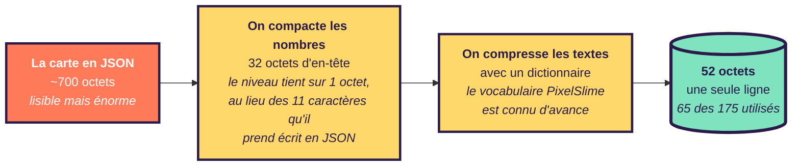
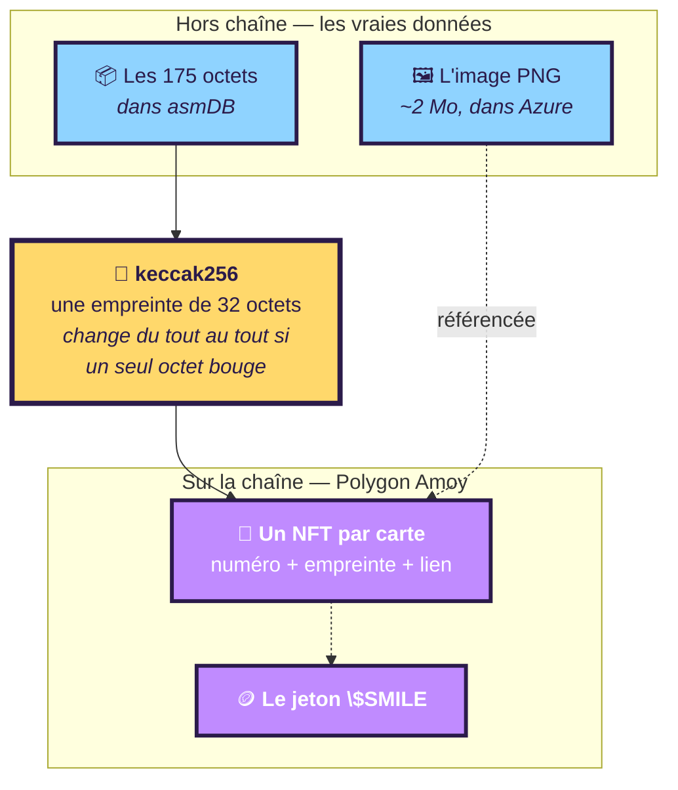

# 🫧 EASYLEARN — PixelSlime expliqué simplement

> Où est l'application, où est la blockchain, et comment tout ça marche.
> Pas de jargon inutile. Pour le détail technique : [`ARCHI.md`](ARCHI.md) et [`PLAN.md`](PLAN.md).

---

## En une phrase

**Chaque jour à 10h00 heure de Paris, une intelligence artificielle dessine une carte de collection
unique, la range dans une base de données minuscule, et en grave l'empreinte sur une blockchain.**

Personne ne clique sur rien. Ça tourne tout seul.

---

## 1. Où est l'application ?

| Quoi | Où | À quoi ça sert |
|---|---|---|
| **Le site web** | `www.pixelslime.cloud` | Ce que tu vois : la carte du jour, la galerie, la fiche de chaque slime |
| **Le cerveau** | Azure Container Apps, à Stockholm | Sert le site **et** l'API. Un seul programme, une seule adresse |
| **Les images** | Azure Blob Storage | Les PNG des cartes, ~2 Mo chacun |
| **Les données** | asmDB Cloud (`smilesdb`) | Le nom, les stats, le pouvoir… en **175 octets par carte** |
| **Le réveil** | Azure Container Apps Job | Se lève deux fois par jour, ne travaille qu'à 10h Paris |
| **La blockchain** | Polygon Amoy (réseau de test) | L'empreinte de chaque carte, pour prouver qu'elle existait |

Tout est dans un seul groupe de ressources Azure : `FGI-ASMDBPIXELSMILES`.

---

## 2. Ce qui se passe chaque matin

```mermaid
flowchart LR
    A(["⏰ 10h00<br/>Paris"]) --> B["🎲 On tire<br/>la rareté"]
    B --> C["✍️ L'IA écrit<br/>la carte"]
    C --> D["🎨 L'IA dessine<br/>la carte"]
    D --> E["🔍 On vérifie<br/>que ça colle"]
    E --> F["💾 On range<br/>l'image + les données"]
    F --> G["🔗 On grave<br/>l'empreinte"]
    G --> H(["✨ La carte<br/>est en ligne"])

    classDef t fill:#FFF6E5,stroke:#2B1B4A,stroke-width:3px,color:#2B1B4A
    classDef c fill:#FFD86B,stroke:#2B1B4A,stroke-width:3px,color:#2B1B4A
    classDef a fill:#C08BFF,stroke:#2B1B4A,stroke-width:3px,color:#FFFFFF
    classDef v fill:#7FE3C0,stroke:#2B1B4A,stroke-width:3px,color:#2B1B4A
    classDef s fill:#8FD3FF,stroke:#2B1B4A,stroke-width:3px,color:#2B1B4A
    classDef k fill:#FF8FC5,stroke:#2B1B4A,stroke-width:3px,color:#2B1B4A
    classDef o fill:#FFF6E5,stroke:#FF7A59,stroke-width:4px,color:#2B1B4A

    class A t
    class B c
    class C,D a
    class E v
    class F s
    class G k
    class H o
```

**Le détail qui compte** : la rareté est tirée **par le programme**, pas par l'IA. Sinon le modèle
ferait des cartes légendaires tous les jours parce que c'est plus amusant à écrire. Le programme
tire : 45 % de communes, 27 % de peu communes… et 0,5 % de mythiques.

Et si la carte dessinée ne correspond pas aux données écrites, **elle est refaite**. Une carte qui
annonce « niveau 12 » alors que la base dit 14 ne sera jamais publiée.

---

## 3. Le truc bizarre : 175 octets

La base de données choisie, **asmDB**, a une contrainte inhabituelle : chaque ligne ne peut contenir
que **175 caractères de texte**. Pas 175 kilo-octets. 175 octets.

Une carte complète — nom, personnalité, pouvoir, description, citation, plus une douzaine de nombres —
c'est normalement **700 octets** de JSON. Il fallait diviser par quatre.

**Mochibo, la première carte, occupe 65 octets sur les 175 disponibles.** Une carte bavarde en prend
deux lignes. Le système en accepte quatre au maximum, donc il y a de la marge.

Sur le site, la fiche de chaque slime affiche ces octets bruts — c'est le panneau **« THE 175 BYTES »**.
Ce n'est pas de la décoration : c'est littéralement ce qui est stocké.

---

## 4. Où est la blockchain, et à quoi elle sert

### Ce qui est sur la blockchain

**Pas l'image. Pas les données.** Seulement leur **empreinte** — 32 octets calculés à partir des
175 octets stockés.

Pourquoi ? Parce qu'écrire 2 Mo sur une blockchain coûterait une fortune et n'apporterait rien.
L'empreinte, elle, suffit à **prouver** qu'une carte donnée existait, telle quelle, ce jour-là.

Si quelqu'un modifiait Mochibo dans la base — ne serait-ce qu'une lettre — l'empreinte recalculée
ne correspondrait plus à celle gravée. La fraude serait visible immédiatement.

> C'est l'idée que j'aime le plus dans ce projet : **la contrainte des 175 octets est devenue la
> fonctionnalité.** Ces octets compacts sont exactement ce qu'on peut se permettre de graver.

### Le jeton $SMILE, en trois phrases

Au départ, une réserve **finie** de 365 000 $SMILE : la *Genesis Rain*. Chaque carte publiée en
**brûle 100** — et cette réserve n'est **jamais** rechargée. Au bout de **3 650 cartes, soit
exactement dix ans**, elle est vide.

En parallèle, chaque carte **crée** du $SMILE proportionnel à son bonheur et à sa rareté — mais dans
une **caisse séparée** que la réserve ne peut pas toucher. C'est ce qui rend la taxe réelle : celui
qui paie et celui qui gagne ne sont jamais la même poche.

*(Un piège avait été évité de justesse : dans la version papier, le Trésor était aussi administrateur
du contrat — il pouvait donc se recréer des jetons et vider la garantie de son sens. Les deux clés
sont maintenant obligatoirement distinctes.)*

---

## 5. Ce qui tourne aujourd'hui, et ce qui ne tourne pas encore

| | État |
|---|---|
| 🟢 Le site | **En ligne**, public, sans compte ni mot de passe |
| 🟢 La base | **Mochibo (PS-0001) est dedans**, vérifié octet par octet |
| 🟢 L'image | Dans Azure, liée à la carte par empreinte |
| 🟢 Le job quotidien | **Armé** — se déclenchera demain à 10h00 Paris |
| 🟡 Le domaine | `www.pixelslime.cloud` branché, certificat en cours |
| 🔴 La blockchain | **Contrats écrits et testés, pas encore déployés** |

### Pourquoi la blockchain n'est pas encore active

Tout le code existe : quatre contrats, 46 tests, une simulation des 3 650 cartes qui vide la réserve
à zéro exactement. Mais le déploiement demande deux choses que le programme ne peut pas décider seul :

1. **Choisir les clés.** La clé administrateur doit être différente de la clé Trésor, sinon toute la
   garantie économique s'effondre.
2. **Des jetons de test.** Amoy est un réseau d'essai ; il faut demander des jetons gratuits à un
   robinet public, ce qui passe par un formulaire humain.

C'est écrit pas à pas dans [`RUNBOOK.md`](RUNBOOK.md).

---

## 6. Trois choses qui n'ont pas marché comme prévu

Elles valent d'être connues, parce qu'elles expliquent pourquoi l'architecture a la forme qu'elle a.

**Le fond transparent.** Le modèle d'image refuse de produire de la transparence sur l'endpoint qui
accepte une image de référence. Solution : lui demander un fond blanc uni, puis découper ce blanc
nous-mêmes. Et l'outil qui fait ce découpage est **exactement celui écrit au départ pour nettoyer
l'image d'exemple** — l'outil d'entrée est devenu l'outil de sortie.

**Le coffre-fort inaccessible.** Une règle de sécurité de l'entreprise interdit l'accès public aux
coffres à secrets *et* aux espaces de stockage. Le mot de passe de la base a donc déménagé ailleurs,
et il a fallu construire un réseau privé pour atteindre les images — ce qui a obligé à recréer
l'environnement complet.

**Deux façons de trouver un fichier.** Deux parties du programme cherchaient le même fichier de deux
manières différentes. L'une remontait l'arborescence jusqu'à le trouver, l'autre comptait les dossiers
en dur. La première a survécu à la mise en conteneur, la seconde non — et ça n'a été visible qu'au
premier vrai déploiement.

---

**« Un slime, c'est un lieu, une émotion et un ami, écrasés ensemble. »**

