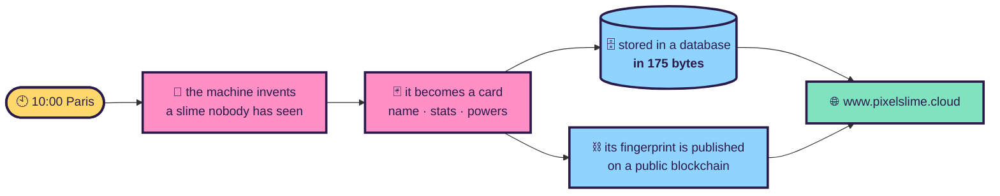
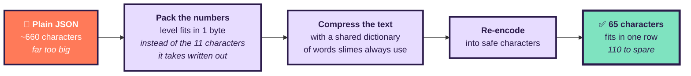
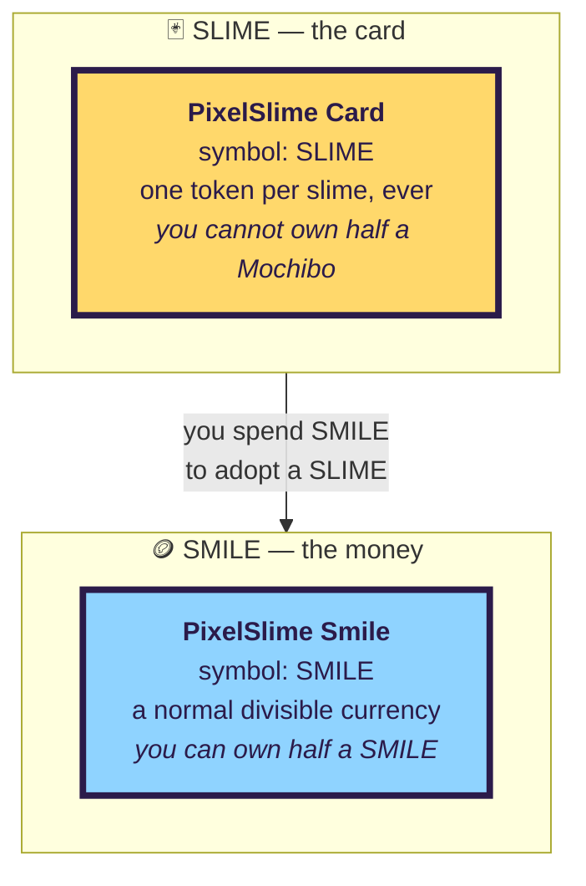
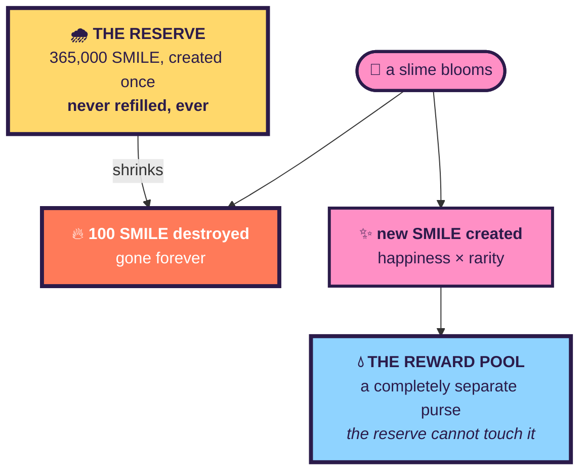

# 🍡 EASYLEARN — PIXELSLIME explained without jargon

> Where the site lives, where the blockchain lives, and how the whole thing works —
> written for someone who has never deployed anything.
>
> For the engineering detail, read [`ARCHITECTURE.md`](ARCHITECTURE.md) and
> [`HOWITWORKS.md`](HOWITWORKS.md). This page is the plain-language version.

---

## 1. What PIXELSLIME actually is

Every day at **10:00 Paris time**, a machine wakes up and invents **one** creature that has never
existed. It writes its name, its personality, its powers. It draws it. It puts it on a trading card.
Then it goes back to sleep for a day.

Nobody chooses the creature. Nobody approves it. There is exactly one per day, forever, and once a
day is gone it never comes back.

---

## 2. Where everything lives

| Thing | Where | Address |
|---|---|---|
| 🌐 The website | Microsoft Azure, Sweden | **https://www.pixelslime.cloud** |
| 🗄️ The card data | asmDB Cloud (external service) | `asmdb.cloud` |
| 🖼️ The images | Azure private storage | reachable only through the site |
| ⛓️ The blockchain | **Polygon Amoy** (a public test network) | see §5 |
| 🔑 The secrets | Container Apps secrets | never in the code |

The site is **public**. No account, no password, no cookie, no tracking. There is nothing to log in
to, which is also why there is no personal data to lose.

---

## 3. The 175-byte constraint — the most unusual part

The database has one hard rule: **each row can hold at most 175 characters of text.**

A card written normally — as plain JSON — takes about **660 characters**. Nearly four times too much.

So the card is compressed:

Mochibo, the first slime, takes **65 of the 175 characters**. And we proved mathematically that the
largest card the rules permit still fits — so no future slime can ever overflow.

---

## 4. Two tokens, one letter apart — SLIME vs SMILE

This trips everyone up, so it deserves its own section.

There are **two** things on the blockchain, and they are not versions of each other:

| | SLIME | SMILE |
|---|---|---|
| What it is | **the cards themselves** | **the money** |
| Standard | ERC-721 (like a numbered painting) | ERC-20 (like coins in a wallet) |
| Divisible? | ❌ no | ✅ yes, to 18 decimals |
| How many | one per slime — 3,650 maximum | 365,660 today, and it grows |
| Mochibo | is `SLIME #1` | — |

**Think of a card game: SLIME is the card you hold, SMILE is the coin you spend.**

> ⚠️ The two names are one letter apart, which is genuinely easy to misread on a block explorer.
> That is a naming mistake worth correcting before this is ever used with real money.

---

## 5. How the money works

Two things happen every time a slime blooms, and they pull in **opposite directions**:

**The reserve only ever shrinks.** 365,000 ÷ 100 per card = **3,650 cards = exactly ten years.** When
it reaches zero, no more slimes can ever bloom. That deadline is not a policy anyone can change; it is
arithmetic baked into the contract.

**The reward pool only ever grows.** Each card creates new SMILE using this formula:

> **new SMILE = happiness × rarity multiplier**

| Rarity | COMMON | UNCOMMON | RARE | EPIC | LEGENDARY | MYTHIC |
|---|---|---|---|---|---|---|
| multiplier | ×1 | ×2 | ×4 | ×8 | ×20 | ×100 |

**Mochibo** — happiness 95, EPIC (×8) — created **760 SMILE**, while 100 were destroyed.

### Why the two purses must be separate

This is the single most important rule in the whole system:

> **The one who pays and the one who earns are never the same purse.**

If the reserve could create new SMILE, it would simply refill itself and the "cost" would be a
pretence. So the contract forbids it, and we checked on the live chain rather than trusting the code:

| Question | Answer |
|---|---|
| Can the administrator create SMILE? | ❌ **No** |
| Can the reserve create SMILE? | ❌ **No** |
| Can *anything* create SMILE? | ✅ Only the reward pool |

During development this protection was found to be **fake**: the administrator and the reserve were
the same key, so the administrator could have granted itself permission and refilled the reserve. It
now uses two separate keys, and the deployment script **refuses to run** if they are ever the same.

---

## 6. What is running today

| | Status |
|---|---|
| 🟢 The website | **Live**, public, no account needed |
| 🟢 The database | **Mochibo (PS-0001) is in it**, verified byte by byte |
| 🟢 The image | In Azure, tied to the card by fingerprint |
| 🟢 The blockchain | **Deployed on Polygon Amoy**, 4 contracts live |
| 🟢 Mochibo on-chain | Minted, owned by the Vault, fingerprint matches exactly |
| 🟢 The daily job | Armed — fires at 10:00 Paris |
| 🟢 `www.pixelslime.cloud` | Live with HTTPS |
| 🟡 `pixelslime.cloud` (no www) | Not yet attached |

**Mochibo, verified end to end:**

| | |
|---|---|
| Mint transaction | [`0x6a1c3c6e…bce6260e`](https://amoy.polygonscan.com/tx/0x6a1c3c6e5879851568bcf934b273aa5979f26de6cd9c248043dae133bce6260e) |
| Bloom transaction | [`0xa29bcec7…f6276ac7`](https://amoy.polygonscan.com/tx/0xa29bcec720a3d34c5973c07fb3b186345c4343ca25cbe5ce9e202676f6276ac7) |
| Fingerprint in the database | `0xe99e4c83…62e7af0a` |
| Fingerprint on the blockchain | `0xe99e4c83…62e7af0a` — **identical** |

That last pair is the whole promise: the card in the database and the card on the blockchain are
provably the same card. Change one letter of Mochibo's name and the two would no longer match.

---

## 7. Four things that did not go as planned

These are worth knowing, because they explain why the architecture looks the way it does.

**The transparent background.** The image model refuses to produce transparency on the endpoint that
accepts a reference image. The fix: ask for a plain white background and cut the white out ourselves.
The tool that does the cutting is **exactly the tool originally written to clean up the example
image** — the entry tool became the exit tool.

**The locked vault.** A company-wide security rule forbids public access to secret vaults *and* to
storage accounts, and it undoes any change within seconds. The database password had to move
elsewhere, and a private network had to be built to reach the images — which forced rebuilding the
whole hosting environment. It also means the blockchain key is stored less securely than intended, so
the code now **refuses to sign on any chain where the money is real**.

**The lost mint.** A card was successfully published to the blockchain, and then the program stopped
before it could write that fact to the database. Publishing cannot be repeated, so the card was
stranded: provably on the blockchain, invisible to the site, with no way back. The program now knows
how to go and read its own past transactions to recover.

**Polygon speaks slightly differently.** The blockchain library rejected every single block, because
Polygon's blocks carry more identifying data than the library expects. Testing had used a simulated
chain that does not have this quirk — so it could only ever have been found against the real thing.

---

## 8. What happens next

1. Each morning at 10:00 Paris a new slime blooms, automatically
2. Shortly after, its fingerprint is published to the blockchain, automatically
3. When enough cards exist, people will be able to earn SMILE and spend it to adopt slimes

Nobody has to do anything for step 1 or 2. That is the point.

---

*PIXELSLIME · one slime a day, forever · 175 bytes of pure joy*
