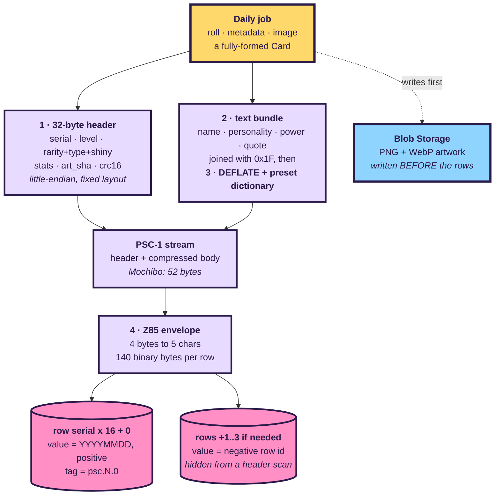
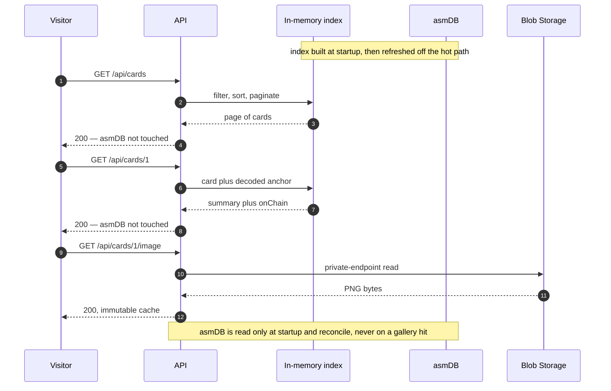
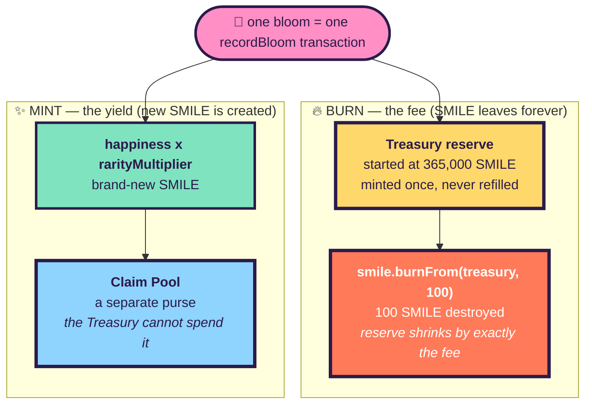
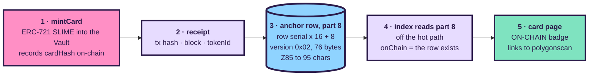

# ⚙️ HOWITWORKS — the asmDB data flow and the blockchain

> How a card travels from the daily job into the **asmDB** database and back out to
> the website, and how the **Polygon Amoy** blockchain fits underneath it.
>
> This page is the *data-path* companion to [`ARCHITECTURE.md`](ARCHITECTURE.md) (the
> deployed infrastructure) and [`EASYLEARN.md`](EASYLEARN.md) (the plain-language
> version). The normative row format lives in [`CODEC.md`](CODEC.md); operations live
> in [`RUNBOOK.md`](RUNBOOK.md). Where this document quotes a number, it comes from the
> code cited beside it.

PIXELSLIME publishes **one** AI-illustrated collectible creature card per day at
**10:00 Europe/Paris**. Each card is squeezed into the external **asmDB Cloud**
database — which allows only **175 bytes of text per row** — and a cryptographic
fingerprint of the card is anchored on **Polygon Amoy**. The public site is
**https://www.pixelslime.cloud**.

There are two data paths, and this document is built around them:

| Pillar | Question it answers | Where the truth lives |
|---|---|---|
| **A · asmDB** | How does a 660-character card survive in a 175-byte row, and how is it read back fast? | asmDB rows are the **source of truth** |
| **B · the chain** | How is a card anchored, and how does the **SMILE** economy burn and mint? | the four Amoy contracts are the **source of truth** |

---

# Pillar A · The asmDB data flow 🗄️

## A.1 The 175-byte wall that dominates the design

An asmDB row hands us exactly **175 bytes of UTF-8 text** for its `content` field, and
that text may contain **no NUL, no CR and no LF** — the limit and the forbidden bytes
are enforced by the service itself, not by us (`CODEC.md` §1; the guard is re-asserted
in `backend/app/codec/codec.py` `_guard_content`, `CONTENT_MAX_BYTES = 175`).

Two facts fall straight out of that single constraint, and between them they explain
almost every decision in the codec:

1. **`content` is text, not a binary blob.** Raw card bytes would contain `0x00` and
   invalid UTF-8 the moment you compressed anything, so a *text envelope is mandatory*.
2. **One row is not enough.** A whole trading card written as plain JSON runs to
   roughly **660 characters** (`EASYLEARN.md` §3) — nearly four rows — so a card is
   stored as a short, arithmetically-addressed **run of rows**, not a single value.

The job of the **PSC-1 codec** is to get a card small enough that the *median* card
fits in **one** row, and to guarantee that even the largest legal card fits in **four**.

## A.2 PSC-1 — 660 characters down to 65

PSC-1 is the card codec (`backend/app/codec/`, specified normatively in `CODEC.md`).
It runs four transformations, in order:

| Step | What it does | Why it matters |
|---|---|---|
| **1 · Pack the header** | 20-plus numeric fields → a fixed **32-byte** binary header, little-endian | `level`, `rarity`, `type`, four stats, `art_sha`, `crc16`… each becomes 1–4 bytes instead of the many characters they take written out (`CODEC.md` §3.1) |
| **2 · Bundle the text** | the five free-form strings joined with a single `0x1F` separator | `name · personality · power_name · power_desc · quote` in a frozen order (`CODEC.md` §3.6) |
| **3 · Compress** | raw **DEFLATE** with a **preset dictionary** primed on the PixelSlime vocabulary | on strings this short DEFLATE alone barely helps; the dictionary typically saves 35–50% and is what lets the median card fit one row (`codec.py` `_deflate`, `CODEC.md` §3.6) |
| **4 · Envelope in Z85** | the binary stream → text, **4 bytes to 5 characters** | Z85's 85-symbol alphabet has no backslash, space, quote, CR, LF or NUL, so it is safe against asmDB's rules and its internal TSV escaping (`backend/app/codec/z85.py`, `CODEC.md` §2) |

The result is the **PSC-1 stream**: a 32-byte header followed by the compressed body.
`card_hash(card)` — the value that gets anchored on-chain — is `keccak256` of exactly
this stream, never of the JSON, because JSON key order is not canonical
(`codec.py` `encode_stream` / `card_hash`).

> **Concrete measurement.** Mochibo (PS-0001) encodes to a **52-byte** stream. Z85 turns
> 52 bytes into `52 / 4 × 5 = ` **65 characters** — using **65 of the 175** bytes a row
> allows, leaving 110 to spare (`CODEC.md` §6, `ARCHITECTURE.md` §5). The largest
> schema-valid card provably deflates to a 557-byte stream against a **560-byte /
> 4-row** ceiling, so **no legal card can ever overflow** (`codec.py` `MAX_STREAM = 560`).



> **Blobs before rows, deliberately.** The artwork is uploaded to private Blob Storage
> *before* any row reaches asmDB. If the upload fails, nothing landed in the database;
> an orphan blob is harmless and gets overwritten, whereas an orphan **row** would
> surface as a broken card (`ARCHITECTURE.md` §4).

## A.3 Row addressing — the arithmetic that makes reads free

Every row a card produces is addressed by pure arithmetic — no lookups, no scans
(`codec.py` `_split_rows`, `CODEC.md` §4):

```
row_id = serial × 16 + part          part ∈ 0..15
```

| `part` | Holds | `value` | `tag` |
|---:|---|---|---|
| `0` | header + start of body | **`YYYYMMDD`** of the mint date — **positive** | `psc.<serial>.0` |
| `1..3` | body continuation (only if needed) | **`-(serial × 16 + part)`** — **negative** | `psc.<serial>.<part>` |
| `8` | the on-chain **anchor row** (Pillar B) | **`-(serial × 16 + 8)`** — **negative** | `psc.<serial>.8` |
| `9..15` | reserved | — | — |

Three conventions are doing real work here:

- **`row_id = serial × 16 + part`** means the reader computes every row id from the
  serial. It reads part 0, gets `total_len` from the header, computes
  `ceil(total_len / 140)`, and fetches the rest by id. It **never guesses and never
  scans** (`codec.py` `_reassemble`; `asmdb/repository.py` `read_card_rows`).

- **The `value` sign convention is the whole trick behind the date query.** Part 0
  carries the mint date as a *positive* `YYYYMMDD` (e.g. Mochibo's `20260728`); every
  other row carries a *negative* value. So a range scan with a non-negative floor —
  `GET /v1/range?lo=20260728&hi=20260728` — returns **exactly one row**, the header of
  the card of the day, and continuation and anchor rows can never pollute the result
  (`codec.py` `_mint_value`, `asmdb/repository.py` `find_card_by_date` /
  `list_card_serials`, `CODEC.md` §4.2).

- **The `tag` convention `psc.<serial>.<part>`** is a single spaceless token ≤ 39 bytes,
  so a prefix `FIND` such as `psc.42.` recovers every row of card 42 at once
  (`CODEC.md` §4.3).

Decoding is order-insensitive and **loud**: a missing continuation row, a wrong value
sign, a bad CRC or a tag that does not match its id all raise rather than return
half a card (`codec.py` `_reassemble` / `decode`).

## A.4 Reading a card — the index projection and the hot path

Here is the rule that shapes the entire read side:

> **asmDB is never touched while serving a website request.** `FIND` and `RANGE` are
> full scans inside the engine, so keeping them off the hot path is not an optimisation —
> it is a requirement (`ARCHITECTURE.md` §7; `backend/app/core/index.py` module docstring).

Every gallery query, every stats counter and "today's bloom" is served from an
**in-memory index** — a rebuildable projection of the collection, mirrored to an
`index.json` blob (`core/index.py` `CardIndex`). asmDB remains the source of truth; the
index is only a cache of it.

| Path | Touches asmDB? | How |
|---|---|---|
| `bootstrap_index` at **startup** | ✅ yes | load the `index.json` blob (warm base), then `reconcile` against asmDB (authoritative). Degrades to the blob if asmDB is asleep, rather than failing to boot |
| background **reconcile / sweep** | ✅ yes | folds in serials the index is missing and re-reads pending anchor rows, all **off** the hot path |
| `GET /api/cards`, `/stats`, today's bloom | ❌ **no** | filtered, sorted and paginated entirely in memory (`CardIndex.query` / `stats` / `today`) |
| `GET /api/cards/{n}` + its `onChain` badge | ❌ **no** | served from the pre-decoded index entry, including the decoded anchor |
| `GET /api/cards/{n}/image` | ❌ no (asmDB) | a Blob Storage read through the private endpoint — never asmDB |

The one thing that *does* talk to asmDB, the `CardSource`, is a deliberately narrow
protocol called only at startup and by the reconcile loop
(`backend/app/core/source.py`). Hiding asmDB behind it does two things: it keeps the
codec ↔ row conversion in exactly one place, and it lets the whole backend run against
an in-memory fake that honours the *same* 175-byte / no-NUL-CR-LF rules, so a green test
suite means something.



## A.5 Why Z85, not base64 — a reminder that this is text

It bears repeating, because it is the single most misunderstood thing about asmDB:
**asmDB stores UTF-8 text, not binary.** The `content` field cannot hold raw bytes.
Z85 exists to make binary safe *as text*, and it was chosen over base64 for two reasons
(`CODEC.md` §2, `ARCHITECTURE.md` §5):

- **Density.** Z85 packs 4 bytes into 5 characters, giving **140 usable binary bytes**
  per 175-byte row, versus 131 for base64.
- **Alphabet safety.** Z85's 85 symbols include no backslash, space, quote, CR, LF or
  NUL, so an encoded payload cannot collide with the engine's internal TSV escaping.

---

# Pillar B · The blockchain ⛓️

Everything above stores the *card*. This pillar stores a *proof of the card* — and runs
a small economy alongside it. It leads with the distinction that trips everyone up.

## B.1 🚨 Read this first — SLIME and SMILE are two different tokens

> [!IMPORTANT]
> **There are TWO tokens and they are NOT versions of each other.** Their names are one
> letter apart, which is a genuine footgun on a block explorer — read them carefully.
>
> - **SLIME** is the **card** (an NFT). It is **indivisible** and it **only ever grows**:
>   one token is minted per slime, forever, to a maximum of **3,650**. **SLIME is never
>   burned and never decremented.**
> - **SMILE** is the **money** (a currency). It is what gets **burned and minted**. When
>   people say "the token that decrements", they mean **SMILE**, not SLIME.
>
> If you remember one sentence from this page: **the thing that decrements is SMILE.**

| | **SLIME** | **SMILE** |
|---|---|---|
| Contract | `0xD88928B55CefcAe756e55824a48342cA432Baf7f` | `0x0BBaC39Bf418ab63BF71802808A4C63D4B39b798` |
| Name | PixelSlime Card | PixelSlime Smile |
| Standard | **ERC-721** (NFT) | **ERC-20** (currency) |
| Decimals | none — indivisible | 18 |
| What it is | **the cards themselves** | **the money** |
| Direction | **only ever grows** — one per slime, max 3,650 | **burned AND minted** — see B.2 |
| Mochibo | is `SLIME #1`, owned by the Vault | — |

*(Sources: `chain/src/PixelSlimeCard.sol` — `ERC721("PixelSlime Card", "SLIME")`;
`chain/src/SmileToken.sol` — `ERC20("PixelSlime Smile", "SMILE")`; addresses from
`ARCHITECTURE.md` §6.3, verified live on Amoy.)*

## B.2 🔥💧 THE CALLOUT — how the decrement works

> [!CAUTION]
> ### One bloom = one transaction = two opposite movements of SMILE
>
> Every bloom triggers a single call to `ClaimPool.recordBloom`, and that one
> transaction does **two** things to **SMILE** (never to SLIME), atomically
> (`chain/src/ClaimPool.sol` `recordBloom`):
>
> **1 · BURN — the fee is destroyed from a finite reserve**
> `smile.burnFrom(treasury, BLOOM_FEE)` destroys exactly **100 SMILE** out of the
> Treasury's reserve. That reserve — the "Genesis Rain" — was minted **once** at
> **365,000 SMILE** and is **never refilled**. The arithmetic is the whole point:
> `365,000 ÷ 100 = ` **3,650 blooms = exactly 10 years**. When it hits zero, no further
> bloom can be recorded — **bloom 3,651 reverts** (`chain/src/SmileToken.sol`
> `GENESIS_RAIN = 365_000 ether`; `ClaimPool.sol` `BLOOM_FEE = 100 ether`;
> `backend/app/core/economy.py` `MAX_BLOOMS = 3_650`).
>
> **2 · MINT — new SMILE is created into a different purse**
> `yieldMinted = happiness × rarityMultiplier(rarity) × ONE_SMILE` mints **brand-new**
> SMILE into the **Claim Pool** — a completely separate purse the Treasury has no
> authority over (`ClaimPool.sol` `recordBloom`).
>
> **So the Treasury only ever shrinks, and the Claim Pool only ever grows. SLIME is
> untouched by all of this.**

The two movements pull in opposite directions on purpose:



### The yield formula and its multipliers

`yield = happiness × rarityMultiplier(rarity)` whole SMILE. The multipliers are frozen
in `chain/script/Deploy.s.sol` `_multipliers()` and mirrored for the site in
`backend/app/core/economy.py` `RARITY_MULTIPLIERS` (a test asserts the two never drift):

| Rarity | COMMON | UNCOMMON | RARE | EPIC | LEGENDARY | MYTHIC |
|---|---:|---:|---:|---:|---:|---:|
| multiplier | ×1 | ×2 | ×4 | ×8 | ×20 | ×100 |

### The governing principle — the payer and the earner are never the same purse

This is the rule the whole economy rests on:

> **If the Treasury could mint, it would simply refill itself and the burn would be
> theatre.** So the Treasury *cannot* mint. Minting SMILE requires `MINTER_ROLE`, and
> that role is held by the **Claim Pool alone**.

The `SmileToken` constructor grants `MINTER_ROLE` to the Treasury only long enough to
mint the Genesis Rain once, then **immediately renounces it**; the deploy script later
grants `MINTER_ROLE` to the Claim Pool and to nobody else (`SmileToken.sol` constructor;
`Deploy.s.sol` — `smile.grantRole(smile.MINTER_ROLE(), address(pool))`). Read back off
the **live** chain rather than trusted from source (`ARCHITECTURE.md` §6.3):

| Question | On-chain answer |
|---|---|
| `hasRole(MINTER_ROLE, admin)` | ❌ **false** |
| `hasRole(MINTER_ROLE, treasury)` | ❌ **false** |
| `hasRole(MINTER_ROLE, ClaimPool)` | ✅ **true** |

And the guarantee is protected at deploy time: **the deploy script refuses to run if
`admin == treasury`** — because a Treasury that was also its own admin could re-grant
itself `MINTER_ROLE` and refill the reserve (`Deploy.s.sol` —
`require(a.admin != a.treasury, "admin must differ from treasury (refill guarantee)")`).
This protection was originally **broken during development** (admin and treasury were
the same key, making the "cannot refill" promise a fiction) and was fixed — which is
exactly why the explicit `require` exists (`EASYLEARN.md` §5, `ARCHITECTURE.md` §6).

### Mochibo, worked end to end

Mochibo has `happiness = 95` and rarity `EPIC` (`contracts/cards/mochibo.json`), so its
bloom yield is `95 × 8 = ` **760 SMILE**. Its single, manually-recorded bloom
(`ARCHITECTURE.md` §6.3, verified on Amoy) moved SMILE like this:

| Movement | Amount | Effect |
|---|---|---|
| `burnFrom(treasury, 100)` | −100 SMILE | Treasury `365,000 → 364,900` |
| `mint(pool, 95 × 8)` | +760 SMILE | Claim Pool `0 → 760` |
| **Net on total supply** | `−100 + 760 = +660` | total supply `365,000 → 365,660` |

Bloom transaction:
[`0xa29bcec7…f6276ac7`](https://amoy.polygonscan.com/tx/0xa29bcec720a3d34c5973c07fb3b186345c4343ca25cbe5ce9e202676f6276ac7).
Note that **no SLIME moved** in that transaction — SLIME #1 was already minted, once,
and stays put.

### After the pool fills — where SMILE is spent

SMILE has a demand-side sink too: `SlimeAdoption.adopt` **burns** the tier price from
the buyer and transfers the SLIME card out of the Vault into their wallet
(`chain/src/SlimeAdoption.sol` `adopt`). Claiming SMILE out of the pool is gated by an
EIP-712 voucher with a `deadline` and single-use nonces (`ClaimPool.sol` `claim`). Both
are downstream of the two movements above; the burn-and-mint of `recordBloom` is the
heart of the economy.

## B.3 The anchor row — putting the chain fact back into asmDB ⚓

Anchoring a card is a **separate** step from creating it, and separate again from the
SMILE economy. `PixelSlimeCard.mintCard(serial, cardHash, uri)` mints the ERC-721 SLIME
into the Vault and records `cardHash` — the `keccak256` of the PSC-1 stream — permanently
on-chain (`chain/src/PixelSlimeCard.sol`; the backend side is
`backend/app/chain/anchor.py` `Anchorer.anchor`, idempotent per serial).

The chain then has to tell asmDB what happened. It does so by writing **one more row**,
the **anchor row** at `part = 8` (`backend/app/chain/anchor_row.py`, `CODEC.md` §4.4):

| Field | Value |
|---|---|
| `row_id` | `serial × 16 + 8` |
| `tag` | `psc.<serial>.8` |
| `value` | `-(serial × 16 + 8)` — negative, so it stays out of the header range scan |
| payload | `magic 'A'` · `version 0x02` · `serial` · **full 32-byte tx hash** · block number · `tokenId` · **full 32-byte cardHash** |
| size | **76 bytes → 95 Z85 characters**, of the 175 available |

> **Why version `0x02` matters.** Version `0x01` stored only the first **8 bytes** of
> each hash. An 8-byte prefix cannot build a working block-explorer link — which is the
> row's entire purpose — so the "ON-CHAIN" badge had nothing to point at. `0x02` stores
> the **full** 32-byte hashes and yields a real per-transaction link; a decoder still
> accepts `0x01` (prefixes, no link) so the version byte means something. No card was
> ever anchored under `0x01`, so in practice only `0x02` is written
> (`anchor_row.py` module docstring, `CODEC.md` §4.4).

The anchor row is the **sole** evidence of anchoring. The card detail endpoint reads its
`onChain` state from this decoded row and from **nowhere else** — in particular, the
header's `flags.on_chain` bit is *not* evidence, because a crash between mint and
anchor-write can leave it set with no row behind it. Reading the row keeps the gallery
badge and the card page in perfect agreement (`backend/app/core/chain.py`
`read_anchor` / `chain_api_dict`; `core/index.py` `chain_for`; `CODEC.md` §4.4).



### The integrity promise

Because `cardHash` is `keccak256` of the canonical stream, and the same stream is stored
in asmDB, the fingerprint **in the database** and the fingerprint **on the blockchain**
are the same value:

| | Value |
|---|---|
| Mochibo `cardHash` in asmDB | `0xe99e4c83067fa3c296802287e0779eaf5c10813cbc9e0c11d1dd75a162e7af0a` |
| Mochibo `cardHash` on-chain | `0xe99e4c83067fa3c296802287e0779eaf5c10813cbc9e0c11d1dd75a162e7af0a` — **identical** |
| Mint tx | [`0x6a1c3c6e…bce6260e`](https://amoy.polygonscan.com/tx/0x6a1c3c6e5879851568bcf934b273aa5979f26de6cd9c248043dae133bce6260e), block **43,516,915** |

That equality **is** the product promise: change one letter of Mochibo's name and the
two would no longer match (`ARCHITECTURE.md` §6.3, `EASYLEARN.md` §6). If a mint lands
but the process dies before the anchor row is written, `Anchorer.find_mint` walks chain
history backwards to recover the transaction, because a mint can never be repeated
(`backend/app/chain/anchor.py`, `backend/app/jobs/anchor.py`).

### Deployed contracts (Polygon Amoy, chain id 80002)

| Contract | Address | Role |
|---|---|---|
| `SmileToken` | [`0x0BBaC39Bf418ab63BF71802808A4C63D4B39b798`](https://amoy.polygonscan.com/token/0x0BBaC39Bf418ab63BF71802808A4C63D4B39b798) | the **SMILE** currency |
| `PixelSlimeCard` | [`0xD88928B55CefcAe756e55824a48342cA432Baf7f`](https://amoy.polygonscan.com/token/0xD88928B55CefcAe756e55824a48342cA432Baf7f) | the **SLIME** cards |
| `ClaimPool` | `0x02a6887730894E39B437eB0A4AB457d98167Fc0f` | burns the fee, mints the yield |
| `SlimeAdoption` | `0x20d6A4F365d00b4d27726f13093Dc2C497473CcA` | spend SMILE to adopt |

---

# Known gaps and deliberate trade-offs 🚧

These are stated plainly because hiding them would be worse than having them.

- **`recordBloom` is not yet wired into any automated job.** As of this writing a new
  card gets **anchored** (its SLIME NFT is minted and its anchor row written by
  `backend/app/jobs/anchor.py`), but the **burn/mint does not fire automatically** — the
  `AnchorDependencies.bloom` seam (`BloomRecorder`) exists in the code, but
  `anchor_serial` does not call it and the production entrypoint injects no recorder.
  Mochibo's bloom was recorded **manually**. Until this is wired, the SMILE economy does
  not advance on its own. *(This module is under active development; check its current
  state before relying on it.)*

- **Signing uses a raw private key in a Container Apps secret, not Azure Key Vault.**
  The preferred `KeyVaultSigner` is written and tested, but the
  `KeyVault_PublicNetwork_Modify` governance policy forces `publicNetworkAccess:
  Disabled` on every vault and reverts the change within seconds, so the vault's data
  plane is unreachable from the app. Amoy therefore signs with a raw key held as a
  Container Apps secret — a real reduction in security, acceptable **only** because these
  tokens carry no value. `backend/app/chain/signer.py` enforces this as code, not as a
  comment: `build_signer` refuses the in-process `LocalSigner` unless the chain id is in
  `TESTNET_CHAIN_IDS` (`{80002, 31337, 1337, 11155111}`), so pointing the same config at
  a value-bearing chain **fails closed** (`ARCHITECTURE.md` §6.2, `RUNBOOK.md` Step 1).

- **The public RPC endpoint matters.** `polygon-amoy-bor-rpc.publicnode.com` refuses
  `eth_getLogs` ("Archive requests require a personal token"), which is why
  `CHAIN_RPC_URL` is set to `https://polygon-amoy.drpc.org` for the anchor path. The
  recovery scan already walks history in small windows because public providers reject
  wide `eth_getLogs` ranges outright (`backend/app/chain/anchor.py` `find_mint` — Amoy's
  public node answers a 200k-block span with a bare 403). Polygon is also
  proof-of-authority, so the anchor job injects `ExtraDataToPOAMiddleware`, without which
  every block read raises `ExtraDataLengthError`.

- **`SLIME` and `SMILE` are one letter apart** — a known naming footgun, tolerable on a
  testnet, worth renaming (e.g. the NFT symbol to something unmistakable) before any
  value-bearing deployment (`ARCHITECTURE.md` §6.1).

---

*See also: [`ARCHITECTURE.md`](ARCHITECTURE.md) for the deployed infrastructure and
cost, [`CODEC.md`](CODEC.md) for the normative PSC-1 spec, [`EASYLEARN.md`](EASYLEARN.md)
for the plain-language tour, and [`RUNBOOK.md`](RUNBOOK.md) for operations.*
