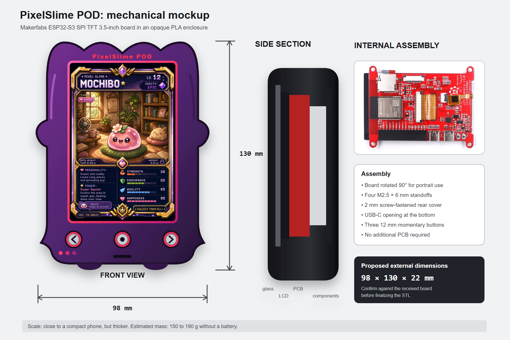
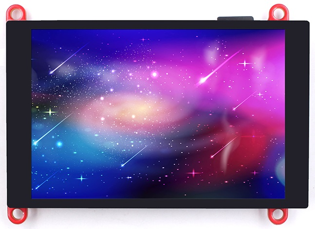
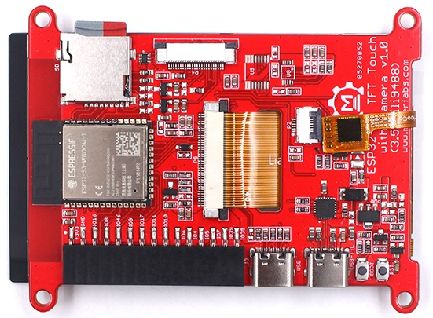
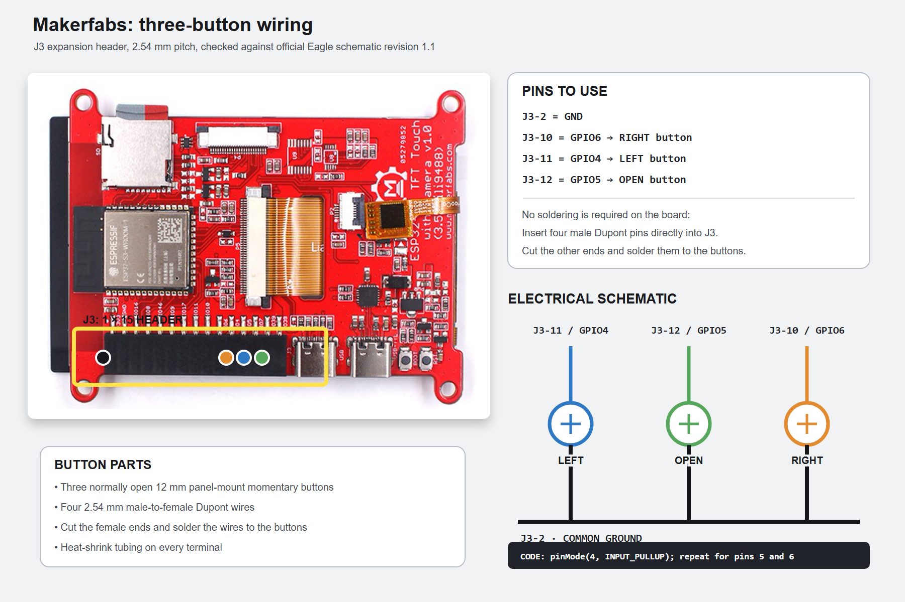
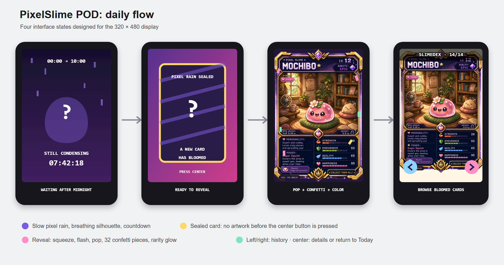
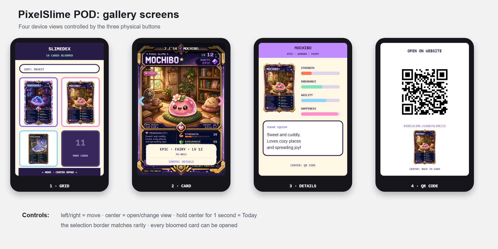
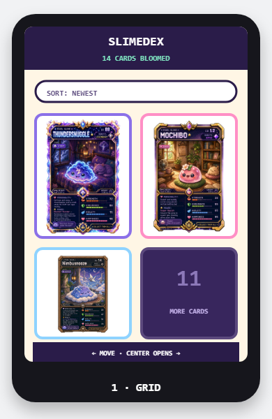
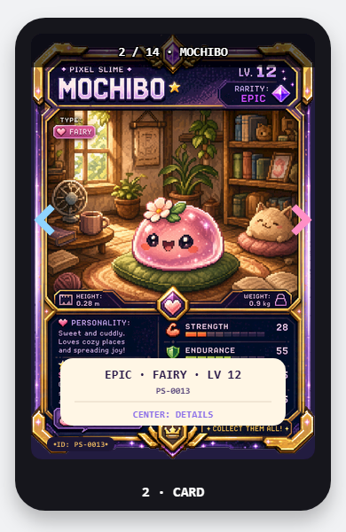
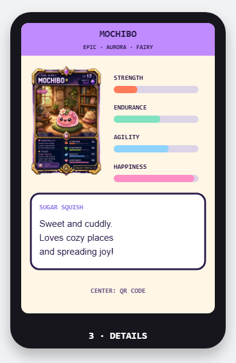
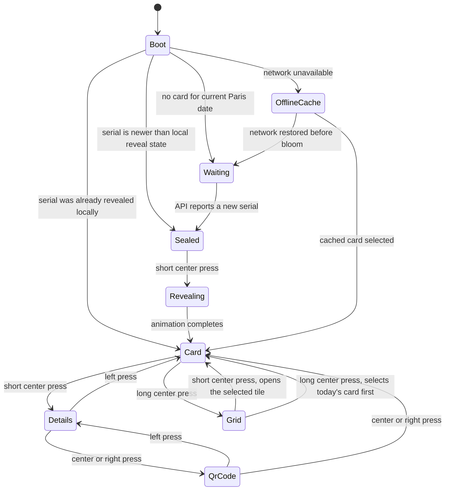

# PixelSlime POD

The PixelSlime POD is a small Wi-Fi display for [pixelslime.cloud](https://pixelslime.cloud). It shows the daily card, runs a physical reveal ceremony, and lets the user browse every card that has already bloomed.

The build uses one Makerfabs ESP32-S3 display board, three physical buttons, a microSD card, USB-C power, and an opaque 3D-printed enclosure. It does not need a custom PCB or a battery.

## 1. Target behavior

The finished device must:

- connect to a 2.4 GHz Wi-Fi network;
- synchronize its clock;
- wait for the daily bloom at 10:00 in `Europe/Paris`;
- show a sealed card when a new bloom is available;
- start the reveal only after the center button is pressed;
- display the card across the full 320 x 480 screen;
- run a short pop, glow, and confetti animation;
- browse all previously bloomed cards;
- show compact card details and a scannable profile QR code;
- cache card images and state on the microSD card;
- recover cleanly after a power cut or network failure.

The POD does not change a card's artwork, mood, statistics, or personality. Motion belongs to the interface only.

## 2. Physical design



### Proposed dimensions

| Part | Dimension |
|---|---:|
| Complete enclosure | 98 x 130 x 22 mm |
| Makerfabs board | 66 x 84.3 x 12 mm |
| Display diagonal | 3.5 inches |
| Approximate active area | 49 x 74 mm |
| Portrait resolution | 320 x 480 px |
| Estimated assembled mass | 150 to 190 g |

The display opening exposes only the active LCD area. The printed front panel hides the inactive LCD border, and the device JPEG fills all 320 x 480 pixels.

### Enclosure construction

- Opaque purple PLA main shell
- Separate red or pink display trim
- Red `PixelSlime POD` front lettering
- Three metal buttons with printed red rings
- Organic slime outline with side bumps and two integrated feet
- 2.5 mm front panel
- 2 mm screw-fastened rear cover
- Four M2.5 x 6 mm board standoffs
- Four M2.5 rear-cover screws
- Three 12 mm button holes
- Bottom USB-C opening
- microSD access through the rear cover or a side slot

Do not finalize the STL from the manufacturer's overall dimensions alone. Measure the received board with calipers, including mounting holes, USB-C connectors, microSD clearance, display position, and component height. Print only the front-panel fit test before printing the full enclosure.

## 3. Electronics

### Makerfabs ESP32-S3 SPI TFT with Touch 3.5" ILI9488

<p align="center">
  
  
</p>

| Feature | Specification |
|---|---|
| Controller | ESP32-S3-WROOM-1-N16R2 |
| Memory | 16 MB flash, 2 MB PSRAM |
| Wireless | 2.4 GHz Wi-Fi and Bluetooth 5 |
| Display | 3.5-inch TFT, ILI9488 |
| Resolution | 480 x 320 landscape, 320 x 480 portrait |
| Touch controller | FT6236 capacitive touch |
| Storage | On-board microSD slot |
| Programming | Native USB-C and CP2104 USB-to-UART |
| Power | USB-C, 5 V, no USB Power Delivery |
| Board size | 66 x 84.3 x 12 mm |
| Board mass | 52 g |

Official references:

- [Makerfabs product page](https://www.makerfabs.com/esp32-s3-spi-tft-with-touch-ili9488.html)
- [Makerfabs hardware guide](https://wiki.makerfabs.com/MaTouch_S3_SPI_3.5_TFT_with_Touch.html)
- [Makerfabs source repository](https://github.com/Makerfabs/Makerfabs-ESP32-S3-SPI-TFT-with-Touch)

The board already contains the controller, power regulation, display, touch controller, USB interfaces, and microSD reader. Do not order a custom PCB from JLCPCB, PCBWay, or another board house for this build.

## 4. Button wiring



J3 is the black 1 x 15 expansion header on the rear of the board. The button pinout was checked against the official Makerfabs Eagle schematic, revision 1.1.

| Function | Header pin | ESP32-S3 pin | Wire color |
|---|---:|---:|---|
| Common ground | J3-2 | GND | Black |
| Right button | J3-10 | GPIO6 | Orange |
| Left button | J3-11 | GPIO4 | Blue |
| Open button | J3-12 | GPIO5 | Green |

Each button is a normally open momentary contact:

```text
GPIO4 ---- LEFT button ----+
GPIO5 ---- OPEN button ----+---- J3-2 / GND
GPIO6 ---- RIGHT button ---+
```

The firmware uses the ESP32-S3 internal pull-up resistors:

```cpp
pinMode(4, INPUT_PULLUP);
pinMode(5, INPUT_PULLUP);
pinMode(6, INPUT_PULLUP);
```

| Button state | GPIO reading |
|---|---|
| Released | `HIGH` |
| Pressed | `LOW` |

### Physical wiring

1. Separate four male-to-female Dupont wires.
2. Insert the male pins into J3-2, J3-10, J3-11, and J3-12.
3. Cut off the female ends.
4. Solder one signal wire to each button.
5. Join the other terminal of all three buttons to the J3-2 ground wire.
6. Cover every terminal with heat-shrink tubing.
7. Leave 10 to 12 cm of wire so the rear cover can be opened.

Check the J3 pin numbers printed on the PCB before applying power. Do not identify pins from photograph orientation alone.

### Board pin map

| Function | GPIO |
|---|---:|
| LCD MISO | 12 |
| LCD MOSI | 13 |
| LCD SCK | 14 |
| LCD CS | 15 |
| LCD DC | 21 |
| LCD backlight control | 48 |
| microSD CS | 1 |
| microSD MOSI | 2 |
| microSD MISO | 41 |
| microSD SCK | 42 |
| Touch SDA | 38 |
| Touch SCL | 39 |
| Left button | 4 |
| Open button | 5 |
| Right button | 6 |

The microSD clock is GPIO42 and microSD MISO is GPIO41. This matches both the official Eagle schematic and the Makerfabs `image_display.ino` example.

## 5. Shopping list

Buy the nine lines below. The list contains one selected product per requirement.

| # | Quantity | Product | Direct link |
|---:|---:|---|---|
| 1 | 1 | Makerfabs ESP32-S3 SPI TFT Touch 3.5" ILI9488 | [Makerfabs](https://www.makerfabs.com/esp32-s3-spi-tft-with-touch-ili9488.html) |
| 2 | 1 pack | GUUZI 12 mm metal momentary buttons, no LED, SPST | [Amazon France, B09BMRDPTN](https://www.amazon.fr/dp/B09BMRDPTN) |
| 3 | 1 ribbon | CHANZON 40-wire male-to-female Dupont ribbon, 20 cm | [Amazon France, B09GKB8ZC6](https://www.amazon.fr/dp/B09GKB8ZC6) |
| 4 | 1 pack | PATIKIL M2.5 x 6 mm nylon standoffs with screws and nuts | [Amazon France, B0BR5QW192](https://www.amazon.fr/dp/B0BR5QW192) |
| 5 | 1 pack | Eventronic heat-shrink tubing assortment | [Amazon France, B01MY06WFD](https://www.amazon.fr/dp/B01MY06WFD) |
| 6 | 1 | SanDisk 16 GB microSDHC card | [Amazon France, B001F7AJKI](https://www.amazon.fr/dp/B001F7AJKI) |
| 7 | 1 | UGREEN USB-A to USB-C data and power cable, 1 m | [Amazon France, B01MYKWP0A](https://www.amazon.fr/dp/B01MYKWP0A) |
| 8 | 1 spool | SUNLU opaque purple PLA, 1.75 mm, 1 kg | [Amazon France, B0838XTJ9D](https://www.amazon.fr/dp/B0838XTJ9D) |
| 9 | 1 spool | SUNLU red PLA, 1.75 mm, 1 kg | [Amazon France, B07GSJ6435](https://www.amazon.fr/dp/B07GSJ6435) |

The button pack contains spares. The male Dupont pins fit directly into J3, so no extra header is required.

### Budget

| Cost group | Planning range |
|---|---:|
| Makerfabs board | EUR 30 to 48 |
| Eight Amazon items | EUR 60 to 95 |
| Shipping and import charges | Check at checkout |
| Total | EUR 90 to 143 plus shipping and import charges |

Prices change. Confirm the product reference and final price before payment.

## 6. Daily experience



### Midnight to bloom

The PixelSlime backend publishes at 10:00 in `Europe/Paris`. The clock already handles summer and winter time through `zoneinfo`.

At midnight in Paris, the POD enters the waiting screen:

1. Show `STILL CONDENSING`.
2. Run a slow pixel rain on a dark background.
3. Pulse the mystery silhouette between 98% and 102%.
4. Show the countdown to 10:00.
5. Shift static elements by one or two pixels every minute to avoid a fixed image.
6. Poll `/api/device/state` every 60 seconds.
7. Poll every 10 seconds during the five minutes around the bloom.
8. Show the sealed card as soon as the API reports a new serial.

When the network is unavailable, keep the countdown from the last synchronized time and display `SEARCHING FOR PIXEL SIGNAL`. Retry after 5, 15, 30, and then 60 seconds. Never replace a cached card with an error screen.

### Reveal sequence

The reveal starts only after a short press on the center button.

| Time | Screen behavior |
|---:|---|
| 0 to 150 ms | Contract the sealed card slightly |
| 150 to 450 ms | Squeeze the card horizontally into a bright line |
| 450 to 700 ms | Run a short white flash and open the artwork |
| 700 to 1,200 ms | Scale to 108%, then settle at 100% |
| 800 to 1,800 ms | Emit square confetti around the card |
| 1,000 to 1,600 ms | Draw the rarity-colored glow |
| 1,400 to 2,000 ms | Reveal the name, type, and rarity |
| After 2,000 ms | Show the stable full-screen card |

Performance limits:

- Target 25 to 30 frames per second during the reveal.
- Use no more than 32 confetti particles.
- Draw opaque RGB565 rectangles instead of full-screen alpha effects.
- Compose each animation frame in one PSRAM sprite to avoid trails.
- Decode the final JPEG from microSD only once per view change.

### Rarity behavior

The colors come from `contracts/design-tokens.json`.

| Rarity | Color | Reveal treatment |
|---|---|---|
| COMMON | `#9FB4C7` | One pop and 12 confetti pieces |
| UNCOMMON | `#7FE3C0` | Mint ring and 18 confetti pieces |
| RARE | `#8FD3FF` | Double sky-blue glow and 24 confetti pieces |
| EPIC | `#C08BFF` | 32 confetti pieces and a 2 px screen shake |
| LEGENDARY | `#FFD86B` | Three short gold bursts |
| MYTHIC | `#FF8FC5` | Three rainbow bursts and a pulsing title |

The shake is a graphical offset. No motor is required.

## 7. Gallery on the POD



The POD has no account login and cannot read the browser's `localStorage`. It therefore treats every card returned by the public API as browseable. Only the newest card can remain sealed on the POD until its local reveal is complete.

This section covers the whole gallery feature: the Grid (tile) screen, the Card view, the Detail view, and the QR view. The firmware's `PodState::Grid` corresponds to the Grid screen below; `Gallery` always refers to the feature as a whole, never to a single screen or state.

### Grid



| Input | Action |
|---|---|
| Left | Move to the previous tile |
| Right | Move to the next tile |
| Center, short press | Open the selected tile's card |
| Center, 1 second | Select today's card, then open it |

The selection border uses the selected card's rarity color. The final tile opens the next page when more cards exist.

### Card view



| Input | Action |
|---|---|
| Left | Previous bloomed card |
| Right | Next bloomed card |
| Center, short press | Open card details |
| Center, 1 second | Return to the grid |

The card fills the display area. Navigation arrows stay on the outer edges and the top line shows the current position, such as `2 / 14`.

### Detail view



| Input | Action |
|---|---|
| Left | Return to the card |
| Right | Open the QR code |
| Center | Open the QR code |
| Center, 1 second | No effect (ignored) |

The detail view shows the name, card ID, rarity, type, level, four statistics, power name, and a short personality excerpt. Text does not auto-scroll. A long center press is ignored here; only the Grid and Card view respond to it.

### QR view


| Input | Action |
|---|---|
| Left | Return to details |
| Right | Return to the card |
| Center | Return to the card |
| Center, 1 second | No effect (ignored) |

The QR code is generated on the POD from `https://pixelslime.cloud/slime/{serial}`. The mockup contains a real scannable code for `https://pixelslime.cloud/slime/13`. A long center press is ignored here, the same as in the detail view.

## 8. Existing PixelSlime API

The repository already exposes these routes:

| Route | Current behavior | POD use |
|---|---|---|
| `GET /api/cards/today` | Returns today's card and the next bloom countdown; returns 404 before the bloom | Existing website behavior |
| `GET /api/cards?page=1&size=24&sort=newest` | Returns a paginated SLIMEDEX page (SLIMEDEX is the site's public, paginated card index) | Gallery index |
| `GET /api/cards/{serial}` | Returns full card details | Detail screen |
| `GET /api/cards/{serial}/image` | Proxies the canonical 1024 x 1536 PNG | Website and provenance |
| `GET /api/cards/{serial}/thumb` | Proxies the 512 x 768 WebP thumbnail | Website grid |

The POD needs two additional routes:

```http
GET /api/device/state
GET /api/cards/{serial}/device
```

`/api/device/state` always returns HTTP 200. This keeps the waiting state separate from the website's intentional 404 response before 10:00.

### Device state response

Before the bloom:

```json
{
  "phase": "waiting",
  "serverTime": "2026-08-23T06:15:00Z",
  "nextBloomAt": "2026-08-23T08:00:00Z",
  "secondsUntilNext": 6300,
  "latestSerial": 38,
  "card": null
}
```

After the bloom:

```json
{
  "phase": "ready",
  "serverTime": "2026-08-23T08:00:12Z",
  "nextBloomAt": "2026-08-24T08:00:00Z",
  "secondsUntilNext": 86388,
  "latestSerial": 39,
  "card": {
    "serial": 39,
    "cardId": "PS-0039",
    "name": "ExampleSlime",
    "level": 12,
    "rarity": "EPIC",
    "type": "DREAM",
    "mintDate": "2026-08-23",
    "palette": ["#C08BFF", "#FF8FC5", "#2B1B4A"],
    "deviceImageUrl": "/api/cards/39/device",
    "profileUrl": "/slime/39"
  }
}
```

## 9. Backend implementation

The code below follows the repository's current abstractions:

- card reads come from `CardIndex`;
- API dependencies use `IndexDep` and `BlobDep`;
- image routes reuse `BlobDownload`, `_respond()`, and the existing ETag behavior;
- blob methods use the integer card serial;
- the device JPEG lives in the existing thumbnails container;
- the canonical PNG bytes never change.

### Device JPEG generation

Add the device JPEG to `backend/app/ai/postprocess.py`. `postprocess.py` already imports `io` and `PIL.Image` for the existing thumbnail path, so only the new imports are shown below; do not re-add imports that are already present in the file.

Add `DEVICE_SIZE` next to the existing image constants in `backend/app/ai/config.py` (do not hardcode the tuple in `postprocess.py`):

```python
# backend/app/ai/config.py
DEVICE_SIZE = (320, 480)
```

```python
# backend/app/ai/postprocess.py
from .config import DEVICE_SIZE
from .errors import PostProcessError


def make_device_jpeg(img: Image.Image) -> bytes:
    """Create a full-screen JPEG from the canonical card canvas."""
    rgba = img.convert("RGBA")
    bbox = rgba.getchannel("A").getbbox()
    if bbox is None:
        raise PostProcessError("canonical card image is fully transparent")

    card = rgba.crop(bbox).resize(DEVICE_SIZE, Image.Resampling.LANCZOS)
    canvas = Image.new("RGB", DEVICE_SIZE, "black")
    canvas.paste(card, (0, 0), card.getchannel("A"))

    output = io.BytesIO()
    canvas.save(
        output,
        format="JPEG",
        quality=88,
        optimize=True,
        progressive=False,
        subsampling=2,
    )
    return output.getvalue()
```

The resize is intentionally exact. Transparent margins are removed first, then the visible card is normalized to 320 x 480 so no unused strip remains on the LCD. This affects only the device JPEG.

Extend `PostProcessResult` and the existing `postprocess()` return value:

```python
@dataclass(frozen=True, slots=True)
class PostProcessResult:
    sha256: str
    art_sha: str
    thumbnail_webp: bytes
    device_jpeg: bytes
    palette: list[str]


def postprocess(png_bytes: bytes, *, n_colors: int = 6) -> PostProcessResult:
    digest = hashlib.sha256(png_bytes).hexdigest()
    img = _open(png_bytes)
    return PostProcessResult(
        sha256=digest,
        art_sha=digest[:8],
        thumbnail_webp=make_thumbnail(img),
        device_jpeg=make_device_jpeg(img),
        palette=dominant_palette(img, n_colors=n_colors),
    )
```

`art_sha` still identifies the exact PNG uploaded to the cards container and is anchored by PSC-1 (the card's encoding and provenance format), which ties `art_sha` to the card's row in asmDB, the backend's authoritative card-row storage.

`PostProcessResult.palette` above is the image's dominant colors, used for internal art metadata only. It is not the same value as the `palette` array returned to the POD in the device API responses (section 8): that value comes from `contracts.palette_for(rarity)`, a fixed rarity-to-color mapping, not from `dominant_palette()`.

### Pipeline and job plumbing

Add a property to `PipelineResult` in `backend/app/ai/pipeline.py`:

```python
@property
def device_jpeg(self) -> bytes:
    return self.post.device_jpeg
```

Add the field to `GeneratedCard` in `backend/app/jobs/models.py`:

```python
@dataclass(frozen=True, slots=True)
class GeneratedCard:
    card: Card
    png_bytes: bytes
    thumbnail_webp: bytes
    device_jpeg: bytes
```

Pass `device_jpeg` through:

- `backend/app/jobs/runtime.py`
- `backend/app/jobs/seed.py`
- `backend/tests/jobs/_jobs_helpers.py`, including `FakeBlobStore.put_card`, which must accept and store the JPEG argument the same way `InMemoryBlobStore.put_card` does
- every `GeneratedCard(...)` test fixture

Upload all three images in `backend/app/jobs/_operations.py`:

```python
await deps.blob.put_card(
    card.serial,
    generated.png_bytes,
    generated.thumbnail_webp,
    generated.device_jpeg,
)
```

The upload remains before the asmDB row write. If device JPEG generation or upload fails, the job must fail instead of publishing a card with missing POD media.

### Blob storage

Store the device JPEG in the existing thumbnails container. This avoids a new Azure container and an infrastructure migration.

Add to `backend/app/storage/blob.py`:

```python
def device_blob_name(serial: int) -> str:
    return f"PS-{serial:04d}-device.jpg"
```

Extend the existing protocol. It already declares other members such as `load_index`, `save_index`, and `aclose`; keep those unchanged and add only the three device-related members below:

```python
class BlobStore(Protocol):
    # Existing members, unchanged:
    async def load_index(self) -> bytes | None: ...
    async def save_index(self, data: bytes) -> None: ...
    async def get_card_png(self, serial: int) -> BlobDownload: ...
    async def get_thumb(self, serial: int) -> BlobDownload: ...
    async def aclose(self) -> None: ...

    # New members for the device JPEG:
    async def get_device(self, serial: int) -> BlobDownload: ...

    async def put_card(
        self,
        serial: int,
        png: bytes,
        webp: bytes,
        jpeg: bytes,
    ) -> None: ...
```

`put_card` already existed with a `(serial, png, webp)` signature; add the required `jpeg` positional parameter rather than giving it a default, and update every call site listed below so none of them silently skip the device JPEG.

Add device storage to the in-memory implementation:

```python
class InMemoryBlobStore:
    def __init__(self) -> None:
        self._cards: dict[int, bytes] = {}
        self._thumbs: dict[int, bytes] = {}
        self._devices: dict[int, bytes] = {}
        self._index: bytes | None = None

    async def get_device(self, serial: int) -> BlobDownload:
        data = self._devices.get(serial)
        if data is None:
            raise BlobNotFound(device_blob_name(serial))
        return BlobDownload(data=data, etag=_weak_etag(data), content_type="image/jpeg")

    async def put_card(
        self,
        serial: int,
        png: bytes,
        webp: bytes,
        jpeg: bytes,
    ) -> None:
        self._cards[serial] = png
        self._thumbs[serial] = webp
        self._devices[serial] = jpeg
```

`seed_card()` takes a required JPEG parameter (no default) so that publishing a card without a device JPEG is impossible rather than silently defaulted. Update every call site to pass one:

- `backend/app/main.py` (`build_fakes()`; its placeholder builder must also create a valid 320 x 480 baseline JPEG)
- `backend/tests/api/conftest.py`
- `backend/tests/api/test_spa.py`
- `backend/tests/api/test_cache_headers.py`
- `tests/e2e/serve_today.py`

Add the Azure methods:

```python
async def get_device(self, serial: int) -> BlobDownload:
    return await self._download(
        self._thumbs_container,
        device_blob_name(serial),
        "image/jpeg",
    )

async def put_card(
    self,
    serial: int,
    png: bytes,
    webp: bytes,
    jpeg: bytes,
) -> None:
    await self._upload(self._cards_container, card_blob_name(serial), png, "image/png")
    await self._upload(
        self._thumbs_container,
        thumb_blob_name(serial),
        webp,
        "image/webp",
    )
    await self._upload(
        self._thumbs_container,
        device_blob_name(serial),
        jpeg,
        "image/jpeg",
    )
```

### Device JPEG route

Add this handler to `backend/app/api/routes_media.py`. It uses the same index check, private blob proxy, cache headers, and conditional request handling as the PNG and WebP routes.

```python
@router.get("/cards/{serial}/device")
async def get_card_device(
    request: Request,
    index: IndexDep,
    blob: BlobDep,
    serial: SerialPath,
) -> Response:
    if not index.contains(serial):
        raise ApiError(404, "card_not_found", f"No card with serial {serial}")
    try:
        download = await blob.get_device(serial)
    except BlobNotFound as exc:
        raise ApiError(
            404,
            "device_jpeg_not_found",
            f"No device JPEG for serial {serial}",
        ) from exc
    return _respond(download, request)
```

The existing `_respond()` helper returns:

```http
Content-Type: image/jpeg
Cache-Control: public, max-age=31536000, immutable
ETag: "<storage-etag>"
```

It also returns HTTP 304 when `If-None-Match` matches.

### Device state route

Create `backend/app/api/routes_device.py`:

```python
from __future__ import annotations

from datetime import UTC, datetime
from typing import Any

from fastapi import APIRouter

from app.core.index import CardIndex
from app.core.serialize import card_detail
from app.core.time import iso_utc, next_bloom_at, seconds_until_next_bloom

from .deps import IndexDep


router = APIRouter(prefix="/api/device", tags=["device"])


def _latest_serial(index: CardIndex) -> int | None:
    page = index.query(page=1, size=1, sort="newest")
    return page.items[0].serial if page.items else None


@router.get("/state")
async def get_device_state(index: IndexDep) -> dict[str, Any]:
    now = datetime.now(tz=UTC)
    card = index.today(now)
    next_bloom = next_bloom_at(now)

    device_card: dict[str, Any] | None = None
    if card is not None:
        detail = card_detail(card, chain=index.chain_for(card.serial))
        device_card = {
            "serial": detail["serial"],
            "cardId": detail["cardId"],
            "name": detail["name"],
            "level": detail["level"],
            "rarity": detail["rarity"],
            "type": detail["type"],
            "mintDate": detail["mintDate"],
            "palette": detail.get("palette", []),
            "deviceImageUrl": f"/api/cards/{card.serial}/device",
            "profileUrl": f"/slime/{card.serial}",
        }

    return {
        "phase": "ready" if device_card is not None else "waiting",
        "serverTime": iso_utc(now),
        "nextBloomAt": iso_utc(next_bloom),
        "secondsUntilNext": seconds_until_next_bloom(now),
        "latestSerial": _latest_serial(index),
        "card": device_card,
    }
```

Register it in `backend/app/main.py`:

```python
from app.api import routes_cards, routes_device, routes_media, routes_meta

# Inside create_app()
app.include_router(routes_cards.router)
app.include_router(routes_device.router)
app.include_router(routes_media.router)
app.include_router(routes_meta.router)
```

### OpenAPI contract

Add `/api/device/state`, `/api/cards/{serial}/device`, `DeviceState`, and `DeviceCard` to `contracts/openapi.yaml`. Keep property names in camel case because the existing public API uses that convention. Add a top-level `device` tag alongside the existing tags, and tag both new operations with it.

Add the two paths:

```yaml
tags:
  - name: device
    description: Endpoints used by the PixelSlime POD firmware.

paths:
  /api/device/state:
    get:
      operationId: getDeviceState
      tags: [device]
      summary: Return the current bloom phase and today's card for the POD.
      responses:
        "200":
          description: Waiting or ready device state.
          content:
            application/json:
              schema:
                $ref: "#/components/schemas/DeviceState"

  /api/cards/{serial}/device:
    get:
      operationId: getCardDevice
      tags: [device]
      summary: Return the full-screen 320 x 480 device JPEG for one card.
      parameters:
        - name: serial
          in: path
          required: true
          schema:
            type: integer
            minimum: 1
      responses:
        "200":
          description: Device JPEG image.
          content:
            image/jpeg:
              schema:
                type: string
                format: binary
        "404":
          description: Card or device JPEG not found.
```

Minimum schema for the two new components:

```yaml
DeviceCard:
  type: object
  required:
    - serial
    - cardId
    - name
    - level
    - rarity
    - type
    - mintDate
    - palette
    - deviceImageUrl
    - profileUrl
  properties:
    serial:
      type: integer
      minimum: 1
    cardId:
      type: string
    name:
      type: string
    level:
      type: integer
    rarity:
      type: string
    type:
      type: string
    mintDate:
      type: string
      format: date
    palette:
      type: array
      items:
        type: string
    deviceImageUrl:
      type: string
    profileUrl:
      type: string

DeviceState:
  type: object
  required:
    - phase
    - serverTime
    - nextBloomAt
    - secondsUntilNext
    - latestSerial
    - card
  properties:
    phase:
      type: string
      enum: [waiting, ready]
    serverTime:
      type: string
      format: date-time
    nextBloomAt:
      type: string
      format: date-time
    secondsUntilNext:
      type: integer
      minimum: 0
    latestSerial:
      type: [integer, "null"]
    card:
      oneOf:
        - $ref: "#/components/schemas/DeviceCard"
        - type: "null"
```

Run the repository's existing API generation command after editing the contract:

```powershell
Set-Location frontend
npm run gen:api
```

`backend/tests/api/test_contract.py` hardcodes the expected number of OpenAPI paths. The two new paths raise that count from 10 to 12; update the hardcoded expectation in that test, or it will fail as soon as the contract is regenerated.

### Backend tests

Add focused tests for:

- HTTP 200 and `phase=waiting` before the Paris bloom;
- HTTP 200 and `phase=ready` when today's card is in `CardIndex`;
- correct UTC output across both daylight-saving transitions;
- exact 320 x 480 device JPEG dimensions;
- unchanged SHA-256 for the canonical PNG input;
- `Content-Type: image/jpeg`;
- immutable cache header;
- ETag reuse and HTTP 304;
- `BlobNotFound` mapping to `device_jpeg_not_found`;
- in-memory and Azure blob path parity;
- fake local startup with a valid device placeholder;
- contract parity: the generated OpenAPI document has exactly 12 paths and includes the `device` tag, matching the updated expectation in `backend/tests/api/test_contract.py`.


## 10. Firmware project

Create this repository tree:

```text
device/pixelslime-pod/
|-- platformio.ini
|-- partitions.csv
|-- include/
|   |-- config.example.h
|   |-- pins.h
|   `-- pod_types.h
|-- src/
|   |-- main.cpp
|   |-- api_client.cpp
|   |-- api_client.h
|   |-- buttons.cpp
|   |-- buttons.h
|   |-- display.cpp
|   |-- display.h
|   |-- effects.cpp
|   |-- effects.h
|   |-- storage.cpp
|   `-- storage.h
`-- test/
    |-- test_buttons.cpp
    `-- test_state_machine.cpp
```

### PlatformIO configuration

The environment starts from the official Makerfabs PlatformIO project, but the unmodified generic board profile is not sufficient for this N16R2 module: it defaults to a smaller flash size and to quad PSRAM timings that do not match the board. The settings below are required additions, not optional tuning. LovyanGFX stays on the board manufacturer's tested release; the other libraries are pinned to specific, verified-compatible versions rather than tracking a branch head.

```ini
[env:esp32-s3-devkitc-1]
platform = espressif32
board = esp32-s3-devkitc-1
framework = arduino
monitor_speed = 115200

board_build.arduino.memory_type = qio_qspi
board_upload.flash_size = 16MB
board_build.partitions = partitions.csv

lib_deps =
  lovyan03/LovyanGFX@0.4.18
  bblanchon/ArduinoJson@^7.0.0
  bitbank2/JPEGDEC@1.8.2
  ricmoo/QRCode@0.0.1

build_flags =
  -DARDUINO_USB_CDC_ON_BOOT=1
  -DBOARD_HAS_PSRAM
```

`board_build.arduino.memory_type = qio_qspi` and `-DBOARD_HAS_PSRAM` match the N16R2's quad flash and quad PSRAM wiring; `board_upload.flash_size = 16MB` and `board_build.partitions = partitions.csv` match its 16 MB flash. Confirm these four settings against the module actually received before flashing; do not assume a different Makerfabs SKU shares the same flash or PSRAM configuration.

### Partition table

Create `partitions.csv` at the project root with a standard dual-OTA layout sized for exactly 16 MB of flash:

```text
# Name,   Type, SubType, Offset,   Size,     Flags
nvs,      data, nvs,     0x9000,   0x5000,
otadata,  data, ota,     0xe000,   0x2000,
app0,     app,  ota_0,   0x10000,  0x640000,
app1,     app,  ota_1,   0x650000, 0x640000,
spiffs,   data, spiffs,  0xc90000, 0x360000,
coredump, data, coredump,0xff0000, 0x10000,
```

Each row's offset plus size lines up with the next row's offset, and the last row ends exactly at 0x1000000 (16 MB), so the table is internally consistent for this flash size. `app0`/`app1` support future OTA updates; `spiffs` is reserved and unused by this build; `coredump` captures crash diagnostics. Verify the table with `pio run -t partition_table` after building, and do not fall back to a smaller built-in scheme (for example the default 4 MB table), which would not fit this flash size.

### PSRAM go/no-go gate

`psramFound()` must gate startup, not just log a warning: the firmware cannot allocate the full-screen 320 x 480 RGB565 sprite without PSRAM, so it must not proceed as if the sprite existed.

```cpp
void setup() {
  Serial.begin(115200);
  if (!psramFound()) {
    Serial.println("FATAL: PSRAM not detected, halting");
    while (true) {
      delay(1000);
    }
  }
  // Only allocate the full-screen sprite, initialize the display,
  // and continue boot after psramFound() returns true.
}
```

### Pin definitions

Create `include/pins.h`:

```cpp
#pragma once

#include <Arduino.h>

constexpr gpio_num_t PIN_BUTTON_LEFT = GPIO_NUM_4;
constexpr gpio_num_t PIN_BUTTON_OPEN = GPIO_NUM_5;
constexpr gpio_num_t PIN_BUTTON_RIGHT = GPIO_NUM_6;

constexpr gpio_num_t PIN_SD_CS = GPIO_NUM_1;
constexpr gpio_num_t PIN_SD_MOSI = GPIO_NUM_2;
constexpr gpio_num_t PIN_SD_MISO = GPIO_NUM_41;
constexpr gpio_num_t PIN_SD_SCK = GPIO_NUM_42;

constexpr uint16_t SCREEN_WIDTH = 320;
constexpr uint16_t SCREEN_HEIGHT = 480;
```

Use the `LGFX` display class from the official Makerfabs `image_display.ino` example. Keep its ILI9488 bus configuration and use portrait rotation.

Initialize the microSD bus with the same mapping as the official example:

```cpp
SPIClass sdSpi;

bool beginStorage() {
  sdSpi.begin(PIN_SD_SCK, PIN_SD_MISO, PIN_SD_MOSI, PIN_SD_CS);
  if (!SD.begin(PIN_SD_CS, sdSpi, 40000000)) {
    Serial.println("microSD initialization failed");
    return false;
  }
  return true;
}
```

### Secret-free configuration

Commit only `include/config.example.h`:

```cpp
#pragma once

#define WIFI_SSID "replace-me"
#define WIFI_PASSWORD "replace-me"
#define API_BASE_URL "https://pixelslime.cloud"
#define PIXELSLIME_ROOT_CA R"EOF(
-----BEGIN CERTIFICATE-----
replace-with-current-root-ca
-----END CERTIFICATE-----
)EOF"
```

Add `include/config.h` to `.gitignore`. Never call `WiFiClientSecure::setInsecure()` in production firmware.

### Button debounce

```cpp
enum class ButtonEvent {
  None,
  ShortPress,
  LongPress,
};

class Button {
 public:
  explicit Button(uint8_t pin) : pin_(pin) {}

  void begin() {
    pinMode(pin_, INPUT_PULLUP);
    sample_ = digitalRead(pin_);
    stable_ = sample_;
  }

  ButtonEvent update(uint32_t now) {
    const bool current = digitalRead(pin_);
    if (current != sample_) {
      sample_ = current;
      changedAt_ = now;
    }

    if (current != stable_ && now - changedAt_ >= 30) {
      stable_ = current;
      if (stable_ == LOW) {
        pressedAt_ = now;
        longSent_ = false;
      } else if (!longSent_) {
        return ButtonEvent::ShortPress;
      }
    }

    if (stable_ == LOW && !longSent_ && now - pressedAt_ >= 1000) {
      longSent_ = true;
      return ButtonEvent::LongPress;
    }

    return ButtonEvent::None;
  }

 private:
  uint8_t pin_;
  bool sample_ = HIGH;
  bool stable_ = HIGH;
  bool longSent_ = false;
  uint32_t changedAt_ = 0;
  uint32_t pressedAt_ = 0;
};
```

The 30 ms stable interval filters mechanical bounce. `longSent_` prevents repeated long-press events while the button remains down.

### State machine



```cpp
enum class PodState {
  Boot,
  Waiting,
  Sealed,
  Revealing,
  Card,
  Grid,
  Details,
  QrCode,
  OfflineCache,
};
```

There is no separate `Error` state. Network, storage, and decode failures are handled by `OfflineCache` (see section 6): the POD keeps the last cached card and countdown on screen and retries in the background instead of switching to a dead-end error screen.

### HTTPS state request

```cpp
struct DeviceCard {
  int serial = 0;
  int level = 0;
  String cardId;
  String name;
  String rarity;
  String type;
  String imageUrl;
  String profileUrl;
};

bool fetchDeviceState(
    DeviceCard& card,
    bool& ready,
    uint32_t& secondsLeft) {
  WiFiClientSecure tls;
  tls.setCACert(PIXELSLIME_ROOT_CA);

  HTTPClient http;
  if (!http.begin(tls, String(API_BASE_URL) + "/api/device/state")) {
    return false;
  }

  const int status = http.GET();
  if (status != HTTP_CODE_OK) {
    http.end();
    return false;
  }

  JsonDocument json;
  const DeserializationError error = deserializeJson(json, http.getStream());
  http.end();
  if (error) {
    return false;
  }

  ready = json["phase"] == "ready";
  secondsLeft = json["secondsUntilNext"] | 0;
  if (!ready) {
    return true;
  }

  card.serial = json["card"]["serial"] | 0;
  card.level = json["card"]["level"] | 0;
  card.cardId = json["card"]["cardId"] | "";
  card.name = json["card"]["name"] | "";
  card.rarity = json["card"]["rarity"] | "";
  card.type = json["card"]["type"] | "";
  card.imageUrl = json["card"]["deviceImageUrl"] | "";
  card.profileUrl = json["card"]["profileUrl"] | "";

  return card.serial > 0 &&
         !card.cardId.isEmpty() &&
         !card.imageUrl.isEmpty();
}
```

### Atomic JPEG download

```cpp
bool downloadCard(const DeviceCard& card) {
  const String directory = "/pixelslime/cards";
  const String finalPath = directory + "/" + card.cardId + ".jpg";
  const String temporaryPath = finalPath + ".part";
  const String backupPath = finalPath + ".bak";

  SD.mkdir("/pixelslime");
  SD.mkdir(directory);
  SD.remove(temporaryPath);

  WiFiClientSecure tls;
  tls.setCACert(PIXELSLIME_ROOT_CA);

  HTTPClient http;
  if (!http.begin(tls, String(API_BASE_URL) + card.imageUrl)) {
    return false;
  }

  const int status = http.GET();
  if (status != HTTP_CODE_OK) {
    http.end();
    return false;
  }

  const int expected = http.getSize();
  File output = SD.open(temporaryPath, FILE_WRITE);
  if (!output) {
    http.end();
    return false;
  }

  const int written = http.writeToStream(&output);
  output.close();
  http.end();

  const bool complete =
      written > 0 &&
      (expected < 0 || written == expected);
  if (!complete) {
    SD.remove(temporaryPath);
    return false;
  }

  // Never delete the last complete file before the new one is in place:
  // rename it to a backup first, then promote the new download. If power
  // is lost between these two renames, recoverCardFile() restores the
  // backup on the next boot instead of leaving no file at all.
  SD.remove(backupPath);
  if (SD.exists(finalPath)) {
    SD.rename(finalPath, backupPath);
  }
  if (!SD.rename(temporaryPath, finalPath)) {
    SD.rename(backupPath, finalPath);
    return false;
  }
  SD.remove(backupPath);
  return true;
}

// Call once per cached card during Boot, before the file is read. If the
// final file is missing but its backup survived a crash between the two
// renames above, restore it; otherwise clear any leftover backup.
bool recoverCardFile(const String& cardId) {
  const String finalPath = "/pixelslime/cards/" + cardId + ".jpg";
  const String backupPath = finalPath + ".bak";
  if (!SD.exists(finalPath) && SD.exists(backupPath)) {
    return SD.rename(backupPath, finalPath);
  }
  SD.remove(backupPath);
  return true;
}
```

The `.part` file keeps a failed or partial download from ever reaching `finalPath`. The `.bak` step above closes the remaining gap: the two-rename sequence is not a single atomic FAT operation, but boot-time recovery guarantees the device never ends up with neither a valid final file nor a restorable backup.

### Local state

Store:

```text
/pixelslime/index.json
/pixelslime/state.json
/pixelslime/cards/PS-0001.jpg
/pixelslime/cards/PS-0002.jpg
```

`state.json` contains:

```json
{
  "lastRevealedSerial": 39,
  "selectedSerial": 39,
  "lastSyncAt": "2026-08-23T08:00:15Z"
}
```

Write state with the same backup-and-rename pattern used for card downloads:

```cpp
bool savePodState(int lastRevealedSerial, int selectedSerial) {
  JsonDocument json;
  json["lastRevealedSerial"] = lastRevealedSerial;
  json["selectedSerial"] = selectedSerial;

  const char* temporary = "/pixelslime/state.json.tmp";
  const char* finalPath = "/pixelslime/state.json";
  const char* backup = "/pixelslime/state.json.bak";
  SD.remove(temporary);

  File file = SD.open(temporary, FILE_WRITE);
  if (!file) {
    return false;
  }

  const size_t written = serializeJson(json, file);
  file.close();
  if (written == 0) {
    SD.remove(temporary);
    return false;
  }

  SD.remove(backup);
  if (SD.exists(finalPath)) {
    SD.rename(finalPath, backup);
  }
  if (!SD.rename(temporary, finalPath)) {
    SD.rename(backup, finalPath);
    return false;
  }
  SD.remove(backup);
  return true;
}

// Call once during Boot, before state.json is read.
bool recoverPodState() {
  const char* finalPath = "/pixelslime/state.json";
  const char* backup = "/pixelslime/state.json.bak";
  if (!SD.exists(finalPath) && SD.exists(backup)) {
    return SD.rename(backup, finalPath);
  }
  SD.remove(backup);
  return true;
}
```

Rules:

- Show `Sealed` when the API card serial is greater than `lastRevealedSerial`.
- Save `lastRevealedSerial` only after the reveal animation finishes.
- Do not mark a card as revealed after a network, storage, or decode error.
- Show `Card` immediately after restart when the serial was already revealed.
- Keep all older public cards browseable even though browser discovery is not synchronized.

### Button routing

```cpp
void handleButtons(
    ButtonEvent left,
    ButtonEvent open,
    ButtonEvent right) {
  if (open == ButtonEvent::LongPress) {
    if (state == PodState::Card) {
      state = PodState::Grid;
      redraw = true;
    } else if (state == PodState::Grid) {
      selectTodayCard();
      state = PodState::Card;
      redraw = true;
    }
    // A long press is ignored in every other state (Sealed, Details,
    // QrCode, Waiting, Boot, OfflineCache): only Card and Grid respond to it.
    return;
  }

  switch (state) {
    case PodState::Sealed:
      if (open == ButtonEvent::ShortPress) {
        state = PodState::Revealing;
        revealStartedAt = millis();
      }
      break;

    case PodState::Card:
      if (left == ButtonEvent::ShortPress) selectPreviousCard();
      if (right == ButtonEvent::ShortPress) selectNextCard();
      if (open == ButtonEvent::ShortPress) state = PodState::Details;
      redraw = true;
      break;

    case PodState::Grid:
      if (left == ButtonEvent::ShortPress) moveGridSelection(-1);
      if (right == ButtonEvent::ShortPress) moveGridSelection(1);
      if (open == ButtonEvent::ShortPress) state = PodState::Card;
      redraw = true;
      break;

    case PodState::Details:
      if (left == ButtonEvent::ShortPress) state = PodState::Card;
      if (right == ButtonEvent::ShortPress ||
          open == ButtonEvent::ShortPress) {
        state = PodState::QrCode;
      }
      redraw = true;
      break;

    case PodState::QrCode:
      if (left == ButtonEvent::ShortPress) state = PodState::Details;
      if (right == ButtonEvent::ShortPress ||
          open == ButtonEvent::ShortPress) {
        state = PodState::Card;
      }
      redraw = true;
      break;


    default:
      break;
  }
}
```

### Confetti

```cpp
struct Confetti {
  int16_t x;
  int16_t y;
  int8_t vx;
  int8_t vy;
  uint16_t color;
  bool active;
};

constexpr size_t MAX_CONFETTI = 32;
Confetti confetti[MAX_CONFETTI];
constexpr uint16_t confettiPalette[] = {
  0xFC78,  // Bubblegum
  0xFECD,  // Sunbeam
  0x7F18,  // Mint
  0x8E9F,  // Sky
  0x8B7D,  // Grape
  0xFBCB,  // Coral
};

void startConfetti(uint8_t count, uint16_t rarityColor) {
  count = count > MAX_CONFETTI ? MAX_CONFETTI : count;
  for (size_t i = 0; i < MAX_CONFETTI; ++i) {
    Confetti& particle = confetti[i];
    particle.active = i < count;
    particle.x = SCREEN_WIDTH / 2 + random(-30, 31);
    particle.y = SCREEN_HEIGHT / 2;
    particle.vx = random(-4, 5);
    particle.vy = random(-8, -2);
    particle.color = i % 3 == 0 ? rarityColor : confettiPalette[i % 6];
  }
}

void updateConfetti(LGFX_Sprite& frame) {
  for (Confetti& particle : confetti) {
    if (!particle.active) {
      continue;
    }

    particle.x += particle.vx;
    particle.vy += 1;
    particle.y += particle.vy;
    if (particle.y >= SCREEN_HEIGHT) {
      particle.active = false;
      continue;
    }

    frame.fillRect(
        particle.x,
        particle.y,
        5,
        5,
        particle.color);
  }
}
```

Clear and redraw the sprite for every animation frame, then push it once to the LCD. Drawing particles directly over the previous LCD frame leaves trails.

### QR code

Generate the QR matrix locally from:

```cpp
const String profileUrl = String(API_BASE_URL) + currentCard.profileUrl;
```

Use the `QRCode` library to draw square modules onto a white background. Keep a four-module quiet zone and test the result with two different phone cameras.

### Firmware tests

- Each button emits one short event per press.
- A one-second press emits one long event and no short event.
- Left and right navigation stop or wrap consistently at collection boundaries.
- A partial JPEG never replaces a valid cached file.
- A simulated power loss between the two renames in `downloadCard()` or `savePodState()` leaves a `.bak` file that `recoverCardFile()` / `recoverPodState()` restores on the next boot.
- The device boots from cache without Wi-Fi.
- Wi-Fi recovery returns from `OfflineCache` without rebooting.
- A revealed serial does not replay the ceremony after a power cut.
- A newer serial stays sealed until the center button is pressed.
- The QR code resolves to the selected card profile.
- The reveal remains within available heap and PSRAM.
- `psramFound()` returning `false` halts boot before any sprite is allocated.

## 11. Build order

### Status legend

- 🟢 Complete
- 🔵 Work to do
- 🟠 Hardware check required
- 🔴 Stop until the failed check is corrected

| Stage | Status | Task | Required result |
|---|---|---|---|
| Design | 🟢 | Select the Makerfabs architecture | Board, screen, buttons, and wiring are defined |
| Design | 🟢 | Verify J3 and microSD pins | Pin map matches schematic and official example |
| Design | 🟢 | Prepare enclosure, flow, gallery, and wiring visuals | All project visuals are complete and consistent with this guide |
| Purchase | 🔵 | Order the nine shopping-list items | All parts have confirmed order numbers |
| Backend 1 | 🔵 | Generate the 320 x 480 device JPEG | Full-screen baseline JPEG with unchanged canonical PNG hash |
| Backend 2 | 🔵 | Extend blob storage and media route | Immutable JPEG served with ETag |
| Backend 3 | 🔵 | Add `/api/device/state` | Waiting and ready responses both return HTTP 200 |
| Backend 4 | 🔵 | Update OpenAPI, generated client types, and the contract path-count expectation | Contract, generated files, and `test_contract.py` (12 paths, `device` tag) agree |
| Backend 5 | 🔵 | Update `seed_card()` callers and `FakeBlobStore.put_card` | All five `seed_card()` call sites and the fake blob store pass a required JPEG argument |
| Backend 6 | 🔵 | Run focused backend tests | Device API, image, clock, cache, ETag, and contract-parity tests pass |
| Firmware 1 | 🔵 | Create the PlatformIO project | Official Makerfabs display example compiles |
| Hardware 1 | 🟠 | Confirm PSRAM and flash/partition settings | `psramFound()` is true; flash reports 16 MB; `partitions.csv` is applied |
| Hardware 2 | 🟠 | Power the bare board over USB-C | Display, serial port, and board remain stable |
| Hardware 3 | 🟠 | Run the official Makerfabs image example | Portrait display works without corruption |
| Firmware 2 | 🔵 | Test GPIO4 alone | Serial monitor prints `LEFT` once per press |
| Firmware 3 | 🔵 | Add GPIO5 and GPIO6 | All three buttons work without false presses |
| Firmware 4 | 🔵 | Add HTTPS state request | Waiting and ready JSON parse correctly |
| Firmware 5 | 🔵 | Add atomic microSD download with backup recovery | Cached JPEG survives interrupted transfer and simulated power loss |
| Firmware 6 | 🔵 | Render the device JPEG | Card fills the complete 320 x 480 screen |
| Firmware 7 | 🔵 | Build grid, card, details, and QR views | Controls match the gallery specification |
| Firmware 8 | 🔵 | Add pop, glow, and confetti | Reveal stays near 25 to 30 frames per second |
| Firmware 9 | 🔵 | Persist reveal state with backup recovery | Power cycling does not replay an old reveal or lose state |
| Mechanical 1 | 🔵 | Measure the received board | Mounting and connector coordinates are recorded |
| Mechanical 2 | 🟠 | Print the front-panel fit test | Screen, trim, USB-C, and buttons align |
| Mechanical 3 | 🔵 | Print the complete enclosure | Board and rear cover assemble without force |
| Assembly | 🔵 | Install standoffs, buttons, and wiring | No pinched wire or blocked antenna |
| Endurance | 🟠 | Run the POD for 24 hours | No crash, overheating, Wi-Fi loss, or file corruption |
| Finish | 🔵 | Close the rear cover and fit the feet | Device is stable and serviceable |

Do not print the complete enclosure before both hardware fit checks pass.

## 12. Final inspection

- [ ] The card reaches every edge of the active 320 x 480 area.
- [ ] The printed front panel does not cover active pixels.
- [ ] The LCD does not move when a button is pressed.
- [ ] No printed edge touches the capacitive touch area.
- [ ] Both USB-C ports remain accessible where required.
- [ ] The microSD card can be removed without disassembling the front panel.
- [ ] No wire crosses the ESP32-S3 antenna area.
- [ ] No wire is trapped by the rear cover.
- [ ] Every button returns freely after a press.
- [ ] Screws and standoffs touch no trace or component.
- [ ] The device starts correctly after a hard power cut.
- [ ] A network error is visible and does not erase the cached card.
- [ ] The profile QR code scans from the actual LCD.
- [ ] The enclosure remains cool during the 24-hour test.

## 13. Project files

| File | Purpose |
|---|---|
| [`pixelslime-real-enclosure.png`](assets/pixelslime-pod/pixelslime-real-enclosure.png) | Dimensioned enclosure mockup |
| [`pixelslime-real-enclosure.svg`](assets/pixelslime-pod/pixelslime-real-enclosure.svg) | Editable enclosure source |
| [`pixelslime-real-button-wiring.png`](assets/pixelslime-pod/pixelslime-real-button-wiring.png) | Board photograph and button wiring |
| [`pixelslime-real-button-wiring.svg`](assets/pixelslime-pod/pixelslime-real-button-wiring.svg) | Editable wiring source |
| [`pixelslime-device-flow.png`](assets/pixelslime-pod/pixelslime-device-flow.png) | Waiting, sealed, reveal, and browse flow |
| [`pixelslime-device-flow.svg`](assets/pixelslime-pod/pixelslime-device-flow.svg) | Editable daily-flow source |
| [`pixelslime-gallery-screens.png`](assets/pixelslime-pod/pixelslime-gallery-screens.png) | Complete gallery screen sheet |
| [`pixelslime-gallery-screens.svg`](assets/pixelslime-pod/pixelslime-gallery-screens.svg) | Editable gallery source |
| [`pixelslime-gallery-grid.png`](assets/pixelslime-pod/pixelslime-gallery-grid.png) | Grid screen |
| [`pixelslime-gallery-selected.png`](assets/pixelslime-pod/pixelslime-gallery-selected.png) | Selected card screen |
| [`pixelslime-gallery-details.png`](assets/pixelslime-pod/pixelslime-gallery-details.png) | Compact detail screen |
| [`pixelslime-gallery-qr.png`](assets/pixelslime-pod/pixelslime-gallery-qr.png) | QR screen |
| [`pixelslime-profile-qr.png`](assets/pixelslime-pod/pixelslime-profile-qr.png) | Scannable profile QR used by the mockup |
| [`pixelslime-buttons-test.ino`](assets/pixelslime-pod/pixelslime-buttons-test.ino) | Minimal three-button Arduino test |
| [`pixelslime-makerfabs-guide.txt`](assets/pixelslime-pod/pixelslime-makerfabs-guide.txt) | Plain-text hardware guide |
| [`makerfabs-board-front.jpg`](assets/pixelslime-pod/makerfabs-board-front.jpg) | Manufacturer front photograph |
| [`makerfabs-board-back.jpg`](assets/pixelslime-pod/makerfabs-board-back.jpg) | Manufacturer rear photograph |
| [`mochibo.png`](assets/pixelslime-pod/mochibo.png) | Canonical source artwork used by the mockup |
| [`mochibo-screen.png`](assets/pixelslime-pod/mochibo-screen.png) | 320 x 480 full-screen mockup artwork |

## 14. Verified design decisions

| Decision | Reason |
|---|---|
| Makerfabs integrated board | It already provides the controller, LCD, touch, USB, power regulation, and microSD |
| No custom PCB | Three buttons connect directly to J3 |
| USB-C power only | It avoids lithium charging, protection, and enclosure safety work |
| Opaque PLA | It matches the available printer and does not rely on translucent material |
| Three physical buttons | Navigation remains immediate and works without touch input |
| Portrait display | It matches the PixelSlime card format |
| Exact 320 x 480 JPEG | It fills the LCD and avoids the transparent margins in canonical art |
| Separate device JPEG | The canonical PNG hash and PSC-1 anchor remain unchanged |
| Existing thumbnails container | It adds no Azure storage container or infrastructure migration |
| Local reveal state | The POD has no account system and cannot synchronize browser `localStorage` |
| Measurements after delivery | Manufacturer dimensions do not define every mechanical coordinate |
