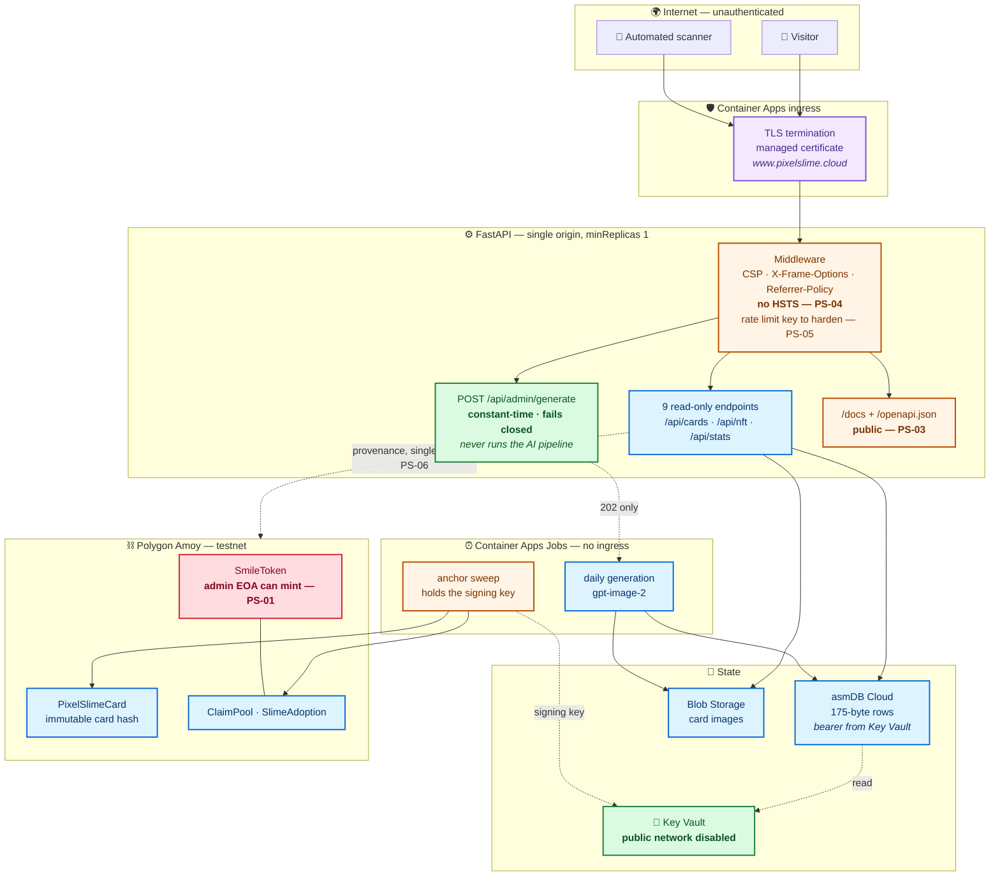
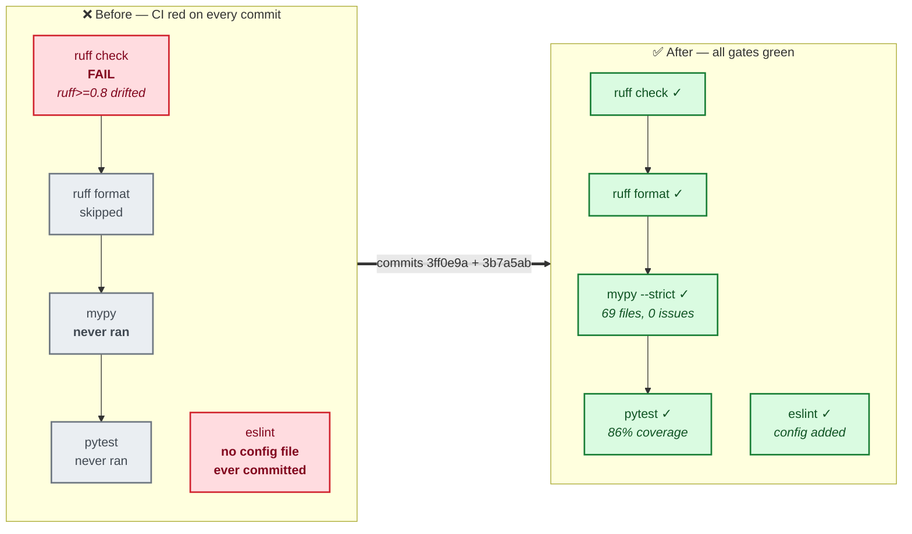
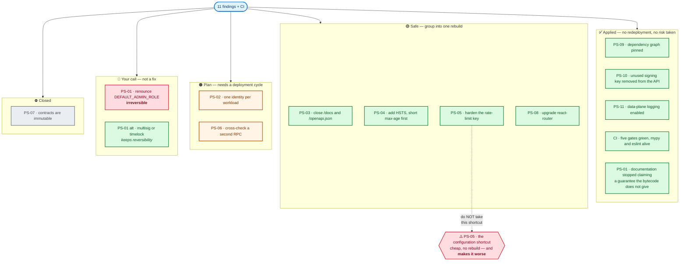

# 🔐 PIXELSLIME — Application Security Report

**Date** — 4 August 2026
**Target** — `https://www.pixelslime.cloud` · repository `fredgis/pixelslime` · commit `3b7a5ab`
**Standards** — OWASP Top 10 (2021) · OWASP Smart Contract Top 10 (2025) · OWASP ASVS v5.0
**Method** — installed OWASP playbook (`agent-security-playbook`): `owasp-top10-web-review`, `iac-security-review`, `sca-audit`, `secrets-scan`, `code-review-security`
**Scope** — FastAPI backend, React frontend, Azure/Bicep infrastructure, Solidity contracts, dependency graph, Git history, live production configuration

> An earlier pass over this system was carried out at commit `d4a3844` and is not published. Every
> finding below was re-verified against the running system rather than carried over from it, and the
> changes between the two are called out explicitly in §7.

> **📢 Publication variant.** This is the version intended for public release. It is complete and
> honest about every finding, including the open ones, but it deliberately omits the exploitation
> specifics of issues that are not yet fixed — file and line references, and the precise mechanism
> behind PS-05. Nothing here is redacted to make the system look better than it is; the omissions only
> remove work an attacker would otherwise be handed for free. An unabridged version is kept privately
> and will be folded into this file once the open items are closed.

---

## 1. Verdict

> ### 🟢 No critical or high-severity vulnerability
>
> **0 CRITICAL · 0 HIGH · 2 MEDIUM · 9 LOW**
>
> No secret is exposed in the source tree or in Git history. The application code is genuinely
> defensive: constant-time token comparison, fail-closed authorisation, no IDOR, a strict CSP, a
> length-bounded binary decoder, and a signer that refuses real-value chains.
>
> **One item deserves a decision rather than a fix: PS-01.** The $SMILE supply invariant is protected
> by the discretion of a key holder, not by the code — and the documentation claimed otherwise until
> today.

### OWASP Top 10 (2021)

| Ref | Risk | Severity | Status | Summary |
|---|---|---|---|---|
| **A01** | Broken Access Control | 🟠 MEDIUM | ⚠️ Partial | One managed identity shared by the public API and the jobs (PS-02). On the web surface: no IDOR, no path traversal, admin endpoint fails closed |
| **A02** | Cryptographic Failures | 🟡 LOW | ⚠️ Partial | HSTS still absent (PS-04). Secrets are never logged, never returned, never written to disk |
| **A03** | Injection | — | ✅ Safe | No SQL, no shell, no template rendering. React escapes by default; the binary decoder is unreachable from the web |
| **A04** | Insecure Design | 🟠 MEDIUM | ⚠️ Partial | The token reserve is finite by policy, not by construction (PS-01) |
| **A05** | Security Misconfiguration | 🟡 LOW | ⚠️ Partial | `/docs` and `/openapi.json` are public (PS-03); no data-plane diagnostics — **fixed today** (PS-11) |
| **A06** | Vulnerable Components | 🟡 LOW | ✅ Improved | No known-exploitable CVE. Runtime graph now pinned — **fixed today** (PS-09) |
| **A07** | Identification & Auth | — | ✅ Safe | Admin endpoint uses `compare_digest` and denies when unconfigured. No user session to steal |
| **A08** | Software & Data Integrity | 🟡 LOW | ⚠️ Partial | Provenance read from a single unverified RPC (PS-06) |
| **A09** | Logging & Monitoring | 🟡 LOW | ✅ Improved | Data-plane logging enabled on ACR, Key Vault and Blob — **fixed today** (PS-11) |
| **A10** | SSRF | — | ✅ Safe | No user-supplied URL is ever fetched server-side |

### OWASP Smart Contract Top 10 (2025)

| Ref | Risk | Status | Note |
|---|---|---|---|
| **SC01** | Access Control | ⚠️ PS-01 | `DEFAULT_ADMIN_ROLE` held by an EOA can grant `MINTER_ROLE` |
| **SC02** | Price Oracle Manipulation | ✅ N/A | No oracle; prices are set by `PARAMS_ROLE` |
| **SC03** | Logic Errors | ✅ Safe | 49/49 Foundry tests pass, including a full 3,650-bloom drain to exactly zero |
| **SC04** | Lack of Input Validation | ✅ Safe | Zero-address and zero-hash rejected; a serial can be minted at most once |
| **SC05** | Reentrancy | ✅ Safe | Effects precede interactions; no external call before state write |
| **SC06** | Unchecked Calls | ✅ Safe | OpenZeppelin primitives throughout |
| **SC07** | Flash Loan Attacks | ✅ N/A | Testnet, no liquidity pool |
| **SC08** | Integer Over/Underflow | ✅ Safe | Solidity 0.8.28 checked arithmetic |
| **SC09** | Insecure Randomness | ✅ Safe | Rarity is rolled off-chain from a reproducible seed, never from `block.*` |
| **SC10** | Denial of Service | 🟡 LOW | `adopt()` has no `maxPrice` guard (PS-07) |

---

## 2. Attack surface

**Reading the diagram.** The write path is the striking part: `POST /api/admin/generate` is the only
non-GET endpoint on the whole surface, and even when authorised it does nothing but return `202`. The
AI pipeline lives in a job with no ingress. An attacker who fully defeated the admin token still could
not make the system generate an image from the web.

---

## 3. Findings

### 🟠 PS-01 — MEDIUM — The $SMILE reserve is finite by policy, not by construction

**A04 Insecure Design · SC01 Access Control · `chain/src/SmileToken.sol`**

Verified live on Amoy at the time of writing, through a public RPC independent of the application:

| Call | Result | Meaning |
|---|---|---|
| `getRoleAdmin(MINTER_ROLE)` | `0x00…00` | administered by `DEFAULT_ADMIN_ROLE` |
| `hasRole(DEFAULT_ADMIN_ROLE, admin)` | `true` | the admin can grant any role |
| `hasRole(MINTER_ROLE, admin)` | `false` | it has not done so — today |
| `eth_getCode(admin)` | `0x` | a plain EOA; no multisig, no timelock |

One transaction from that key — `grantRole(MINTER_ROLE, self)` — makes the supply unbounded. The
invariant holds because nobody has chosen to break it, which is a different thing from being unable to.

**The more serious half of this finding was the documentation.** The contract's own NatSpec described
the reserve as *"finite and provably cannot be refilled"*, and the Bank page told visitors the same.
Neither was true. A reader had no way to discover the gap without querying the chain themselves.

There is a second, quieter confusion in that wording. `totalSupply()` currently reads **367,351 $SMILE**,
already above the "365,000" the site advertises — by design, because the ClaimPool mints yield into a
separate pool. "365,000, finite" was only ever a claim about the Treasury's purse, never about total
supply, but nothing on the page said so.

**Status — documentation corrected today (commit `c1c6ed3`); the on-chain risk is unchanged and is
yours to decide on.** The code now states what it actually guarantees: the *Treasury* can never refill
the Rain (enforced in the constructor via `admin != treasury_`, its `MINTER_ROLE` revoked before the
constructor returns, and its balance monotonically non-increasing — pinned by
`test_TreasuryBalanceIsMonotonicallyNonIncreasing`). The separation between the paying purse and the
earning purse is real. The supply cap is not.

**To make it real** — `renounceRole(DEFAULT_ADMIN_ROLE, admin)`. One transaction, and **irreversible**:
no role could ever be granted on `SmileToken` again, including for a legitimate future migration. That
is exactly what would make the guarantee credible, and exactly why it should be a deliberate decision
rather than an audit follow-up applied quietly.

---

### 🟠 PS-02 — MEDIUM — One managed identity shared by the public API and the jobs

**A01 Broken Access Control · `infra/modules/container-apps.bicep`**

The internet-facing API and both jobs run under the same user-assigned identity, so the API carries
permissions it never exercises. A remote-code-execution bug in the web tier would inherit the jobs'
reach rather than being confined to the read paths it actually uses.

**Mitigating factor:** the API is read-only over HTTP, with no injection sink identified anywhere in
this review, so the path to abusing it is narrow.

**Fix** — one identity per workload, each with only its own role assignments. Requires new identities
and a redeployment; not attempted here.

---

### 🟡 PS-03 — LOW — Interactive API documentation is public

Verified live, and worth stating precisely because two of the three URLs behave differently:

| URL | Response | Reality |
|---|---|---|
| `/docs` | 200 | **genuine Swagger UI** — exposed |
| `/openapi.json` | 200 | **genuine OpenAPI 3.1.0**, 10 paths — exposed |
| `/redoc` | 200 | the SPA catch-all serving `index.html` — **correctly disabled** |

`redoc_url=None` is doing its job; the `200` on `/redoc` is the single-page-app fallback and not an
exposure. `docs_url` and `openapi_url` are left at their defaults.

The schema documents `POST /api/admin/generate` and its `X-PixelSlime-Admin` header, handing an attacker
the shape of the only write endpoint for free.

**Not fixable without a rebuild:** these are constructor arguments in `main.py`, not environment
variables. One line, but it needs an image.

---

### 🟡 PS-04 — LOW — No HSTS header

Confirmed live: `Content-Security-Policy`, `X-Content-Type-Options`, `X-Frame-Options`,
`Referrer-Policy` and `Permissions-Policy` are all present and well-formed.
`Strict-Transport-Security` is not.

The window is genuinely small — the ingress does not serve plaintext HTTP — but a first visit typed as
`http://` is downgradeable. Requires a rebuild.

---

### 🟡 PS-05 — LOW — Rate limiting key needs hardening

The per-client key used by the rate limiter is derived from a request header, which means a determined
caller can influence which bucket they land in. The practical effect is limited to the rate limiter
itself: there is no authentication or authorisation decision anywhere in the application that depends
on the client address.

> **Note for whoever fixes this:** the configuration flag that looks like the obvious remedy is not one,
> and applying it would degrade availability rather than improve it. The correct change is in the
> parsing logic, not in configuration.

**Status:** open, scheduled with the next rebuild.

---

### 🟡 PS-06 — LOW — Provenance from a single unverified RPC

The chain badge and anchor state come from one public RPC with no cross-check. A hostile or merely
wrong endpoint could show a card as anchored when it is not. Low impact on a testnet with no value at
stake; it matters if this ever carries real assets.

---

### 🟡 PS-07 — LOW — `adopt()` has no `maxPrice` guard

`PARAMS_ROLE` can raise a tier price while a user's transaction is in flight, and the transaction will
succeed at the new price. Standard mitigation is a caller-supplied `maxPrice`. Contracts are deployed
and immutable, so this is a note for any future version.

---

### 🟡 PS-08 — LOW — `react-router` behind current

Flagged as a potential redirect issue and **downgraded after direct verification**: every `navigate()`
target is a literal template containing a numeric serial, the only `redirect()` lives in the MSW mock
which is constant-folded out by `VITE_USE_MOCK=false`, and there is no SSR. Not exploitable in this
application. Worth upgrading on hygiene grounds alone.

---

### 🟢 PS-09 — LOW — Unpinned dependency graph · **FIXED TODAY**

`requirements.txt` carried `>=` floors only, so every rebuild re-resolved the entire graph against
whatever PyPI held that day — the same commit could produce different code.

This was not theoretical. Two concrete consequences were found:

1. **A pre-release shipped to production.** `eth_abi==6.0.0b1` — a beta — is installed in the running
   image, pulled in silently by the open floors. That library ABI-encodes every anchoring transaction.
2. **CI had been red for weeks because of it.** `ruff>=0.8` re-resolved to a newer release with new
   rules, so lint began failing on files nobody had touched (see §5).

**Fixed** — `backend/constraints.txt` now pins all 69 packages, captured with `pip freeze` from the
image actually running in production, so adopting it changes nothing about what gets installed and only
stops future drift. Verified by building the dependency layer in ACR against real
`linux/python:3.12-slim`, and again by the CI image job. The beta is pinned **as-is** rather than
moved: this file should record what runs today, not introduce an untested change on the transaction
signing path.

---

### 🟡 PS-10 — LOW — Secrets bundled across workloads · **PARTIALLY FIXED TODAY**

The API declared the blockchain signing key as a secret **but never referenced it** in any environment
variable — dead weight that widened the blast radius for no functional benefit. Anyone able to call
`listSecrets` on the public-facing app could read the key that signs on-chain transactions.

**Fixed** — removed from the API. Before doing so, the key was confirmed to exist and be in active use
on `caj-pixelslime-anchor`, so no copy was destroyed. Current distribution:

| Workload | Declares | Uses |
|---|---|---|
| `ca-pixelslime-api` | `asmdb-bearer-token` | ✅ the same — **now minimal** |
| `caj-pixelslime-daily` | `asmdb-bearer-token` | ✅ the same |
| `caj-pixelslime-anchor` | bearer + `chain-signer-key` | ✅ both |

Every workload now holds exactly what it uses. Removing it created **no new revision and required no
restart** — secrets are app-scoped, and nothing was reading it.

---

### 🟢 PS-11 — LOW — No data-plane diagnostics · **FIXED TODAY**

Control-plane activity was captured by Azure Activity Log, but data-plane access was not: nobody could
answer "who read this secret?" or "who pulled this image?" after the fact.

**Fixed** — diagnostic settings now stream to the `log-pixelslime` workspace (30-day retention):

| Resource | Categories |
|---|---|
| Container Registry | `ContainerRegistryRepositoryEvents`, `ContainerRegistryLoginEvents` |
| Key Vault | `AuditEvent`, `AzurePolicyEvaluationDetails` |
| Blob Storage | `StorageRead`, `StorageWrite`, `StorageDelete` |

Purely additive resources: no revision, no restart, no interruption, reversible with one command.

---

## 4. Dependencies and supply chain

| Ecosystem | Verdict |
|---|---|
| Python (69 packages) | No known-exploitable CVE. **Now fully pinned.** One pre-release in production (`eth_abi==6.0.0b1`) — recorded deliberately, see PS-09 |
| npm | No high-severity advisory affecting a reachable path. `react-router` behind current (PS-08) |
| Solidity | OpenZeppelin, vendored and version-pinned |
| Container base | `python:3.12-slim`, `node:22-alpine` — both current |

**Structural gap that remains:** `pip install` does not use `--require-hashes`, so pinning protects
against drift but not against a compromised PyPI artefact. Hash pinning is the natural next step.

---

## 5. Quality gates — a finding in their own right

Not a vulnerability, but directly load-bearing on every other finding here: **the CI pipeline had been
failing on every recent commit, and the failures were masking dark gates.**

Three distinct root causes, none of them in application code:

1. **ESLint had never run at all.** The plugins and the `lint` script were declared from the start, but
   no configuration file was ever committed, so the job failed with *"couldn't find a configuration
   file"* on every single run. Adding it produced 4 findings — a good result for a gate that had been
   dark since the beginning.
2. **`ruff` drifted.** A newer release introduced rules that failed on untouched files, which stopped
   the Backend job before `mypy` and `pytest` could run. Same root cause as PS-09.
3. **`mypy` could never have passed.** Once ruff was fixed it ran for the first time and refused
   immediately: `app` has no `__init__.py`, and the editable install also places `backend/` on
   `sys.path`, so it reached `app/codec/` under two module names at once. `pytest` would have failed
   behind it, because CI installs `.[dev]` while the suite needs `.[dev,chain]`.

**The code itself was clean the whole time** — `mypy --strict` reports 0 issues across 69 files, and the
suite passes at 86% coverage. Only the configuration was broken. That is precisely the class of problem
a gate that never runs cannot tell you about, and it is why a green pipeline is a security control and
not merely hygiene: a dark `mypy` is also a dark check on the code handling secrets and signing keys.

---

## 6. Secrets

**Verdict: clean.** `gitleaks` passes in CI; a manual review of the working tree and the full rewritten
history found no private key, no bearer token, no connection string.

Controls verified in code, not assumed:

- `verify_admin` returns `False` when the token is **unconfigured** (fail-closed, not fail-open) and
  compares with `secrets.compare_digest`
- The asmDB bearer is read from Key Vault at startup and a failure **aborts the boot** rather than
  degrading silently
- Key Vault has **public network access disabled** — confirmed by being unable to list secrets from an
  authenticated administrative session outside the network boundary
- No secret is logged, returned in a response, or written to disk

---

## 7. What changed since the previous audit

| ID | Previously | Now |
|---|---|---|
| PS-09 | Unpinned graph | ✅ **69 packages pinned**, verified by a real Linux build |
| PS-10 | Secrets bundled everywhere | ✅ **Unused signing key removed from the public API**, no restart |
| PS-11 | No data-plane logging | ✅ **ACR + Key Vault + Blob** streaming to Log Analytics |
| PS-01 | Documented as a guarantee | ✅ **Documentation corrected** in the contract, the site and the plan · ⚠️ on-chain risk unchanged |
| PS-03 | `/docs`, `/openapi.json`, `/redoc` | ↔️ Re-verified: `/redoc` **is** correctly disabled; the other two remain exposed |
| — | CI red, gates dark | ✅ **All five jobs green**, `mypy` and `eslint` running for the first time |

**Production was not redeployed.** The application still runs image `v21`, revision
`ca-pixelslime-api--0000019`, `minReplicas: 1`, responding in 291–453 ms across `/`, `/api/health` and
`/api/cards`.

---

## 8. Recommendations

### Decide (not a fix — a governance choice)

- **PS-01** — renounce `DEFAULT_ADMIN_ROLE` to make the supply cap real, accepting that it is
  irreversible. Alternatively, move the admin key behind a multisig or a timelock, which keeps
  flexibility while removing the single-EOA risk. **Doing nothing is also defensible on a testnet — but
  the documentation had to stop claiming otherwise, which it now does.**

### Next rebuild (code ready to write, no urgency)

- **PS-03** close the interactive docs · **PS-04** add HSTS · **PS-05** harden the rate-limit key in the
  parsing logic (**not** by configuration) · **PS-08** upgrade `react-router`

### Next deployment cycle

- **PS-02** one identity per workload · **PS-06** cross-check provenance against a second RPC ·
  hash-pinned installs (`--require-hashes`)

### Keep

- The green pipeline. It only just started telling the truth; the first regression it catches will be
  worth more than this report.

---

## 9. Method and limitations

Three independent review agents covered web/API, infrastructure, and chain/supply-chain, working from
the installed OWASP playbook. **Their headline findings were re-verified by hand** rather than
transcribed — PS-08 was downgraded from MEDIUM to LOW on that basis, and PS-03 was corrected once
`/redoc` turned out to be the SPA fallback rather than an exposure.

**What this review did not do:**

- No dynamic penetration testing, no fuzzing, no live exploitation
- No formal verification of the contracts, and no re-audit of OpenZeppelin
- The admin endpoint was assessed **by reading the code, deliberately not by probing it**, to avoid any
  risk of triggering a card generation
- Findings reflect commit `3b7a5ab` and the production configuration as of 4 August 2026

**One honest caveat.** Several findings in this report — PS-01's false guarantee, PS-09's drift, the
dark quality gates — are defects in work this project produced, not in third-party components. They
were found by looking rather than by being told, but they are a reminder that the most convincing claim
in a codebase is often the one nobody has re-checked since it was written.

---

## 10. Conclusion — the decision table

Everything above, on one page. The last column is the one that usually gets left out of security
reports and is often the one that decides whether a finding actually gets fixed: **the risk of applying
the remedy**, as distinct from the risk of leaving it alone.

| ID | Finding | Severity | Handled? | Risk **of fixing it** |
|---|---|---|---|---|
| **PS-01** | $SMILE reserve finite by policy, not by construction | 🟠 MEDIUM | 🟡 Docs corrected · chain unchanged | 🔴 **High — irreversible.** See below |
| **PS-02** | One managed identity shared by API and jobs | 🟠 MEDIUM | ❌ No | 🟠 Medium — new identities, RBAC re-assignment, ~5 min propagation, full redeploy |
| **PS-03** | `/docs` + `/openapi.json` public | 🟡 LOW | ❌ No | 🟢 Near zero — one line. Cost: you lose Swagger too |
| **PS-04** | HSTS absent | 🟡 LOW | ❌ No | 🟠 Medium — **browsers cache the header**. A long `max-age` plus a certificate problem locks users out with no recourse. Start short (300 s), raise later |
| **PS-05** | Rate limiting key needs hardening | 🟡 LOW | ❌ No | 🔴 **High if done by configuration** — degrades availability. Low via a proper code fix |
| **PS-06** | Provenance from a single unverified RPC | 🟡 LOW | ❌ No | 🟢 Low — adds latency and a second external dependency |
| **PS-07** | `adopt()` has no `maxPrice` guard | 🟡 LOW | ⛔ **Unfixable** | Contracts are deployed and immutable — a note for a v2 only |
| **PS-08** | `react-router` behind current | 🟡 LOW | ❌ No | 🟠 Medium — major version bump, routing regressions possible. **Not exploitable here** (verified) |
| **PS-09** | Unpinned dependency graph | 🟡 LOW | ✅ **Done** | 🟢 None — pinned to what already runs; verified by a real Linux build |
| **PS-10** | Secrets spread wider than needed | 🟡 LOW | 🟡 Partial | 🟢 None for the part done. Remainder: per-workload Key Vault references |
| **PS-11** | No data-plane diagnostics | 🟡 LOW | ✅ **Done** | 🟢 None — additive resources. Only effect: log ingestion cost |
| **CI** | Pipeline red, quality gates dark | ⚙️ Quality | ✅ **Done** | 🟢 None — all five jobs green |

### PS-01 — why I now recommend *against* the obvious fix

The textbook remedy is `renounceRole(DEFAULT_ADMIN_ROLE, admin)`: one transaction, and the 365,000 cap
becomes a mathematical fact rather than a promise. While writing this report I found a concrete reason
not to, in `chain/deployments/amoy.json`:

> `ClaimPool_v1` has **already been retired and replaced** — *"recordBloom had no idempotency guard, so
> a serial could burn the Bloom Fee more than once. MINTER_ROLE revoked."*

That migration was only possible because the admin could grant `MINTER_ROLE` to the replacement
contract. **Had the role been renounced beforehand, the bug would have been unfixable** — the pool
would have been frozen with a double-burn defect and no way to promote a corrected version.

So the choice is not "guarantee versus laziness". It is: *a provable supply cap*, or *the ability to
repair a contract you have already had to repair once*. On a testnet where the token carries no
monetary value, keeping the ability to repair is the more defensible position — and it is far more
defensible now that the documentation no longer claims the guarantee.

**If the single-EOA risk still bothers you**, the middle path gets most of the benefit with none of the
finality: move the admin key behind a multisig or a timelock. The "one key, one transaction, unbounded
supply" scenario disappears, and a legitimate future migration remains possible.

### PS-05 — the one remedy that is worse than the defect

Worth repeating in the conclusion precisely because it is the cheapest-looking action in this entire
report: the apparent fix is a configuration flag, so it needs no rebuild and no code review. It is
exactly the kind of change that gets applied straight from an audit table.

Applying it would replace a per-client key that can be influenced with **a single key shared by every
visitor on the site**, because the fallback path resolves to the ingress address — identical for
everyone. One client could then rate-limit the whole site. The correct fix is in the parsing logic and
requires code.

### Two cross-cutting notes

**Any code fix implies a redeployment — and that redeployment is less risky today than it was
yesterday.** The Python graph is now pinned to exactly what image `v21` runs, `package-lock.json`
already froze the frontend, and all five CI gates work for the first time. Grouping PS-03, PS-04, PS-05
and PS-08 into a single rebuild would cost one cycle and would be the first deployment in this
project's history to pass through a `mypy` and an `eslint` that actually execute.

**Nothing in this report is urgent.** There is no critical or high finding, no exposed secret, and no
known-exploitable dependency. The two MEDIUMs are design and blast-radius concerns rather than open
doors. This is a system to improve deliberately, not to patch in a hurry.

